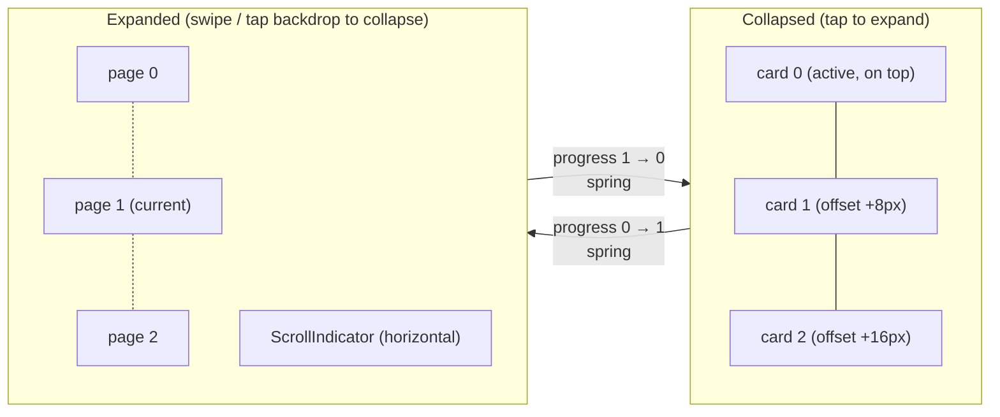
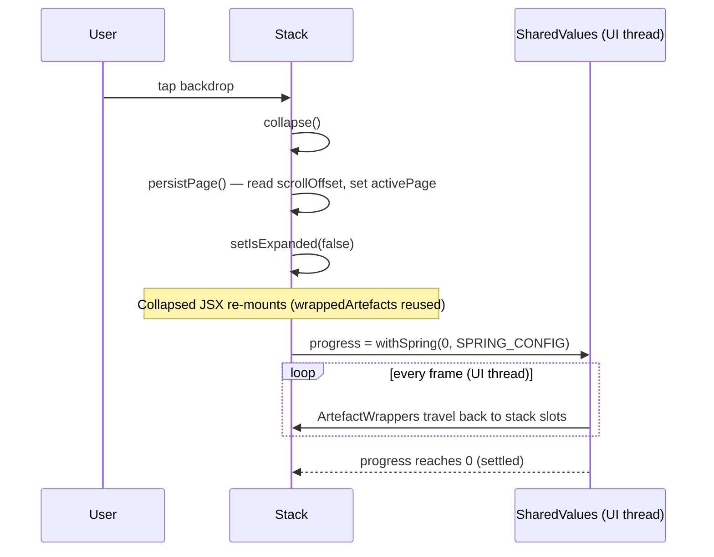
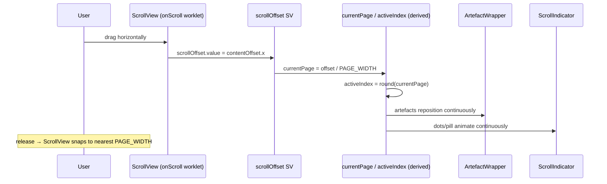

# Feature 1 — Stack / Entry expand & collapse

This document covers the **expand & collapse** interaction for an entry: a
collapsed "deck of cards" that, when tapped, blooms into a fullscreen horizontal
pager you can swipe through. It is the core interaction of the home screen.

## What it does

- **Collapsed state** — an entry renders as a stack of its artefacts offset by a
  few pixels, like a fanned deck. Only the top card is fully visible; the cards
  behind peek out at the edges. A single tap expands the entry.
- **Expanded state** — the entry teleports into a root-level overlay (via a
  `Portal`) and becomes a horizontal, snapping `ScrollView`. You swipe or use the
  on-screen scroll indicator to page through the artefacts. Tapping the backdrop
  collapses it back to a stack.
- **State preservation** — the page you were viewing is remembered across
  expand/collapse cycles and restored when you next expand.

## Files involved

| File | Role |
|------|------|
| `src/components/Stack.tsx` | Orchestrates collapse/expand, owns scroll + paging state, renders both states. |
| `src/components/ArtefactWrapper.tsx` | Per-artefact animated wrapper; interpolates between stacked and paged positions/scales. |
| `src/components/Paper.tsx` | Renders a `paper` artefact (A4-styled text card). |
| `src/components/Print.tsx` | Renders a `print` artefact (image + caption card). |
| `src/constants/animation.ts` | `SPRING_CONFIG` for the expand/collapse spring. |
| `src/constants/layout.ts` | `STACK_OFFSET` and `EXPANDED_STACK_GAP`. |
| `src/data/entries.ts` | The `Entry` / artefact types and mock data. |
| `src/app/_layout.tsx` | Mounts the `overlay` Portal host the expanded Stack renders into. |
| `src/components/ScrollIndicator.tsx` | The horizontal rail shown at the bottom of the expanded stack (see [Feature 3](./03-scroll-indicator.md)). |

## Visual model



In the **collapsed** state every artefact occupies the *same* frame; cards other
than the active one are translated by `(index - active) * STACK_OFFSET` and sit
behind the active card in `zIndex` order. In the **expanded** state each artefact
is positioned at `(index - currentPage) * SCREEN_WIDTH` so the horizontal pager
scrolls through them one screen-width at a time.

```
Collapsed (top-down, same frame, offset stack):   Expanded (horizontal pager):

       ┌──────────┐                                ┌──────────┐ ┌──────────┐ ┌──────────┐
       │ card 0   │ ← active (z 100)               │  page 0  │ │  page 1  │ │  page 2  │
       │██████████│                                │██████████│ │██████████│ │██████████│
       │██████████│                                │██████████│ │██████████│ │██████████│
       └──────────┘                                └──────────┘ └──────────┘ └──────────┘
      └──────────┘                                  ◄──── swipe ────►
     └──────────┘                                      snap = PAGE_WIDTH
```

## The layout math

Two width values anchor everything and are derived from the screen width:

```tsx
const { width: SCREEN_WIDTH } = useWindowDimensions();
const EXPANDED_WIDTH = SCREEN_WIDTH - 20;                 // 10px margin each side
const PAGE_WIDTH     = EXPANDED_WIDTH + LAYOUT.EXPANDED_STACK_GAP; // +48px peek
```

- **`EXPANDED_WIDTH`** — the visible width of one artefact when expanded
  (screen width minus a 20px gutter).
- **`PAGE_WIDTH`** — the snap interval of the horizontal `ScrollView`. It is
  wider than `EXPANDED_WIDTH` by `EXPANDED_STACK_GAP` (48px) so a sliver of the
  *next* artefact peeks at the right edge, signalling that there is more to
  swipe to.

The collapsed card width is `calc(100vw-80px)` (a 40px gutter each side), set via
the Tailwind class `w-[calc(100vw-80px)]`. The card's aspect ratio depends on the
entry type — `aspect-a4` for papers, `aspect-print` for prints — and a
`max-h-[calc((100vw-80px)/210*297)]` clamps the A4 ratio to the screen.

The total scrollable content width of the pager is:

```tsx
width: (entry.artefacts.length - 1) * PAGE_WIDTH + EXPANDED_WIDTH
```

i.e. `n-1` full page-widths plus one final `EXPANDED_WIDTH` so the last page
stops aligned to the left margin rather than overshooting.

## `Stack.tsx` — segment-by-segment

### Segment 1 — Imports (lines 1–22)

```tsx
import { useCallback, useState, ReactNode } from "react";
import { Pressable, ScrollView, View, useWindowDimensions } from "react-native";
import Animated, {
  useAnimatedRef,
  useAnimatedScrollHandler,
  useDerivedValue,
  useSharedValue,
  withSpring,
} from "react-native-reanimated";
import { Portal } from "react-native-teleport";
import { withUniwind } from "uniwind";

import type { Entry } from "../data/entries";

import { SPRING_CONFIG } from "../constants/animation";
import { LAYOUT } from "../constants/layout";
import ArtefactWrapper from "./ArtefactWrapper";
import Paper from "./Paper";
import Print from "./Print";
import { ArtefactPreview, ScrollIndicator } from "./ScrollIndicator";

const StyledPortal = withUniwind(Portal);
```

- `useAnimatedRef` returns a ref usable both as a React ref *and* inside worklets
  (needed for `scrollRef.current?.scrollTo(...)` and `measure`).
- `Portal` from `react-native-teleport` is wrapped with `withUniwind` so we can
  pass `className` to it for layout (`items-center justify-center`).
- `ArtefactPreview` is imported from `ScrollIndicator` and used as the thumbnail
  in the bottom scroll indicator.

### Segment 2 — Component signature & layout constants (lines 24–31)

```tsx
type StackProps = {
  entry: Entry;
};

const Stack = ({ entry }: StackProps) => {
  const { width: SCREEN_WIDTH } = useWindowDimensions();
  const EXPANDED_WIDTH = SCREEN_WIDTH - 20;
  const PAGE_WIDTH = EXPANDED_WIDTH + LAYOUT.EXPANDED_STACK_GAP;
```

`Stack` takes a single `entry`. The two width constants are recomputed whenever
the window dimensions change (e.g. device rotation), so the pager stays correct.

### Segment 3 — State & shared values (lines 33–42)

```tsx
const [isExpanded, setIsExpanded] = useState(false);
const [activePage, setActivePage] = useState(0);

const scrollRef = useAnimatedRef<ScrollView>();
const scrollOffset = useSharedValue(0);
const progress = useSharedValue(0);

const onScroll = useAnimatedScrollHandler((event) => {
  scrollOffset.value = event.contentOffset.x;
});
```

- **`isExpanded`** — React state that decides *which* tree to render (collapsed
  vs. expanded). It flips instantly; the *visual* transition is driven entirely
  by `progress`.
- **`activePage`** — the committed integer page index, persisted on collapse and
  used to restore scroll on re-expand (see `restoreScroll`).
- **`scrollOffset`** — the live horizontal scroll position (px), written on every
  scroll frame by the worklet handler `onScroll`.
- **`progress`** — the single source of truth for the morph: `0` = fully
  collapsed, `1` = fully expanded. Spring-animated between the two.

### Segment 4 — Derived page values (lines 44–50)

```tsx
const currentPage = useDerivedValue(() => {
  return scrollOffset.value / PAGE_WIDTH;
});

const activeIndex = useDerivedValue(() => {
  return Math.round(currentPage.value);
});
```

- **`currentPage`** — a *fractional* page index. If the user has scrolled 1.4
  page-widths, `currentPage === 1.4`. This is what makes the scroll indicator's
  dots and the artefact positions animate *continuously* as you swipe, rather
  than snapping.
- **`activeIndex`** — the nearest integer page, computed on the UI thread. It is
  passed to `ArtefactWrapper` so the *collapsed* stack can be centred on the
  card you're currently viewing.

### Segment 5 — Wrapping each artefact (lines 52–77)

```tsx
const wrapArtefact = (index: number, artefact: ReactNode) => (
  <ArtefactWrapper
    type={entry.type}
    key={index}
    index={index}
    progress={progress}
    currentPage={currentPage}
    activeIndex={activeIndex}
  >
    {artefact}
  </ArtefactWrapper>
);

const wrappedArtefacts =
  entry.type === "paper"
    ? entry.artefacts.map((artefact, index) =>
        wrapArtefact(index, <Paper key={index}>{artefact.text}</Paper>),
      )
    : entry.artefacts.map((artefact, index) =>
        wrapArtefact(
          index,
          <Print key={index} img={artefact.img}>
            {artefact.text}
          </Print>,
        ),
      );
```

`wrapArtefact` builds the element tree once and reuses it for **both** the
collapsed and the expanded render. The same `<ArtefactWrapper>` instances appear
in both branches of the JSX below; their animated styles react to `progress`,
so they smoothly travel from stacked to paged. Because the discriminant
`entry.type` is fixed for the entry's lifetime, the `.map` produces a stable set
of children keyed by `index`, which keeps React reconciliation cheap across
expand/collapse.

The `paper` branch renders `<Paper>{artefact.text}</Paper>`; the `print` branch
renders `<Print img={artefact.img}>{artefact.text}</Print>`. (The `print` branch
also narrows the `PaperEntry`/`PrintEntry` union so `artefact.img` type-checks.)

### Segment 6 — Persisting the page on collapse (lines 79–86)

```tsx
const persistPage = () => {
  const page = Math.max(
    0,
    Math.min(entry.artefacts.length - 1, Math.round(scrollOffset.value / PAGE_WIDTH)),
  );

  setActivePage(page);
};
```

When the user collapses, we read the *current* fractional scroll position from
the shared value, round it, and clamp it to `[0, artefacts.length - 1]`, then
store it in `activePage`. This is the page that will be centred in the collapsed
stack and restored when re-expanding. Reading `scrollOffset.value` here is safe
because `persistPage` is called from `collapse`, which runs on the JS thread
(scheduled by a `Pressable` `onPress`); Reanimated lets JS read the latest UI
value.

### Segment 7 — Expand & collapse (lines 88–100)

```tsx
const expand = () => {
  setIsExpanded(true);

  progress.value = withSpring(1, SPRING_CONFIG);
};

const collapse = () => {
  persistPage();

  setIsExpanded(false);

  progress.value = withSpring(0, SPRING_CONFIG);
};
```

- **`expand`** — flip `isExpanded` to `true` (which swaps the JSX to the expanded
  branch and mounts the `Portal`), then spring `progress` to `1`. The artefacts,
  already mounted in the new branch via `wrappedArtefacts`, animate from their
  stacked positions to their paged positions.
- **`collapse`** — first `persistPage()` (capture the page), then flip
  `isExpanded` to `false` (swap back to the collapsed branch), then spring
  `progress` back to `0`.

> **Ordering matters.** `persistPage()` must run *before* `setIsExpanded(false)`,
> because the collapsed branch's `ArtefactWrapper` reads `activeIndex` (which
> depends on the scroll offset) to centre the stack. We also set the React state
> *before* kicking off the spring so the collapsed tree is mounted and ready to
> receive the animating `progress`.

### Segment 8 — Restoring scroll & jumping to an artefact (lines 102–114)

```tsx
const restoreScroll = () => {
  scrollRef.current?.scrollTo({ x: activePage * PAGE_WIDTH, y: 0, animated: false });
  scrollOffset.value = activePage * PAGE_WIDTH;
};

const jumpToArtefact = useCallback(
  (index: number) => {
    scrollRef.current?.scrollTo({ x: index * PAGE_WIDTH, y: 0, animated: false });
    scrollOffset.value = index * PAGE_WIDTH;
    setActivePage(index);
  },
  [PAGE_WIDTH, scrollOffset, scrollRef],
);
```

- **`restoreScroll`** — wired to the `ScrollView`'s `onLayout`. When the expanded
  tree mounts, the native scroll position is `0`; we instantly jump it to the
  last-viewed page (`activePage * PAGE_WIDTH`) *and* sync the shared
  `scrollOffset` so `currentPage`/`activeIndex` are correct from the first frame.
  Without the shared-value write, the worklet-derived values would briefly read
  `0` and the stack would flash to page 0 before snapping.
- **`jumpToArtefact`** — called by the `ScrollIndicator` when the user taps/scrubs
  to a specific artefact. It imperatively scrolls (no animation) and updates both
  the shared value and the React `activePage` state. Memoised so the indicator's
  `useCallback` dependency stays stable.

### Segment 9 — Render: collapsed branch (lines 116–126)

```tsx
return (
  <>
    {!isExpanded && (
      <Pressable onPress={expand}>
        <Animated.View
          className={`${entry.type === "paper" ? "aspect-a4" : "aspect-print"} relative max-h-[calc((100vw-80px)/210*297)] w-[calc(100vw-80px)]`}
        >
          {wrappedArtefacts}
        </Animated.View>
      </Pressable>
    )}
```

The collapsed entry is a `Pressable` wrapping a relatively-positioned frame with
the right aspect ratio. Inside it are the absolutely-positioned `ArtefactWrapper`
children (each `ArtefactWrapper` is `className="absolute"`). The whole frame is
tappable to expand.

### Segment 10 — Render: expanded branch (lines 128–168)

```tsx
{isExpanded && (
  <StyledPortal hostName="overlay" className="items-center justify-center">
    <View className="absolute inset-0 items-center justify-center">
      <Pressable className="absolute inset-0" onPress={collapse} />
      <View
        className={`${entry.type === "paper" ? "aspect-a4" : "aspect-print"} relative max-h-[calc((100vw-80px)/210*297)] w-[calc(100vw-80px)]`}
        pointerEvents="box-none"
      >
        <Animated.ScrollView
          ref={scrollRef}
          horizontal
          snapToInterval={PAGE_WIDTH}
          decelerationRate="fast"
          showsHorizontalScrollIndicator={false}
          scrollEventThrottle={16}
          onScroll={onScroll}
          onLayout={restoreScroll}
        >
          <View
            style={{ width: (entry.artefacts.length - 1) * PAGE_WIDTH + EXPANDED_WIDTH }}
          />
        </Animated.ScrollView>

        {wrappedArtefacts}
      </View>
      <View
        style={{ zIndex: 200 }}
        className="absolute bottom-24 left-1/2 -translate-x-1/2"
        pointerEvents="box-none"
      >
        <ScrollIndicator
          orientation="horizontal"
          count={entry.artefacts.length}
          currentPage={currentPage}
          maxVisible={5}
          onJumpToIndex={jumpToArtefact}
          renderPreview={(index) => <ArtefactPreview entry={entry} index={index} />}
        />
      </View>
    </View>
  </StyledPortal>
)}
```

This is the heart of the expanded state. Walking through it:

1. **`<StyledPortal hostName="overlay">`** — the entire expanded UI is teleported
   to the root-level `overlay` Portal host (mounted in `_layout.tsx`). Because
   that host is `absolute inset-0` *inside* the `SafeAreaView`, the overlay
   respects safe areas. The `className="items-center justify-center"` centres
   content horizontally.

2. **Backdrop `Pressable`** — an `absolute inset-0` invisible press target that
   calls `collapse` when tapped. It sits behind the card frame.

3. **Card frame** — the same aspect-ratio frame as the collapsed state, but with
   `pointerEvents="box-none"`. `box-none` is critical: it lets the frame *pass
   through* touches to its children (the artefacts) and to the `ScrollView`
   behind it, instead of capturing them. The artefacts themselves are
   `pointerEvents="none"` (set in `ArtefactWrapper`), so all gestures go to the
   `ScrollView`.

4. **`Animated.ScrollView`** — the actual horizontal pager:
   - `horizontal` + `snapToInterval={PAGE_WIDTH}` makes it snap one page at a
     time.
   - `decelerationRate="fast"` makes flings stop quickly so paging feels tight.
   - `scrollEventThrottle={16}` ≈ one scroll event per frame (60fps).
   - `onScroll={onScroll}` writes the offset into the `scrollOffset` shared
     value.
   - `onLayout={restoreScroll}` jumps to the saved page once the scroll view has
     been laid out.
   - Its *single child* is an empty spacer `View` whose width is the total
     scrollable width. The visible artefacts are **not** children of the
     `ScrollView` — they are siblings, positioned by `ArtefactWrapper` based on
     `currentPage`. This decouples the visible content from the scroll
     machinery: the `ScrollView` provides gesture + snapping + offset, while the
     artefacts are laid out by transforms that read the same offset.

5. **`wrappedArtefacts`** — the absolutely-positioned, animated artefacts, laid
   out on top of the scroll view.

6. **`ScrollIndicator`** — a horizontal rail pinned 96px (`bottom-24`) above the
   bottom, horizontally centred, at `zIndex: 200` so it floats above the cards.
   It receives the fractional `currentPage`, the artefact count, the jump
   callback, and a `renderPreview` that returns an `ArtefactPreview` thumbnail
   for each index (used when the rail is long-pressed into its expanded
   scrubber). See [Feature 3](./03-scroll-indicator.md).

## `ArtefactWrapper.tsx` — segment-by-segment

`ArtefactWrapper` is the per-artefact animator. It receives the shared values
from `Stack` and produces a transform that moves each card between its collapsed
stack slot and its expanded page slot, while also scaling it up to the expanded
size.

### Segment A — Props & width math (lines 7–27)

```tsx
type ArtefactWrapperProps = {
  type: string;
  index: number;
  progress: SharedValue<number>;
  currentPage: SharedValue<number>;
  activeIndex: SharedValue<number>;
  children: ReactNode;
};

const ArtefactWrapper = ({ type, index, progress, currentPage, activeIndex, children }: ArtefactWrapperProps) => {
  const { width: SCREEN_WIDTH } = useWindowDimensions();
  const BASE_WIDTH =
    type === "paper" ? SCREEN_WIDTH - 80 : (53 / 86) * (((SCREEN_WIDTH - 80) / 210) * 297);
  const EXPANDED_WIDTH = SCREEN_WIDTH - 20;
```

- **`BASE_WIDTH`** — the rendered width of a card in the **collapsed** state. For
  papers it is simply `100vw - 80px` (the collapsed gutter). For prints the
  width is derived from the print's aspect ratio: a print is `86:53`, and its
  *height* is constrained by the A4-based max height
  `((100vw-80px)/210*297)`, so the print width is
  `53/86 * that height`. This keeps prints and papers the same height when
  stacked.
- **`EXPANDED_WIDTH`** — the target width when expanded (`100vw - 20px`).

The scale factor below is `EXPANDED_WIDTH / BASE_WIDTH`, so a card grows from its
collapsed width to its expanded width as `progress` goes 0 → 1.

### Segment B — The animated style (lines 29–49)

```tsx
const animatedStyle = useAnimatedStyle(() => {
  const active = activeIndex.value;

  const expandedX = (index - currentPage.value) * SCREEN_WIDTH;
  let collapsedX = 0;

  if (index !== active) {
    const distance = index - active;

    collapsedX = distance * LAYOUT.STACK_OFFSET;
  }

  const translateX = interpolate(progress.value, [0, 1], [collapsedX, expandedX]);

  const scale = interpolate(progress.value, [0, 1], [1, EXPANDED_WIDTH / BASE_WIDTH]);

  return {
    transform: [{ translateX }, { scale }],
    zIndex: index === active ? 100 : 100 - Math.abs(index - active),
  };
});
```

This is the key transform. Line by line:

- **`expandedX`** — the expanded pager position. When `currentPage` is the
  fractional page, `(index - currentPage) * SCREEN_WIDTH` places artefact
  `index` exactly one screen-width per page away from the current page. At
  `currentPage = 1`, artefact 1 is at `x = 0` (centred), artefact 0 at
  `x = -SCREEN_WIDTH` (off-screen left), artefact 2 at `x = +SCREEN_WIDTH`
  (off-screen right). As the user swipes, `currentPage` changes continuously and
  every artefact slides in lockstep — no per-page re-render needed.
- **`collapsedX`** — the stacked position. The active card stays at `0`; every
  other card is offset by `(index - active) * STACK_OFFSET` (8px per step), so
  cards fan out behind/beside the active one.
- **`translateX`** — `interpolate(progress, [0, 1], [collapsedX, expandedX])`.
  When `progress` is `0` the card sits at its stacked slot; when `progress` is
  `1` it sits at its paged slot; in between it smoothly travels between the two.
  Because `collapsedX` is recomputed every frame from `activeIndex`, the stack
  re-centres on the current page even as `progress` animates.
- **`scale`** — grows the card from `1` (collapsed width) to
  `EXPANDED_WIDTH / BASE_WIDTH` (expanded width) as it blooms. Combined with the
  translate, this produces the "card flies out and grows" effect.
- **`zIndex`** — the active card is always on top (`100`); other cards drop by
  their distance from the active index. This keeps the deck visually ordered in
  the collapsed state and is harmless in the expanded state (cards don't
  overlap there).

### Segment C — Render (lines 51–55)

```tsx
return (
  <Animated.View style={[animatedStyle]} className="absolute" pointerEvents="none">
    {children}
  </Animated.View>
);
```

Each wrapper is `absolute` (so all cards share one frame) and
`pointerEvents="none"` so the `ScrollView` receives all gestures. The animated
style drives `transform` and `zIndex`; React Native applies these on the UI
thread, so the 60fps motion never touches JS.

## `Paper.tsx` & `Print.tsx`

These are the leaf artefact renderers. They are intentionally tiny.

### `Paper.tsx` (full file)

```tsx
const Paper = ({ children }: PropsWithChildren) => {
  return (
    <View className="aspect-a4 h-full w-full bg-paper p-6 shadow-sm">
      <Text className="font-paper text-base text-primary">{children}</Text>
    </View>
  );
};
```

An A4-proportioned card with paper background, a 24px pad, and a soft shadow.
The text uses the `font-paper` family in the `text-primary` colour.

### `Print.tsx` (full file)

```tsx
const Print = ({ img, children }: PropsWithChildren<PrintProps>) => {
  return (
    <View className="flex aspect-print h-full w-full items-center gap-4 bg-paper pt-8 shadow-sm">
      <StyledImage
        className="aspect-print-image w-[86.79%]"
        source={img}
        contentFit="cover"
        cachePolicy="memory-disk"
        transition={0}
      />
      <Text className="font-paper text-base text-primary">{children}</Text>
    </View>
  );
};
```

A print-proportioned card. The image (`StyledImage = withUniwind(Image)` from
`expo-image`) is `86.79%` wide and uses the `aspect-print-image` ratio,
`contentFit="cover"`, and `memory-disk` caching with `transition={0}` (no
fade-in) so re-renders are instant. The caption sits below with a 16px gap.

## Constants

### `src/constants/animation.ts`

```ts
export const SPRING_CONFIG = {
  stiffness: 900,
  damping: 110,
  mass: 4,
  overshootClamping: true,
  energyThreshold: 6e-9,
  velocity: 0,
};
```

This is a stiff, heavily-damped spring. The high `stiffness` (900) with strong
`damping` (110) and `overshootClamping: true` produces a fast, decisive motion
with **no bounce** — the expand/collapse should feel like a snap, not a wobble.
The tiny `energyThreshold` lets the spring settle quickly. Compare this with
`MORPH_SPRING` in `MorphOverlay.tsx`, which is deliberately slower so the
calendar's shape change is perceivable.

### `src/constants/layout.ts`

```ts
export const LAYOUT = {
  STACK_OFFSET: 8,
  EXPANDED_STACK_GAP: 48,
};
```

See [The layout math](#the-layout-math) above.

## Interaction flows

### Expand

```mermaid
sequenceDiagram
    participant U as User
    participant S as Stack
    participant AW as ArtefactWrapper
    participant P as PortalHost "overlay"
    participant SV as SharedValues (UI thread)

    U->>S: tap collapsed card
    S->>S: expand()
    S->>S: setIsExpanded(true)
    Note over S: Expanded JSX mounts;<br/>wrappedArtefacts teleported to "overlay"
    S->>P: render ScrollView + artefacts + ScrollIndicator
    S->>SV: progress = withSpring(1, SPRING_CONFIG)
    loop every frame (UI thread)
        SV->>AW: progress, currentPage, activeIndex update
        AW->>AW: recompute translateX / scale
    end
    SV-->>S: progress reaches 1 (settled)
```

### Collapse



### Swipe within the expanded pager



## Edge cases & design decisions

- **Why one `progress` shared value for the whole morph.** A single scalar
  drives every artefact's translate and scale. This keeps the entire stack
  perfectly in sync (no per-card timing skew) and means there is exactly one
  spring running at a time.
- **Why the visible artefacts are *siblings* of the `ScrollView`, not children.**
  The `ScrollView` owns gesture/snapping/offset; the artefacts are positioned by
  transforms that read the same offset. This avoids re-laying-out large card
  subtrees on every scroll frame (transforms are cheap; layout is not) and lets
  the same `wrappedArtefacts` array be reused in both states.
- **Why `restoreScroll` writes the shared value too.** `scrollTo` updates the
  *native* scroll position, but the `onScroll` worklet may not fire for a
  programmatic scroll before the next frame. Writing `scrollOffset.value`
  directly guarantees `currentPage`/`activeIndex` are correct immediately, so
  the stack doesn't flash to page 0 on re-expand.
- **Why `persistPage` runs before `setIsExpanded(false)`.** The collapsed branch
  centres on `activeIndex`, which is derived from `scrollOffset`. Once the
  expanded tree unmounts, the `ScrollView` (and its offset) is gone, so the
  current page must be captured into `activePage` *first*. `activePage` also
  drives `restoreScroll` on the next expand.
- **Why `pointerEvents="box-none"` on the expanded frame and `"none"` on the
  wrappers.** The frame must not swallow the horizontal-drag gestures intended
  for the `ScrollView`; the wrappers must not either. `box-none` lets the frame
  pass touches through to descendants/the sibling scroll view, while `"none"`
  makes the artefacts transparent to touches entirely.
- **Why the overlay uses the `overlay` Portal host (inside the `SafeAreaView`).**
  The expanded stack should not cover the status-bar/notch region, so it renders
  into the host that lives *inside* the safe area. The calendar morph, by
  contrast, uses the `morph` host *outside* the safe area to go truly
  fullscreen (see [Feature 2](./02-calendar-morph-overlay.md)).
- **Why the bottom `ScrollIndicator` is at `zIndex: 200`.** It must float above
  the artefacts and the backdrop so it remains tappable even when a large card
  is centred.
- **Aspect ratios & max height.** The collapsed frame uses
  `max-h-[calc((100vw-80px)/210*297)]` so an A4 card never grows taller than the
  screen on narrow devices; `aspect-a4`/`aspect-print` then size the width from
  the height. This is why prints compute `BASE_WIDTH` from the A4 height rather
  than from the screen width directly.
- **`scrollEventThrottle={16}`** balances responsiveness and cost: roughly one
  event per frame is enough to keep `currentPage` smooth without flooding the UI
  thread.
