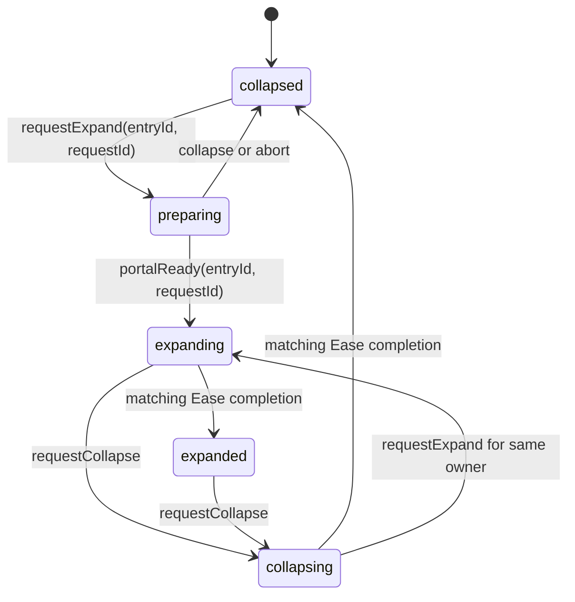

# Feature 1 — Stack / Entry expand and collapse

An Entry appears on Home as a fanned deck of Artefacts. Tapping the deck opens
the Entry in a retained root portal as a horizontal pager; tapping outside the
card collapses it back to the page that was last viewed.

The transition is phase-synchronized. There is no shared `0…1` expansion
progress. React state establishes one discrete endpoint for each participant,
and each Ease wrapper animates to that endpoint with its own property owner.
Reanimated remains responsible for the fractional page position while the user
is actively scrolling.

## Ownership boundary

| Concern | Owner | Why |
|---|---|---|
| Expansion phase, portal owner, request identity | React reducer | These are discrete application states. |
| Card correction, scale, shadow, close-control entrance | `react-native-ease` | Each has fixed collapsed and expanded endpoints. |
| Home header, launchers, Day pager chrome | `react-native-ease` | Opacity follows the Stack phase, not animation progress. |
| Horizontal drag, snapping, fractional page translation | Native `ScrollView` + Reanimated | Values change continuously with user input. |
| Paper/Print content readiness | Native renderers + React request IDs | Entry navigation must wait for real native content. |

One native view never receives the same property from both animation engines.
`ArtefactWrapper` expresses that boundary as nested views:

```text
Animated.View       continuous pager translateX + live zIndex
  EaseView           collapsed-position correction translateX
    EaseView         presentation scale + shadow
      Paper/Print    canonical content
```

## State machine

`ExpandProvider` owns one global `StackExpansionState`, so only one Entry can
own the expanded portal at a time.



The state also records `ownerEntryId`, the current `requestId`, and whether Home
chrome must remain hidden while a widget command atomically replaces another
portal owner. Readiness and completion events with stale request or Entry IDs
are ignored. If the owner unmounts, the reducer returns to `collapsed`.

## Expand sequence

1. `Stack` calls `requestExpand(entry.id)`. The reducer enters `preparing` and
   assigns that Entry as portal owner.
2. The portal tree mounts invisibly. The canonical collapsed deck remains
   visible, preventing a blank frame while the native pager lays out.
3. The pager restores `activePage`, writes the matching `scrollOffset`, and
   reports `portalReady` for the active request.
4. The reducer enters `expanding`. The canonical deck is hidden and the portal
   becomes visible at the identical collapsed endpoint.
5. Ease animates the correction, presentation scale/shadow, close control, and
   Home chrome to their expanded endpoints.
6. Only the active card carries the request completion token. Its presentation
   completion advances the reducer to `expanded`, when horizontal scrolling is
   enabled.

The hidden preparation phase is important: mounting a Portal and restoring a
native `ScrollView` are readiness work, not animation work.

## Collapse sequence

1. `persistPage()` rounds and clamps the current fractional page.
2. The pager is synchronously frozen at that page by updating both native
   scroll position and the Reanimated offset.
3. `requestCollapse(entry.id)` enters `collapsing`; the portal remains mounted
   and scrolling becomes disabled.
4. Ease returns the card, shadow, close control, and Home chrome to their
   collapsed endpoints.
5. The matching active-card completion returns the reducer to `collapsed`.
   Only then is the portal released and the canonical deck interactive again.

If expansion is requested again during collapse, the same retained portal
reverses immediately to `expanding`. Superseded native completion events cannot
settle the newer request.

## Geometry

For a screen width `screenWidth`:

```ts
expandedWidth = screenWidth - 20;
pageWidth = expandedWidth + LAYOUT.EXPANDED_STACK_GAP;
```

The native horizontal pager snaps at `pageWidth`; the extra gap leaves a visual
peek of the next Artefact. Reanimated exposes:

```ts
currentPage = scrollOffset / pageWidth;
activeIndex = round(currentPage);
livePageX = (index - currentPage) * screenWidth;
```

At a phase boundary, `activePage` is frozen. Ease then owns only the correction
between the expanded resting position and the collapsed fan:

```ts
expandedRestX = (index - activePage) * screenWidth;
collapsedX = (index - activePage) * LAYOUT.STACK_OFFSET;
collapsedCorrectionX = collapsedX - expandedRestX;
```

Adding `livePageX` and the collapsed correction produces `collapsedX`; removing
the correction produces the expanded pager position. This decomposition lets
scroll remain continuous without requiring Ease and Reanimated to write the
same transform on one view.

Paper and Print allocate their device-sized canonical canvas from mount. Their
presentation Ease wrapper animates from a collapsed scale to identity, so
native text, glyphs, and carets are not left behind a reciprocal or enlarged
raster transform at expanded rest.

## Chrome synchronization

`StackChromeMotion` maps reducer phases to a binary opacity endpoint:

- visible in `collapsed` and `collapsing`;
- visible during ordinary `preparing`, while the canonical deck is still shown;
- hidden in `expanding` and `expanded`;
- retained as hidden during widget-driven owner replacement.

Home's header, Create launcher, Featured Artefacts launcher, and vertical Day
pager each use this wrapper. They become interactive and accessibility-visible
only after the reducer returns to `collapsed`, even when their opacity is
already animating back during `collapsing`. Entry navigation opacity is a
separate outer Ease wrapper, preserving one owner per native view.

## Completion and interruption

Ease completion events do not include application request IDs.
`EaseMotionCompletionQueue` associates each target change with its logical
request. It suppresses a cancelled completion when a replacement target is
queued, accepts the replacement's completion, and treats a lone native
interruption as logical completion so the state machine cannot remain stuck.

Changing viewport geometry produces a new target signature as well, allowing
the same queue to recover safely when dimensions change during a transition.

## Widget targets

A widget deep link can request a specific Artefact. `Stack` resolves the target
page before preparing the portal. If another Entry currently owns the portal,
the reducer switches ownership while retaining hidden Home chrome, then reveals
the new portal only after its pager restores the requested page. The target is
consumed after readiness, not merely after the React request is issued.

## Files

| File | Role |
|---|---|
| `src/components/stackExpansion.ts` | Pure phases, request validation, owner replacement, and chrome selector. |
| `src/components/ExpandContext.tsx` | Global reducer provider and monotonic request IDs. |
| `src/components/Stack.tsx` | Portal preparation, page persistence, paging, Focus, close control, and widget targeting. |
| `src/components/CollapsedDeck.tsx` | Canonical/portal deck construction. |
| `src/components/ArtefactWrapper.tsx` | Nested Reanimated geometry and Ease presentation owners. |
| `src/components/StackChromeMotion.tsx` | Phase-to-opacity adapter for Home chrome. |
| `src/components/ScrollIndicator.tsx` | Continuous page rail plus retained Ease scrubber shell. |
| `src/constants/animation.ts` | Stack presentation spring and chrome timing. |
| `src/constants/layout.ts` | Fan offset and expanded pager gap. |

## Regression gates

Automated tests cover reducer ordering, stale requests, immediate reversal,
widget owner replacement, owner teardown, native-text scale ownership, and the
Ease/Reanimated source boundary. Physical iOS acceptance should additionally
exercise rapid tap reversals, collapse after swiping, widget replacement, and
Reduce Motion, watching for blank handoff frames or stale Home chrome.
