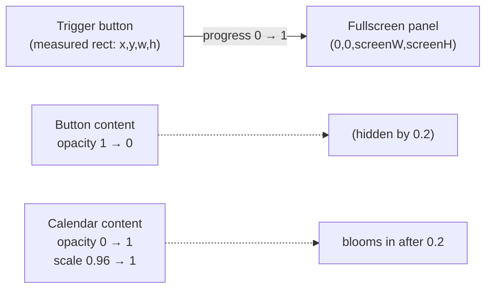

# Feature 2 — Calendar with a morphing overlay

This document covers the date-picker in the home header: a button showing the
current date that, when tapped, **morphs** into a fullscreen calendar. The
calendar lists months, marks days that have entries with a dot, highlights the
active date, and — when a day is picked — navigates to that date *behind* the
closing overlay.

The feature is split across three files that follow a clean
**trigger / engine / content** separation:

- **Trigger** — `HomeHeader.tsx` renders the button, owns open/close state, and
  wires the engine to the calendar content.
- **Engine** — `MorphOverlay.tsx` measures the trigger and animates a panel from
  the trigger's frame to a fullscreen (or menu) target. It is generic and knows
  nothing about calendars.
- **Content** — `CalendarOverlay.tsx` renders the actual calendar using
  `@marceloterreiro/flash-calendar`, with a custom high-performance day cell.

## Files involved

| File | Role |
|------|------|
| `src/components/HomeHeader.tsx` | Trigger button, open/close state, navigation, post-close highlight sync. |
| `src/components/MorphOverlay.tsx` | Generic measure-and-morph overlay engine (animation + portal + back handling). |
| `src/components/CalendarOverlay.tsx` | Calendar content: month list, custom `DayCell`, entry dots, active range. |
| `src/components/Button.tsx` | The styled `Pressable` primitive used for the trigger. |
| `src/data/entries.ts` | `getEntryDates()` provides the set of dates that get a dot. |
| `src/utils/date.ts` | ISO date helpers + `formatDisplayDate` for the button label. |
| `src/app/_layout.tsx` | Mounts the `morph` Portal host the overlay renders into. |

## The morph technique, conceptually

The illusion is a **cross-fade between two shapes that share an origin**: the
small rounded button "grows" into the fullscreen panel while the button's
contents fade out and the calendar fades in.



Concretely, `MorphOverlay` keeps a single `progress` shared value (`0` = closed,
`1` = open) and an `origin` shared value holding the trigger's measured screen
frame. Each frame it computes a style that:

1. **Translates** the panel from the trigger's top-left `(origin.x, origin.y)` to
   the target top-left `(0, 0)` (fullscreen) — via `interpolate(progress, [0,1], [origin.x, 0])`.
2. **Scales** the panel from the trigger's size to the screen size — via
   `scaleX = origin.width / screenW → 1` and `scaleY = origin.height / screenH → 1`.
3. **Fades** the panel's opacity from `0` to `1` over the first slice of the
   animation (`PANEL_FADE_END = 0.2`) so the button cross-fades into a solid
   container instead of a foreign white rectangle popping in.
4. **Animates the corner radius** from the button's `32px` to `0px` so the
   rounded pill squares off as it grows.
5. **Blooms the content** (the calendar) only *after* the panel is solid
   (`CONTENT_BLOOM_START = 0.2`): opacity `0 → 1` and scale `0.96 → 1`.

All of this runs on the UI thread as a spring, so it stays smooth even while the
JS thread is busy.

```mermaid
sequenceDiagram
    participant U as User
    participant H as HomeHeader
    participant M as MorphOverlay
    participant UI as UI thread (worklets)
    participant C as CalendarOverlay

    U->>H: tap date button
    H->>H: setCalendarOpen(true)
    H->>M: open flips true
    M->>UI: scheduleOnUI(animateOpen)
    UI->>UI: measure(triggerRef) → origin
    UI->>UI: progress = withSpring(1, MORPH_SPRING)
    loop every frame
        UI->>UI: panelStyle + contentStyle recompute
    end
    UI-->>M: progress reaches 1 (calendar fully visible)
    Note over C: Calendar was already mounted (preloaded);<br/>no re-render on open

    U->>C: tap a day
    C->>H: onPick(dateId)
    H->>H: router.setParams({date})  (navigate behind overlay)
    H->>H: pickedDateRef = dateId
    H->>H: setCalendarOpen(false)
    H->>M: open flips false
    M->>UI: scheduleOnUI(animateClose)
    UI->>UI: progress = withSpring(0, MORPH_SPRING)
    UI-->>UI: spring finished → scheduleOnRN(onClose)
    UI->>H: onClose → setHighlightDate(pickedDate)
```

## `HomeHeader.tsx` — segment-by-segment

### Segment 1 — Imports & icon set (lines 1–18)

```tsx
import { useRouter } from "expo-router";
import { useCallback, useRef, useState } from "react";
import { Text, View } from "react-native";
import { createNanoIconSet } from "react-native-nano-icons";
import Animated, {
  interpolate,
  useAnimatedRef,
  useAnimatedStyle,
  useSharedValue,
} from "react-native-reanimated";

import glyphMap from "../../assets/nanoicons/icons.glyphmap.json";
import { formatDisplayDate } from "../utils/date";
import Button from "./Button";
import CalendarOverlay from "./CalendarOverlay";
import MorphOverlay from "./MorphOverlay";

const Icon = createNanoIconSet(glyphMap);
```

- `useRouter` from `expo-router` is used to change the active date via
  `router.setParams({ date })`, which updates the `(tabs)/index` route's
  `date` query param without a full navigation.
- `createNanoIconSet(glyphMap)` builds a lightweight SVG icon component from a
  precompiled glyph map; only the `chevron-down` glyph is used here.
- `Button`, `CalendarOverlay`, and `MorphOverlay` are the three collaborators.

### Segment 2 — State (lines 20–34)

```tsx
type HomeHeaderProps = {
  date: string;
};

const HomeHeader = ({ date }: HomeHeaderProps) => {
  const router = useRouter();
  const triggerRef = useAnimatedRef<Animated.View>();
  const progress = useSharedValue(0);
  const [calendarOpen, setCalendarOpen] = useState(false);
  // Drives the calendar's active-date highlight, decoupled from the route param
  // so navigation no longer re-renders the calendar. Synced post-close below.
  const [highlightDate, setHighlightDate] = useState(date);
  // Stash the picked date so the highlight can be synced after the close morph,
  // when the calendar is hidden and no animation is running.
  const pickedDateRef = useRef<string | null>(null);
```

This is the most subtle part of the feature. There are **three** date-related
values, and the reason for the plurality is the morph:

- **`date`** (prop) — the *effective* date from the route. This drives the
  header label and the entries shown. It changes the moment the user picks a day.
- **`progress`** — shared value handed to `MorphOverlay` so the header can also
  read it (to fade the button out as the panel blooms).
- **`calendarOpen`** — React state controlling the morph's `open` prop.
- **`highlightDate`** — the date the calendar draws as "active". It is
  **intentionally decoupled** from `date`. Why: when a day is picked we navigate
  immediately (so new entries render behind the closing overlay) *and* we start
  the close morph. If `activeDateRanges` followed `date`, the calendar would
  re-render its highlight *during* the close animation — a visible jump while the
  panel is still on screen. Instead, the highlight is synced **after** the morph
  finishes (when the calendar is hidden), so the *next* open shows the right
  highlight with no mid-animation re-render.
- **`pickedDateRef`** — a ref that stashes the picked date between the pick and
  the post-close `onClose` callback. A ref (not state) so it doesn't trigger a
  render.

### Segment 3 — Day-press handler (lines 36–46)

```tsx
const handleDayPress = useCallback(
  (dateId: string) => {
    // Navigate immediately so the new entries render behind the closing overlay
    // and are visible the moment it finishes closing. The calendar is decoupled
    // (activeDateRanges follows highlightDate), so this does not re-render it.
    router.setParams({ date: dateId });
    pickedDateRef.current = dateId;
    setCalendarOpen(false);
  },
  [router],
);
```

On picking a day:

1. **`router.setParams({ date: dateId })`** — updates the route param *now*. The
   `Index` screen re-reads `getEntriesByDate` and renders the new day's `DayPager`
   behind the still-visible overlay. When the overlay finishes closing, the new
   content is already there.
2. **`pickedDateRef.current = dateId`** — remember the pick for the post-close
   sync.
3. **`setCalendarOpen(false)`** — start the close morph.

### Segment 4 — Post-close & request-close handlers (lines 48–57)

```tsx
const handleClosed = useCallback(() => {
  if (pickedDateRef.current) {
    setHighlightDate(pickedDateRef.current);
    pickedDateRef.current = null;
  }
}, []);

const handleRequestClose = useCallback(() => {
  setCalendarOpen(false);
}, []);
```

- **`handleClosed`** — `MorphOverlay` calls `onClose` *after* its close spring
  finishes (and only if it finished, not if it was interrupted). At that point
  the calendar is hidden, so updating `highlightDate` is safe and causes no
  visible re-render. This is the "sync post-close" step that completes the
  decoupling described above.
- **`handleRequestClose`** — called by `MorphOverlay`'s backdrop tap or hardware
  back press; simply starts the close morph (no pick, so `pickedDateRef` stays
  `null` and the highlight is left untouched).

### Segment 5 — Button fade-out style (lines 59–62)

```tsx
// Button content + border + bg cross-fade out as the panel blooms in.
const triggerStyle = useAnimatedStyle(() => ({
  opacity: interpolate(progress.value, [0, 0.2], [1, 0]),
}));
```

As the panel fades *in* over the first `0.2` of `progress`, the button's
contents fade *out* over the same slice. The two cross-fades overlap, so the
button appears to transform *into* the panel rather than disappearing and being
replaced by a foreign rectangle. `progress` is the same shared value passed into
`MorphOverlay`, so the header and the overlay animate in lockstep.

### Segment 6 — Render (lines 64–102)

```tsx
return (
  <View className="absolute z-50 w-full px-5 py-2">
    <Animated.View ref={triggerRef} collapsable={false} className="self-start">
      <Animated.View style={triggerStyle}>
        <Button
          onPress={() => {
            setCalendarOpen(true);
          }}
          accessibilityRole="button"
        >
          <View className="flex gap-1 px-6 py-2">
            <Text className="font-sans-medium text-xl text-primary">kiyomizudera</Text>
            <View className="flex flex-row items-center gap-2">
              <Text className="font-mono text-base text-secondary">
                {formatDisplayDate(date)}
              </Text>
              <Icon name="chevron-down" size={20} color="#79716B" />
            </View>
          </View>
        </Button>
      </Animated.View>
    </Animated.View>

    <MorphOverlay
      triggerRef={triggerRef}
      open={calendarOpen}
      progress={progress}
      onRequestClose={handleRequestClose}
      onClose={handleClosed}
      variant="fullscreen"
      solid
    >
      <CalendarOverlay
        effectiveDate={date}
        highlightDate={highlightDate}
        onPick={handleDayPress}
      />
    </MorphOverlay>
  </View>
);
```

- The header is `absolute z-50` so it floats above the day pager.
- **`triggerRef`** is attached to the outermost `Animated.View` with
  `collapsible={false}`. `collapsible={false}` is essential: React Native
  optimises pure-layout views away by default, which would make the view
  unmeasurable from native. Forcing it to remain in the native tree lets
  `measure(triggerRef)` return a real frame.
- The inner `Animated.View` applies `triggerStyle` (the fade-out) so only the
  *contents* fade, while the outer view keeps a stable frame to measure.
- The `Button` shows a static title ("kiyomizudera"), the formatted date, and a
  `chevron-down` icon — the universal "this opens a picker" affordance.
- **`MorphOverlay`** is configured `variant="fullscreen"` and `solid`. Its
  `children` is the `CalendarOverlay`, which is therefore **always mounted**
  (preloaded) — opening the calendar never mounts or re-renders it; it just
  animates into view.

## `MorphOverlay.tsx` — segment-by-segment

### Segment 1 — Tuning constants (lines 15–22)

```tsx
const BUTTON_BORDER_RADIUS = 32;
// Slower spring so the shape morph is perceivable (~400ms).
const MORPH_SPRING = { stiffness: 110, damping: 20, mass: 1, overshootClamping: true };
// Panel fades in (transparent -> solid) over the first slice so the button
// cross-fades into the container instead of a foreign white pill appearing.
const PANEL_FADE_END = 0.2;
// Calendar blooms in once the container is solid, so the shape morph is visible.
const CONTENT_BLOOM_START = 0.2;
```

- **`BUTTON_BORDER_RADIUS`** — matches the `rounded-4xl` radius used by `Button`
  so the panel starts with the exact corner shape of the trigger.
- **`MORPH_SPRING`** — deliberately slower than the Stack's `SPRING_CONFIG`
  (~400ms vs. a near-instant snap). The morph is a *shape change* the user should
  *perceive*, so it needs breathing room. `overshootClamping` prevents the panel
  from bouncing past fullscreen.
- **`PANEL_FADE_END` / `CONTENT_BLOOM_START`** — both `0.2`. The panel becomes
  solid over the first 20% of the animation; only then does the content bloom in.
  This sequencing ensures the shape morph is visible *before* the calendar
  distracts the eye.

### Segment 2 — Props (lines 24–34)

```tsx
type MorphOverlayProps = PropsWithChildren<{
  triggerRef: AnimatedRef<Animated.View>;
  open: boolean;
  onRequestClose: () => void;
  onClose?: () => void;
  progress?: SharedValue<number>;
  variant?: "fullscreen" | "menu";
  solid?: boolean;
  backdrop?: boolean;
  backgroundColor?: string;
}>;
```

The engine is generic:

- **`triggerRef`** — a ref to the view to measure as the morph origin.
- **`open`** — controlled open/closed flag.
- **`onRequestClose`** — called on backdrop tap or hardware back.
- **`onClose`** — called *after* the close spring completes (the "settled"
  callback); used by `HomeHeader` to sync the highlight.
- **`progress`** — optional external shared value. If supplied (as `HomeHeader`
  does), the engine animates *that* value so the caller can read it too (for the
  button fade). If omitted, the engine creates an internal one.
- **`variant`** — `"fullscreen"` grows to cover the screen; `"menu"` grows to a
  small panel anchored beneath the trigger (a dropdown-like menu). The calendar
  uses `fullscreen`.
- **`solid`** — when true, the panel fades `0 → 1` (opaque white); when false,
  it stays slightly translucent (`0.92 → 0.98`) for a glassy menu look.
- **`backdrop`** — for `menu` variant, whether to render a dimming backdrop.
- **`backgroundColor`** — panel fill; defaults to white.

### Segment 3 — State & screen tracking (lines 36–60)

```tsx
const MorphOverlay = ({ triggerRef, open, onRequestClose, onClose, children, progress: progressProp, variant = "fullscreen", solid = true, backdrop = false, backgroundColor = "#FFFFFF" }: MorphOverlayProps) => {
  const { width: screenWidth, height: screenHeight } = useWindowDimensions();

  const internalProgress = useSharedValue(0);
  const progress = progressProp ?? internalProgress;
  const origin = useSharedValue({ x: 0, y: 0, width: 1, height: 1 });
  const screenW = useSharedValue(screenWidth);
  const screenH = useSharedValue(screenHeight);
  const isFirstRun = useRef(true);

  useEffect(() => {
    screenW.value = screenWidth;
    screenH.value = screenHeight;
  }, [screenHeight, screenWidth, screenH, screenW]);
```

- **`progress`** resolves to the caller's shared value if provided, else an
  internal one. Either way the animated styles below read `progress.value`.
- **`origin`** — the measured trigger frame, defaulting to a 1×1 box at `(0,0)`
  so the first ever open (before measure) doesn't divide by zero. It is
  overwritten by `measure` on open.
- **`screenW`/`screenH`** — kept in shared values (not just closures) so the UI
  thread always sees the current screen size even after a rotation; the
  `useEffect` syncs them when the window changes.
- **`isFirstRun`** — guards the open/close effect so the very first render does
  not trigger an animation (see Segment 5).

### Segment 4 — Open/close animation callbacks (lines 62–93)

```tsx
const finishClose = useCallback(() => {
  onClose?.();
}, [onClose]);

const animateOpen = useCallback(() => {
  scheduleOnUI(() => {
    "worklet";
    const layout = measure(triggerRef);

    if (layout) {
      origin.value = {
        x: layout.pageX,
        y: layout.pageY,
        width: layout.width,
        height: layout.height,
      };
    }

    progress.value = withSpring(1, MORPH_SPRING);
  });
}, [origin, progress, triggerRef]);

const animateClose = useCallback(() => {
  scheduleOnUI(() => {
    "worklet";
    progress.value = withSpring(0, MORPH_SPRING, (finished) => {
      if (finished) {
        scheduleOnRN(finishClose);
      }
    });
  });
}, [finishClose, progress]);
```

- **`animateOpen`** runs on the **UI thread** (`scheduleOnUI` + `"worklet"`):
  1. `measure(triggerRef)` reads the trigger's screen-space frame synchronously
     on the UI thread. `layout.pageX/pageY` are coordinates relative to the
     screen (not the parent), which is exactly what we need because the panel is
     rendered in the root `morph` host.
  2. Store the frame into `origin`.
  3. Spring `progress` to `1`.
- **`animateClose`** springs `progress` to `0`. The spring's completion callback
  fires on the UI thread; if it `finished` (i.e. wasn't interrupted by a
  re-open), it bridges back to JS via `scheduleOnRN(finishClose)`, which calls
  `onClose`. This is why `HomeHeader.handleClosed` runs only after the close
  visually completes.
- **`measure` on the UI thread** is what makes this work without flicker: the
  origin and the spring start in the same frame, so the panel begins growing
  from the exact button position with no delay.

### Segment 5 — The open/close effect (lines 95–108)

```tsx
// Always mounted (preloaded). Only animate on `open` changes, not on mount.
useLayoutEffect(() => {
  if (isFirstRun.current) {
    isFirstRun.current = false;
    return;
  }

  if (open) {
    animateOpen();
    return;
  }

  animateClose();
}, [animateClose, animateOpen, open]);
```

- A `useLayoutEffect` reacts to `open` changes. On the **first run** it does
  nothing besides flipping the `isFirstRun` flag — this is what makes the
  overlay "always mounted, preloaded": the children mount at `progress = 0`
  (invisible) without animating.
- Subsequent flips of `open` call `animateOpen` or `animateClose`.
- `useLayoutEffect` (vs. `useEffect`) ensures the animation is scheduled before
  the browser paints, reducing the chance of a one-frame flash.

### Segment 6 — Hardware back handling (lines 110–121)

```tsx
useEffect(() => {
  if (!open) {
    return;
  }

  const subscription = BackHandler.addEventListener("hardwareBackPress", () => {
    onRequestClose();
    return true;
  });

  return () => subscription.remove();
}, [onRequestClose, open]);
```

On Android (and hardware-back gestures), pressing back while the overlay is open
calls `onRequestClose` and returns `true` to swallow the event (so it doesn't
also pop the route). The subscription is created only while `open` and cleaned up
on close/unmount.

### Segment 7 — The panel style (lines 123–142)

```tsx
const panelStyle = useAnimatedStyle(() => {
  const o = origin.value;
  const targetWidth = variant === "fullscreen" ? screenW.value : o.width;
  const targetHeight = variant === "fullscreen" ? screenH.value : o.height * 4;
  const targetX = variant === "fullscreen" ? 0 : o.x;
  const targetY = variant === "fullscreen" ? 0 : o.y + o.height + 8;

  return {
    opacity: solid
      ? interpolate(progress.value, [0, PANEL_FADE_END], [0, 1])
      : interpolate(progress.value, [0, 1], [0.92, 0.98]),
    transform: [
      { translateX: interpolate(progress.value, [0, 1], [o.x, targetX]) },
      { translateY: interpolate(progress.value, [0, 1], [o.y, targetY]) },
      { scaleX: interpolate(progress.value, [0, 1], [o.width / targetWidth, 1]) },
      { scaleY: interpolate(progress.value, [0, 1], [o.height / targetHeight, 1]) },
    ],
    borderRadius: interpolate(progress.value, [0, 1], [BUTTON_BORDER_RADIUS, 0]),
  };
});
```

This is the morph itself. For the `fullscreen` variant:

- **Target** is `(0, 0)` at `screenW × screenH`.
- **`translateX/Y`** move the panel's top-left from the trigger's `(o.x, o.y)` to
  `(0, 0)`. Because the panel uses `transformOrigin: "top left"` (see the styles
  below), scaling pivots from this same corner, so translate + scale compose
  into a clean "grow from the button" motion.
- **`scaleX/Y`** start at `o.width / screenW` and `o.height / screenH` (so at
  `progress = 0` the panel is exactly the button's size) and grow to `1` (full
  screen). The denominator is the *target* size, so the math is "what fraction of
  the target am I currently".
- **`opacity`** (solid) goes `0 → 1` over `[0, PANEL_FADE_END]`, then is clamped
  at `1` for the rest. This is the cross-fade-in.
- **`borderRadius`** goes from the button's `32px` to `0` so the rounded pill
  squares off as it becomes fullscreen.

For the `menu` variant the target is a panel anchored just below the trigger
(`o.y + o.height + 8`), `o.width` wide and `o.height * 4` tall — a dropdown.

### Segment 8 — The content style (lines 144–147)

```tsx
const contentStyle = useAnimatedStyle(() => ({
  opacity: interpolate(progress.value, [CONTENT_BLOOM_START, 1], [0, 1]),
  transform: [{ scale: interpolate(progress.value, [CONTENT_BLOOM_START, 1], [0.96, 1]) }],
}));
```

The calendar (children) stays at `opacity 0`, `scale 0.96` until
`progress ≥ CONTENT_BLOOM_START` (`0.2`), then blooms to `opacity 1`, `scale 1`.
Below `0.2` the `interpolate` clamps to `0`, so the content is invisible while
the panel is still becoming solid — guaranteeing the shape morph is seen first.

### Segment 9 — Panel dimensions & render (lines 149–177)

```tsx
const panelWidth = variant === "fullscreen" ? screenWidth : screenWidth * 0.88;
const panelHeight = variant === "fullscreen" ? screenHeight : screenHeight * 0.5;

return (
  <Portal hostName="morph">
    <View style={styles.root} pointerEvents={open ? "auto" : "none"}>
      {backdrop && variant === "menu" && (
        <Pressable
          style={styles.backdrop}
          onPress={onRequestClose}
          accessibilityRole="button"
          accessibilityLabel="Close menu"
        />
      )}

      <Animated.View
        style={[
          styles.panel,
          { width: panelWidth, height: panelHeight, backgroundColor },
          panelStyle,
        ]}
        pointerEvents="auto"
      >
        {/* Children are always mounted (preloaded) so opening never re-renders them. */}
        <Animated.View style={[styles.content, contentStyle]}>{children}</Animated.View>
      </Animated.View>
    </View>
  </Portal>
);
```

- Rendered into the **`morph` Portal host** (mounted *outside* the `SafeAreaView`
  in `_layout.tsx`), so the fullscreen panel can cover the status-bar/notch area.
- **`pointerEvents={open ? "auto" : "none"}`** on the root: when closed, the
  whole overlay is click-through so it doesn't block the app beneath; when open,
  it captures touches (so taps on the dim area can close).
- A **backdrop** is rendered only for the `menu` variant when `backdrop` is set.
  The `fullscreen` variant doesn't need a separate backdrop because the panel
  itself covers the screen; closing is done via the calendar's own interactions
  and the hardware back handler.
- The **panel** is a fixed `panelWidth × panelHeight` view positioned at
  `top:0, left:0` (see styles) with `transformOrigin: "top left"` and
  `overflow: "hidden"`. Its `panelStyle` (translate + scale + opacity + radius)
  is applied on top. `overflow: "hidden"` is what clips the calendar to the
  panel's rounded/scaled shape during the morph.
- The **content** wrapper applies `contentStyle`; the children (the calendar) go
  inside and are always mounted.

### Segment 10 — Styles (lines 180–198)

```tsx
const styles = StyleSheet.create({
  root: { ...StyleSheet.absoluteFill },
  backdrop: { ...StyleSheet.absoluteFill, backgroundColor: "rgba(0, 0, 0, 0.35)" },
  panel: {
    position: "absolute",
    top: 0,
    left: 0,
    overflow: "hidden",
    transformOrigin: "top left",
  },
  content: { flex: 1 },
});
```

- `root` and `backdrop` are `absoluteFill` (cover the host).
- `panel` is anchored to `(0,0)` with `overflow: "hidden"` (clips content to the
  morphing shape) and **`transformOrigin: "top left"`** — critical: it makes
  `scaleX/scaleY` pivot from the same corner we translate to/from, so the
  button-to-fullscreen growth looks like it originates from the button.
- `content` is `flex: 1` so the calendar fills the panel.

## `CalendarOverlay.tsx` — segment-by-segment

This is the calendar content. It uses `@marceloterreiro/flash-calendar`'s
headless `Calendar.List` (a `FlashList` under the hood) and supplies a custom,
memoized day cell to keep the per-cell JS cost low (~84 visible cells per month
group).

### Segment 1 — Constants (lines 18–32)

```tsx
const CALENDAR_INSTANCE_ID = "home-calendar-picker";
const CALENDAR_SPACING = 20;
const DAY_HEIGHT = 44;
const MONTH_HEADER_HEIGHT = 28;
const ROW_SPACING = 8;
// Until account-creation tracking exists, assume the user could only have
// entries from Jan 2026 onward. No future months (user can't create them yet).
const ACCOUNT_START_DATE_ID = "2026-01-01";
const ENTRY_DOT_COLOR = "#79716B";
const PRIMARY_TEXT = "#252525";
const TERTIARY_BG = "#EDEFEE";
const INVERSE_BG = "#000000";
const INVERSE_TEXT = "#FFFFFF";
const DISABLED_TEXT = "#B0B0B0";
const BORDER_DEFAULT = "#E0E0E0";
```

- Heights (`DAY_HEIGHT`, `MONTH_HEADER_HEIGHT`, `ROW_SPACING`, `CALENDAR_SPACING`)
  are fixed so the FlashList can compute layout deterministically — a hard
  requirement for `FlashList`/`getItemType` recycling.
- `ACCOUNT_START_DATE_ID` is the earliest month the calendar will show (see
  `pastRange` below). `futureRange` is hard-coded to `0` so no future months can
  render.
- A small palette of greys defines the cell states (idle, today, active,
  disabled) and the entry dot.

### Segment 2 — Cell & dot styles (lines 34–111)

```tsx
const styles = StyleSheet.create({
  overlay: { flex: 1, paddingHorizontal: 20 },
  monthContainer: { paddingBottom: CALENDAR_SPACING },
  cell:        { flex: 1, position: "relative", height: DAY_HEIGHT, marginLeft: ROW_SPACING },
  cellStart:   { flex: 1, position: "relative", height: DAY_HEIGHT, marginLeft: 0 },
  cellEmpty:      { flex: 1, height: DAY_HEIGHT, marginLeft: ROW_SPACING },
  cellEmptyStart: { flex: 1, height: DAY_HEIGHT, marginLeft: 0 },
  cellBase:    { flex: 1, alignItems: "center", justifyContent: "center", borderRadius: 16 },
  cellActive:  { backgroundColor: INVERSE_BG, borderRadius: 16 },
  cellToday:   { borderColor: BORDER_DEFAULT, borderWidth: 1 },
  cellPressed: { backgroundColor: TERTIARY_BG },
  cellText:           { fontFamily: "GeistMono-Regular", fontSize: 14, color: PRIMARY_TEXT },
  cellTextActive:     { color: INVERSE_TEXT },
  cellTextDisabled:   { color: DISABLED_TEXT },
  dotWrap:   { position: "absolute", bottom: 4, left: 0, right: 0, alignItems: "center" },
  dotIdle:   { width: 4, height: 4, borderRadius: 2, backgroundColor: ENTRY_DOT_COLOR },
  dotActive: { width: 4, height: 4, borderRadius: 2, backgroundColor: INVERSE_TEXT },
});
```

- Each week row is a flex row of 7 cells. `cell`/`cellEmpty` add a left margin
  (`ROW_SPACING`) between columns; `cellStart`/`cellEmptyStart` are the
  first-column variants with no margin. Empty cells render days that belong to
  the previous/next month (`isDifferentMonth`).
- `cellBase` is the rounded press target; `cellActive` is the black "selected"
  fill; `cellToday` adds a thin border; `cellPressed` is the press feedback fill.
- The entry dot is an absolutely-positioned 4×4 circle at the bottom of the cell;
  `dotIdle` is grey, `dotActive` is white (visible on the black active fill).

### Segment 3 — Pressable style functions (lines 113–119)

```tsx
// Module-level Pressable style fns so list cells never allocate inline styles.
const idleContainerStyle = ({ pressed }: { pressed: boolean }) =>
  pressed ? [styles.cellBase, styles.cellPressed] : [styles.cellBase];
const todayContainerStyle = ({ pressed }: { pressed: boolean }) =>
  pressed ? [styles.cellBase, styles.cellPressed] : [styles.cellBase, styles.cellToday];
const activeContainerStyle = [styles.cellBase, styles.cellActive];
const disabledContainerStyle = [styles.cellBase];
```

`Pressable`'s `style` prop accepts a function of `{ pressed }`. Defining these
**once at module scope** (rather than inline per render) avoids allocating new
arrays/closures for ~84 cells on every render — a meaningful GC saving when the
calendar opens. The `active` and `disabled` states don't depend on `pressed`, so
they're plain arrays.

### Segment 4 — `DayCell` (lines 121–167)

```tsx
type DayCellProps = {
  day: CalendarDayMetadata;
  entryDates: Set<string>;
  onPress: CalendarOnDayPress;
};

// Lightweight day cell: a single Pressable + Text + absolute dot. No per-cell
// hook, no theme-context lookup, no library wrapper — to minimize the JS cost
// of rendering ~84 visible cells when the calendar opens.
const DayCell = memo(function DayCell({ day, entryDates, onPress }: DayCellProps) {
  if (day.isDifferentMonth) {
    return <View style={day.isStartOfWeek ? styles.cellEmptyStart : styles.cellEmpty} />;
  }

  const hasEntry = entryDates.has(day.id);
  const isActive = day.state === "active";
  const isDisabled = day.state === "disabled";

  const containerStyle =
    day.state === "idle"
      ? idleContainerStyle
      : day.state === "today"
        ? todayContainerStyle
        : day.state === "active"
          ? activeContainerStyle
          : disabledContainerStyle;

  const textStyle =
    day.state === "active"
      ? [styles.cellText, styles.cellTextActive]
      : day.state === "disabled"
        ? [styles.cellText, styles.cellTextDisabled]
        : styles.cellText;

  return (
    <View style={day.isStartOfWeek ? styles.cellStart : styles.cell}>
      <Pressable onPress={() => onPress(day.id)} disabled={isDisabled} style={containerStyle}>
        <Text style={textStyle}>{day.displayLabel}</Text>
      </Pressable>
      {hasEntry && (
        <View style={styles.dotWrap}>
          <View style={isActive ? styles.dotActive : styles.dotIdle} />
        </View>
      )}
    </View>
  );
});
```

`DayCell` is deliberately minimal:

- **`memo`** skips re-renders when props are unchanged. Because `entryDates` is a
  stable `useMemo` and `onPress` is a stable `useCallback`, a cell only re-renders
  when its own `day` metadata changes (e.g. the active highlight moves).
- **Early return for `isDifferentMonth`** renders a cheap empty spacer — those
  cells can't be pressed and have no dot.
- **`hasEntry = entryDates.has(day.id)`** is an O(1) `Set` lookup against the
  dates that have entries, so the dot is drawn only on days with content.
- **State → style** is a flat if/else picking one of the module-level style
  functions/arrays. No per-cell hook, no context lookup, no library wrapper — the
  comment spells out the performance rationale.
- The cell is `Pressable` (with `disabled` for future/disabled days) wrapping a
  `Text`, plus the absolute dot if `hasEntry`.

### Segment 5 — Calendar theme & helpers (lines 169–194)

```tsx
const lightCalendarTheme: CalendarTheme = {
  rowMonth: { content: { color: PRIMARY_TEXT, fontFamily: "Geist-Medium", fontSize: 18 } },
  itemWeekName: { content: { color: ENTRY_DOT_COLOR, fontFamily: "GeistMono-Regular", fontSize: 12 } },
};

function uppercaseFirstLetter(value: string) {
  return value.charAt(0).toUpperCase() + value.slice(1);
}

function monthsBetween(fromDateId: string, toDateId: string): number {
  const [fromYear, fromMonth] = fromDateId.split("-").map(Number);
  const [toYear, toMonth] = toDateId.split("-").map(Number);
  return (toYear - fromYear) * 12 + (toMonth - fromMonth);
}
```

- The theme only styles the **month header** ("February") and **weekday names**
  ("S M T W T F S"). Day cells are rendered by our custom `DayCell`, so the
  theme doesn't touch them.
- `uppercaseFirstLetter` capitalises the month label (flash-calendar returns it
  lowercase).
- `monthsBetween` computes the number of months between two ISO dates — used to
  size the past scroll range (how many months you can scroll back from the
  initial month to the account start).

### Segment 6 — `CalendarMonthWithDots` (lines 196–241)

```tsx
type CalendarMonthWithDotsProps = CalendarProps & {
  calendarMonthId: string;
  entryDates: Set<string>;
};

const CalendarMonthWithDots = memo(function CalendarMonthWithDots({
  calendarMonthId,
  entryDates,
  calendarRowVerticalSpacing = ROW_SPACING,
  calendarMonthHeaderHeight = MONTH_HEADER_HEIGHT,
  calendarWeekHeaderHeight = DAY_HEIGHT,
  onCalendarDayPress,
  theme,
  ...buildCalendarParams
}: CalendarMonthWithDotsProps) {
  const { calendarRowMonth, weeksList, weekDaysList } = useCalendar({
    calendarMonthId,
    ...buildCalendarParams,
  });

  return (
    <Calendar.VStack alignItems="center" spacing={calendarRowVerticalSpacing}>
      <Calendar.Row.Month height={calendarMonthHeaderHeight} theme={theme?.rowMonth}>
        {uppercaseFirstLetter(calendarRowMonth)}
      </Calendar.Row.Month>
      <Calendar.Row.Week spacing={ROW_SPACING} theme={theme?.rowWeek}>
        {weekDaysList.map((weekDay, index) => (
          <Calendar.Item.WeekName key={index} height={calendarWeekHeaderHeight} theme={theme?.itemWeekName}>
            {weekDay}
          </Calendar.Item.WeekName>
        ))}
      </Calendar.Row.Week>
      {weeksList.map((week, weekIndex) => (
        <Calendar.Row.Week key={weekIndex}>
          {week.map((day) => (
            <DayCell key={day.id} day={day} entryDates={entryDates} onPress={onCalendarDayPress} />
          ))}
        </Calendar.Row.Week>
      ))}
    </Calendar.VStack>
  );
});
```

This is the renderItem for one month:

- `useCalendar({ calendarMonthId, ...buildCalendarParams })` (from flash-calendar)
  returns the month label, the weekday-name list, and the `weeksList` — an array
  of weeks, each an array of `CalendarDayMetadata` (with `id`, `displayLabel`,
  `state`, `isDifferentMonth`, `isStartOfWeek`).
- The layout is a vertical stack (`Calendar.VStack`) of: a month header row, a
  weekday-name row, then one week row per week. Each week row maps its days to
  `DayCell`s.
- `memo` + stable `entryDates`/`onCalendarDayPress` mean a month only re-renders
  when its own data or the active range changes.

### Segment 7 — `CalendarOverlay` body (lines 243–325)

```tsx
type CalendarOverlayProps = {
  effectiveDate: string;
  highlightDate: string;
  onPick: CalendarOnDayPress;
};

const CalendarOverlay = ({ effectiveDate, highlightDate, onPick }: CalendarOverlayProps) => {
  const insets = useSafeAreaInsets();
  const entryDates = useMemo(() => getEntryDates(), []);
  const [initialMonthId] = useState(effectiveDate);
  // Cap the calendar at today: blocks future months from ever rendering (even
  // via onEndReached/appendMonths) and disables future days within view.
  const maxDateId = useMemo(() => todayISO(), []);

  // Range is fixed: [account start, initial month]. No earlier/future months.
  const pastRange = useMemo(
    () => Math.max(0, monthsBetween(ACCOUNT_START_DATE_ID, initialMonthId)),
    [initialMonthId],
  );
  const futureRange = 0;

  // Decoupled from `effectiveDate`: navigation (router.setParams) changes
  // `effectiveDate` but must NOT re-render the calendar during the close morph.
  // `highlightDate` is synced post-close by HomeHeader so the next open is correct.
  const activeDateRanges = useMemo<CalendarActiveDateRange[]>(
    () => [{ startId: highlightDate, endId: highlightDate }],
    [highlightDate],
  );

  const handleDayPress = useCallback<CalendarOnDayPress>(
    (dateId) => { onPick(dateId); },
    [onPick],
  );

  const renderItem = useCallback(
    ({ item }: { item: CalendarMonthEnhanced }) => (
      <View style={styles.monthContainer}>
        <CalendarMonthWithDots
          calendarMonthId={item.id}
          entryDates={entryDates}
          {...item.calendarProps}
        />
      </View>
    ),
    [entryDates],
  );

  return (
    <View style={[styles.overlay, { paddingTop: insets.top + 12, paddingBottom: insets.bottom + 12 }]}>
      <Calendar.List
        calendarInstanceId={CALENDAR_INSTANCE_ID}
        calendarInitialMonthId={initialMonthId}
        calendarFirstDayOfWeek="sunday"
        calendarPastScrollRangeInMonths={pastRange}
        calendarFutureScrollRangeInMonths={futureRange}
        calendarMaxDateId={maxDateId}
        calendarActiveDateRanges={activeDateRanges}
        calendarColorScheme="light"
        calendarDayHeight={DAY_HEIGHT}
        calendarRowVerticalSpacing={ROW_SPACING}
        calendarRowHorizontalSpacing={ROW_SPACING}
        calendarMonthHeaderHeight={MONTH_HEADER_HEIGHT}
        calendarSpacing={CALENDAR_SPACING}
        getItemType={(item) => item.numberOfWeeks}
        drawDistance={0}
        onCalendarDayPress={handleDayPress}
        renderItem={renderItem}
        theme={lightCalendarTheme}
        showsVerticalScrollIndicator={false}
      />
    </View>
  );
};
```

Walking through the key props:

- **`entryDates`** — `useMemo(() => getEntryDates(), [])` is computed once for
  the overlay's lifetime and passed down; the `Set` reference is stable so
  `DayCell`'s `memo` and `CalendarMonthWithDots`'s `memo` hold.
- **`initialMonthId`** — `useState(effectiveDate)` captures the *first*
  `effectiveDate` and never updates. The calendar always opens on the month the
  user was viewing when it first mounted; later navigations don't yank the
  scroll position.
- **`maxDateId = todayISO()`** — caps selectable days at today; future days are
  rendered as `disabled`.
- **`pastRange`** — `monthsBetween(ACCOUNT_START_DATE_ID, initialMonthId)`,
  clamped at `0`. This is how many months *above* the initial month the list
  will render. `futureRange = 0` means no months below the initial month —
  together with `maxDateId` this prevents any future month from ever rendering
  (even via `onEndReached`/`appendMonths`).
- **`activeDateRanges`** — `[{ startId: highlightDate, endId: highlightDate }]`,
  a single-day range marking the active date. This is the **decoupled** value:
  it follows `highlightDate`, *not* `effectiveDate`, so navigating (which changes
  `effectiveDate`) does not move the highlight during the close morph.
- **`handleDayPress` / `renderItem`** — stable callbacks (`useCallback`) so the
  FlashList doesn't re-render items on parent re-renders.
- **`Calendar.List`** props:
  - `calendarFirstDayOfWeek="sunday"`.
  - All heights/spacing match the constants so recycling works.
  - `getItemType={(item) => item.numberOfWeeks}` — groups months by week count
    (4/5/6) for FlashList recycling; months with the same number of weeks share
    a recycler pool.
  - `drawDistance={0}` — only render items currently in view (no offscreen
    pre-render), minimising the initial cell count when the calendar opens.
  - `onCalendarDayPress={handleDayPress}` — fires with the day's ISO id.
- The container pads by the safe-area insets so the calendar clears the
  notch/home-indicator.

## `Button.tsx`

```tsx
const Button = forwardRef<View, PropsWithChildren<PressableProps>>(
  ({ children, ...props }, ref) => {
    return (
      <Pressable ref={ref} {...props}>
        <View className="flex items-center justify-center rounded-4xl border border-controls-border bg-controls-background">
          {children}
        </View>
      </Pressable>
    );
  },
);
```

A `forwardRef` `Pressable` with a `rounded-4xl` (32px) bordered pill body. The
`rounded-4xl` radius is what `BUTTON_BORDER_RADIUS` in `MorphOverlay` mirrors, so
the panel starts with the button's exact corner shape. `forwardRef` lets
`HomeHeader` attach its `triggerRef` to the `Pressable`'s underlying `View`…
except note `HomeHeader` actually attaches `triggerRef` one level *up* (to the
outer `Animated.View`), and that outer view has `collapsable={false}` — that is
the measured element.

## Edge cases & design decisions

- **Decoupled highlight (`highlightDate` vs `effectiveDate`).** The single most
  important design choice. Navigating on pick is immediate (so new content is
  ready when the overlay closes), but the calendar's active range follows
  `highlightDate`, which is only synced in `onClose` (after the close spring
  finishes). Result: zero mid-morph re-renders of the calendar; the next open
  shows the correct highlight.
- **Always-mounted (preloaded) children.** `MorphOverlay` renders its children
  even when closed (`pointerEvents="none"`, `opacity 0`). The `isFirstRun` guard
  prevents an opening animation on mount. This means opening the calendar never
  pays a mount cost — it just animates into view — which is why the open feels
  instant even though the calendar is a heavy FlashList of ~84 cells.
- **`measure` on the UI thread.** Doing the measure *inside* the
  `scheduleOnUI` worklet, in the same frame the spring starts, means the origin
  is captured exactly when animation begins. Measuring on the JS thread and then
  starting the spring on the UI thread would risk a one-frame mismatch (the
  button could have moved).
- **`transformOrigin: "top left"`.** The panel scales from its top-left corner,
  which is the same point translated to/from the trigger's top-left. Without
  this, the scale would pivot from the panel's centre and the "grow from the
  button" illusion would break.
- **`overflow: "hidden"` on the panel.** Clips the calendar to the panel's
  morphing (rounded, scaled) shape, so the content never spills out during the
  morph.
- **Two Portal hosts.** The calendar uses the `morph` host (outside the
  `SafeAreaView`) to go truly fullscreen; the Stack uses the `overlay` host
  (inside the `SafeAreaView`) to respect safe areas. This is why `_layout.tsx`
  declares both.
- **`collapsable={false}` on the trigger.** Without it, React Native may remove
  the pure-layout `Animated.View` from the native tree, making `measure` return
  `null` and the morph fall back to the `(0,0,1,1)` default origin.
- **`onClose` only on a *finished* close.** The spring completion callback
  checks `finished`; if the user re-opens mid-close, `onClose` is not called, so
  `highlightDate` isn't prematurely synced. `HomeHeader` relies on this.
- **Hardware back.** `BackHandler` is wired only while `open`, swallows the
  event (`return true`), and routes through `onRequestClose` so the close morph
  plays rather than the route popping instantly.
- **FlashList recycling.** Fixed heights, `getItemType` by week count,
  `drawDistance={0}`, and module-level style functions all minimise the JS work
  of opening the calendar. `DayCell`/`CalendarMonthWithDots` are `memo`'d and
  receive stable `entryDates`/`onPress` so they don't re-render on parent
  renders.
- **`futureRange = 0` + `maxDateId`.** A belt-and-braces guard against future
  months: `futureRange` stops the list from appending future months on
  `onEndReached`, and `maxDateId` disables any future day that somehow renders.
- **`initialMonthId` captured once.** `useState(effectiveDate)` freezes the
  opening month so navigation doesn't reset the calendar's scroll position each
  time the route param changes.
- **Menu vs fullscreen.** The engine supports a `menu` variant (a small panel
  anchored below the trigger with an optional dimming backdrop) for reuse in
  dropdown-style menus. The calendar uses `fullscreen`; the `menu` path is
  included for completeness and future use.
