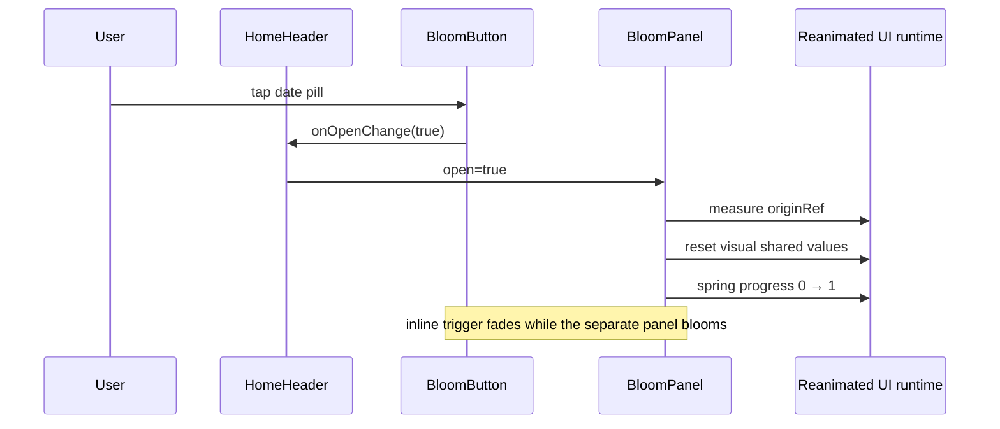
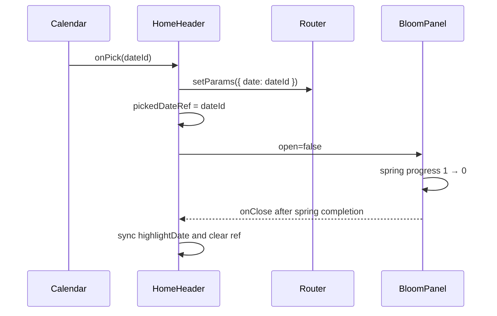

# Calendar bloom

> The filename is retained for existing links. The active calendar no longer
> uses `MorphOverlay`; it uses the reusable `BloomButton` / `BloomPanel`
> measure-and-morph system.

## Active files

| File | Responsibility |
|------|----------------|
| `src/components/HomeHeader.tsx` | Owns calendar open state, route navigation, and the deferred highlight sync |
| `src/components/BloomButton.tsx` | Keeps the trigger inline, measures it, and delegates the panel |
| `src/components/BloomPanel.tsx` | Portals, measures, animates, blurs, handles back, and reports close completion |
| `src/components/CalendarOverlay.tsx` | Renders calendar content and reports a picked ISO date |
| `src/components/BlurTargetViewContext.tsx` | Supplies the Android blur target ref |
| `src/app/_layout.tsx` | Mounts the root `bloom` portal host and blur target |

`src/components/MorphOverlay.tsx` is an unreferenced legacy implementation. It
is not part of the runtime calendar path.

## Ownership and contract

`HomeHeader` controls the interaction:

```text
calendarOpen
  false → date pill is interactive, panel is closed
  true  → panel is open, date pill ignores pointer events
```

`BloomButton` receives:

- `open` and `onOpenChange` for controlled visibility;
- the inline date-pill children;
- `panelNode={<CalendarOverlay ... />}`;
- `variant="fullscreen"`;
- `onClose`, which fires on RN/JS only after the close spring finishes.

The trigger never moves into the portal. This is an important coordinate-space
invariant: a node transformed in the root portal must not be reparented into
the header's flex layout, or the old transform can produce a visible jump at
the end of close. `BloomPanel` renders a separate absolute panel that starts
at the trigger's measured window frame.

## Open sequence



On the first closed render, `previousOpenRef` records the state without
starting a close animation. This transition guard is required under
`StrictMode`, where mount effects are replayed in development.

Fullscreen layout is measured from the window and safe-area insets. The panel
animates:

- position from the trigger's window coordinates to the fullscreen inset;
- size from the trigger frame to the fullscreen panel frame;
- border radius and backdrop/blur from the compact control to the calendar;
- content opacity/scale after the panel has visibly taken over.

Animations and measurements remain on the UI thread. Shared values use
`.get()` / `.set()` for React Compiler compatibility.

## Picking a date and closing

Calendar selection deliberately separates three moments:

1. `HomeHeader.handleDayPress` updates the route immediately.
2. It stores the picked date in a ref and sets `calendarOpen` to `false`.
3. After the close spring, `handleClosed` copies the ref into
   `highlightDate`.

The route changes first so the destination day is visible behind the shrinking
panel. The calendar highlight is deferred because changing it during the close
would re-render the calendar content and make the active-day pill pop while
the panel is moving.



## Safe UI→RN completion

Reanimated spring callbacks run on the UI runtime. They must not receive a
render-local callback as a serialized `scheduleOnRN` argument. `BloomPanel`
instead increments a primitive completion sequence on the UI thread:

```ts
const next = closeSequence.get() + 1;
closeSequence.set(next);
scheduleOnRN(setCloseSequence, next);
```

An RN effect observes the sequence and invokes the latest `onClose` from a ref.
This keeps the external callback out of Worklets serialization while retaining
the post-animation timing contract.

The same rule applies to menu content cross-fades. The outgoing React node is
cleared by passing a stable dispatcher and serializable value:

```ts
scheduleOnRN(setOutgoing, null);
```

Do not introduce patterns such as
`scheduleOnRN(finishClose, onClose)` or
`scheduleOnRN(clearOutgoing, setOutgoing)`. The second function in each example
would be serialized as ordinary data and can fail after React Compiler changes
callback identity or capture shape.

## Blur behavior

The app root is wrapped in `BlurTargetView`. `BloomPanel` reads that ref and
adds `blurTarget` plus `blurMethod="dimezisBlurViewSdk31Plus"` only on Android.
Expo SDK 57 documents those props as Android-only. iOS uses the native
`BlurView` path without a target prop, avoiding the deprecated
`findNodeHandle` lookup that StrictMode reports.

## Back and dismissal behavior

- Backdrop press requests `onOpenChange(false)`.
- Android hardware back is subscribed only while open and requests the same
  controlled close.
- The panel stays mounted through the close spring.
- `onClose` runs only after a finished close, so post-close state never changes
  the calendar midway through animation.

## Legacy `MorphOverlay`

`MorphOverlay.tsx` has no callsite under `src/`. It still contains a
function-valued Worklets close bridge and must not be wired into active UI in
its current form. Either remove it in a dedicated cleanup or first migrate its
completion signaling to the primitive-sequence pattern above.

## Validation

Automated gates cover type safety, formatting, Oxlint React Compiler rules, and
production transformation. Native acceptance still requires the calendar row
in [`qa/react-compiler-closure.md`](./qa/react-compiler-closure.md):

- repeatedly open and close;
- choose dates in both directions;
- dismiss with backdrop and Android hardware back;
- confirm no `findNodeHandle`, Worklets, render-write, or unmounted-update logs.
