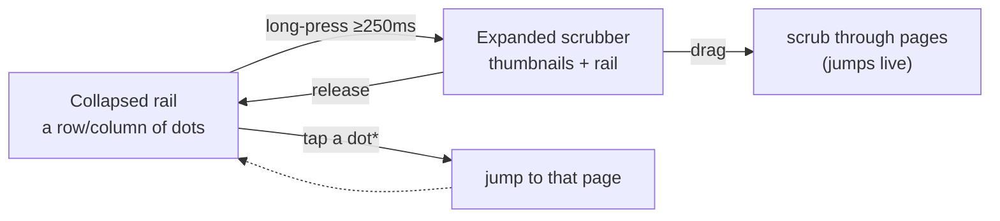
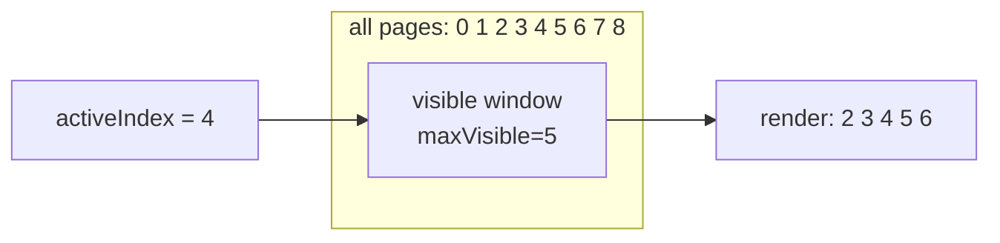

# Feature 3 — Scroll indicator

This document covers the **scroll indicator**: a compact rail of dots that tracks
the current scroll position and lets the user jump to a specific page. It is a
reusable component used in **two orientations**:

- **Horizontal** — at the bottom of an expanded `Stack`, to page between an
  entry's artefacts (see [Feature 1](./01-stack-expand-collapse.md)).
- **Vertical** — on the right edge of the `DayPager`, to page between days.

It also supports a **long-press scrubber**: holding the rail expands it into a
larger control showing thumbnail previews of nearby pages, and dragging on it
scrubs through pages in real time.

## Files involved

| File | Role |
|------|------|
| `src/components/ScrollIndicator.tsx` | The indicator itself: dots rail, sliding window, long-press/pan scrubber, preview thumbnails. |
| `src/components/DayPager.tsx` | Vertical pager of days; hosts a vertical `ScrollIndicator` and supplies `EntryPreview` thumbnails. |
| `src/components/Stack.tsx` | Expanded stack; hosts a horizontal `ScrollIndicator` and supplies `ArtefactPreview` thumbnails (see [Feature 1](./01-stack-expand-collapse.md)). |

## What it does



\* Tap-to-jump on a dot is implicit via the expanded scrubber's preview/pan
mapping; the collapsed rail is primarily a visual progress indicator, while the
expanded scrubber is the interactive jump surface.

Visually, each dot is a small circle; the dot nearest the current page grows
into a rounded **pill** that stretches along the major axis (horizontally for a
horizontal rail, vertically for a vertical one) as it becomes active. This gives
a smooth "the active dot is stretching toward you" feel that tracks fractional
scroll position continuously.

```
Horizontal rail (3 pages, page 1 active):

   ●       ▬▬▬▬       ●
  page0   page1      page2
 (small) (active pill) (small)

Expanded scrubber (horizontal, long-pressed):

  ┌──────────────────────────────────────────┐
  │ [thumb0] [thumb1] [thumb2] [thumb3] [thumb4] ●  ●▬▬●  ●  ●  │
  └──────────────────────────────────────────┘
   <-- previews (sliding window) -->          <-- rail -->
```

## Concepts

### The `active` metric

Everything visual is driven by how "close" a given index is to the current
(fractional) page:

```ts
const active = 1 - Math.min(1, Math.abs(currentPage.value - index));
```

- `currentPage` is a `SharedValue<number>` supplied by the host (`Stack` or
  `DayPager`) and represents the *fractional* page index (e.g. `1.4`).
- `|currentPage - index|` is the distance in pages; `Math.min(1, …)` caps it at
  one page; `1 - …` flips it so the **current** page has `active = 1` and a page
  one-or-more away has `active = 0`.
- Intermediate values (e.g. `0.6`) arise while swiping between pages, which is
  why the dots and pills animate *continuously* as you scroll.

`active` is computed inside `useAnimatedStyle` worklets, so it updates at 60fps
on the UI thread with no JS involvement.

### The sliding window

If an entry has many artefacts (or there are many days), rendering a dot for
every page would be wasteful and visually crowded. `useVisibleIndices` computes
a **sliding window** of at most `maxVisible` (default 5) indices centred on the
active page:



### Long-press + pan scrubber

The expanded scrubber is driven by two simultaneous gestures:

- **`Gesture.LongPress()`** — `minDuration(250)` (hold for 250ms) with a generous
  `maxDistance(1000)` so a slight finger shift doesn't cancel it. On start it
  springs the expanded UI in; on finalize (release/cancel) it springs it out.
- **`Gesture.Pan()`** — active simultaneously (via `Gesture.Simultaneous`).
  While expanded (`expandedProgress > 0.5`), drag translation is mapped to an
  index delta using the measured rail size, and the host's `onJumpToIndex` is
  called as the finger crosses each item boundary.

## `ScrollIndicator.tsx` — segment-by-segment

### Segment 1 — Imports (lines 1–17)

```tsx
import { Image } from "expo-image";
import { ReactNode, useCallback, useMemo, useState } from "react";
import { Text, View } from "react-native";
import { Gesture, GestureDetector } from "react-native-gesture-handler";
import Animated, {
  interpolate,
  SharedValue,
  useAnimatedReaction,
  useAnimatedStyle,
  useSharedValue,
  withSpring,
  withTiming,
} from "react-native-reanimated";
import { scheduleOnRN } from "react-native-worklets";
import { withUniwind } from "uniwind";

import type { Entry } from "../data/entries";

const StyledImage = withUniwind(Image);
```

- `Gesture` / `GestureDetector` from `react-native-gesture-handler` build the
  long-press + pan composition.
- `useAnimatedReaction` watches the fractional `currentPage` and bridges integer
  changes back to React state (to update the sliding window).
- `scheduleOnRN` bridges worklet callbacks (gesture handlers, reactions) back to
  the JS thread to call React state setters / the host's jump callback.
- `StyledImage = withUniwind(Image)` is used by the `ArtefactPreview` thumbnail.

### Segment 2 — Types (lines 21–37)

```tsx
type ScrollIndicatorOrientation = "vertical" | "horizontal";

type ScrollIndicatorProps = {
  orientation: ScrollIndicatorOrientation;
  count: number;
  currentPage: SharedValue<number>;
  maxVisible?: number;
  className?: string;
  renderPreview: (index: number) => ReactNode;
  onJumpToIndex: (index: number) => void;
};

type IndicatorItemProps = {
  orientation: ScrollIndicatorOrientation;
  index: number;
  currentPage: SharedValue<number>;
};
```

- **`orientation`** — drives layout direction and which axis the active pill
  stretches along.
- **`count`** — total number of pages.
- **`currentPage`** — the fractional page `SharedValue` from the host.
- **`maxVisible`** — sliding-window size (default 5).
- **`renderPreview`** — host-supplied thumbnail factory; called per visible
  index when the scrubber is expanded.
- **`onJumpToIndex`** — host callback to scroll to a given index (imperative).

### Segment 3 — `clampIndex` helper (line 39)

```tsx
const clampIndex = (index: number, count: number) => Math.max(0, Math.min(count - 1, index));
```

Clamps an index into `[0, count - 1]`. Used by `jumpToIndex` and the pan handler
so out-of-range deltas (from dragging past the ends) are pinned.

### Segment 4 — `IndicatorItem` (the dot) (lines 41–82)

```tsx
const IndicatorItem = ({ orientation, index, currentPage }: IndicatorItemProps) => {
  const inactiveStyle = useAnimatedStyle(() => {
    const active = 1 - Math.min(1, Math.abs(currentPage.value - index));

    return {
      opacity: interpolate(active, [0, 1], [1, 0]),
      transform: [{ scale: interpolate(active, [0, 1], [1, 0.65]) }],
    };
  });

  const activeStyle = useAnimatedStyle(() => {
    const active = 1 - Math.min(1, Math.abs(currentPage.value - index));
    const majorScale = interpolate(active, [0, 1], [0.25, 1]);

    return {
      opacity: active,
      transform:
        orientation === "vertical"
          ? [{ scaleY: majorScale }, { scaleX: interpolate(active, [0, 1], [0.75, 1]) }]
          : [{ scaleX: majorScale }, { scaleY: interpolate(active, [0, 1], [0.75, 1]) }],
    };
  });

  return (
    <View
      className={
        orientation === "vertical"
          ? "h-5 w-4 items-center justify-center"
          : "h-4 w-5 items-center justify-center"
      }
    >
      <Animated.View style={inactiveStyle} className="h-1.5 w-1.5 rounded-full bg-icon" />
      <Animated.View
        style={activeStyle}
        className="absolute rounded-full bg-secondary"
        pointerEvents="none"
      >
        <View className={orientation === "vertical" ? "h-4 w-1.5" : "h-1.5 w-4"} />
      </Animated.View>
    </View>
  );
};
```

Each `IndicatorItem` is two layered `Animated.View`s in a fixed-size slot:

- **`inactiveStyle`** — the static grey dot (`bg-icon`, 6×6px). As `active`
  rises, it fades `1 → 0` and shrinks `1 → 0.65`. So when a page becomes active,
  its grey dot fades out to make room for the pill.
- **`activeStyle`** — the coloured pill (`bg-secondary`), absolutely positioned
  over the dot. As `active` rises:
  - `opacity` goes `0 → 1` (it's literally `active`).
  - The **major axis** scale goes `0.25 → 1`: horizontally the pill stretches
    wide (`scaleX`), vertically it stretches tall (`scaleY`). This is the
    "stretching toward you" effect.
  - The **minor axis** scale goes `0.75 → 1`, so the pill also thickens slightly
    as it becomes active.
- The pill contains a sizing `View` (`h-1.5 w-4` horizontal or `h-4 w-1.5`
  vertical) that gives the `Animated.View` an intrinsic size to scale *from*;
  without it the absolutely-positioned pill would have zero size and the scale
  would be invisible. `pointerEvents="none"` ensures the pill never intercepts
  touches (the `GestureDetector` on the parent handles all interaction).

Because both styles read `currentPage.value` inside `useAnimatedStyle`, the
dot↔pill cross-fade and stretch animate continuously as the user swipes — on the
UI thread, no JS.

### Segment 5 — `PreviewSlot` (thumbnail wrapper) (lines 84–101)

```tsx
type PreviewSlotProps = {
  index: number;
  currentPage: SharedValue<number>;
  children: ReactNode;
};

const PreviewSlot = ({ index, currentPage, children }: PreviewSlotProps) => {
  const style = useAnimatedStyle(() => {
    const active = 1 - Math.min(1, Math.abs(currentPage.value - index));

    return {
      opacity: interpolate(active, [0, 1], [0.65, 1]),
      transform: [{ scale: interpolate(active, [0, 1], [0.92, 1]) }],
    };
  });

  return <Animated.View style={style}>{children}</Animated.View>;
};
```

A wrapper for each thumbnail in the expanded scrubber. The thumbnail nearest the
current page is fully opaque and at full scale; neighbours dim to `0.65` and
shrink to `0.92`. This makes the active thumbnail "pop" within the row.

### Segment 6 — `useVisibleIndices` (sliding window) (lines 103–110)

```tsx
const useVisibleIndices = (count: number, maxVisible: number, activeIndex: number) =>
  useMemo(() => {
    const visibleCount = Math.min(count, maxVisible);
    const halfWindow = Math.floor(visibleCount / 2);
    const start = Math.min(Math.max(activeIndex - halfWindow, 0), count - visibleCount);

    return Array.from({ length: visibleCount }, (_, index) => start + index);
  }, [activeIndex, count, maxVisible]);
```

- **`visibleCount`** — never more than `maxVisible`, and never more than `count`.
- **`halfWindow`** — how many slots to put on each side of the active index.
- **`start`** — the first visible index. It tries to centre the window on
  `activeIndex` (`activeIndex - halfWindow`), but is clamped so:
  - near the **start** (`activeIndex - halfWindow < 0`), the window pins to `0`;
  - near the **end** (`activeIndex - halfWindow > count - visibleCount`), the
    window pins so its last index is `count - 1`.
- Returns the array of visible indices, e.g. `[2, 3, 4, 5, 6]`.

This is a `useMemo` on the **JS-thread** `activeIndex` state (not the shared
value), so the window only recomputes when the active *integer* page changes —
not on every scroll frame. That keeps the visible-children array stable during a
swipe until you actually cross a page boundary.

### Segment 7 — `ScrollIndicator` body: state & reaction (lines 112–137)

```tsx
export const ScrollIndicator = ({
  orientation, count, currentPage, maxVisible = 5, className, renderPreview, onJumpToIndex,
}: ScrollIndicatorProps) => {
  const [activeIndex, setActiveIndex] = useState(0);
  const [expanded, setExpanded] = useState(false);
  const expandedProgress = useSharedValue(0);
  const lastJumpIndex = useSharedValue(-1);
  const railSizeSV = useSharedValue(1);
  const panStartIndex = useSharedValue(0);
  const visibleIndices = useVisibleIndices(count, maxVisible, activeIndex);

  useAnimatedReaction(
    () => Math.max(0, Math.min(count - 1, Math.round(currentPage.value))),
    (next, previous) => {
      if (next !== previous) {
        scheduleOnRN(setActiveIndex, next);
      }
    },
    [count],
  );
```

State and shared values:

- **`activeIndex`** (React state) — the integer page used by `useVisibleIndices`.
  Kept in sync with the worklet `currentPage` via the reaction below.
- **`expanded`** (React state) — whether the scrubber UI is shown. Flipped from
  worklet callbacks via `scheduleOnRN`.
- **`expandedProgress`** — shared value `0 → 1` for the expand/collapse spring of
  the scrubber.
- **`lastJumpIndex`** — shared value remembering the last index we jumped to,
  used to avoid duplicate jumps while panning (only fire when the index actually
  changes).
- **`railSizeSV`** — measured length of the rail (px), set on `onLayout`; used
  to map pan translation → index delta.
- **`panStartIndex`** — the page index when the pan began, so the delta is
  relative to where the drag started.

The **`useAnimatedReaction`** is the bridge from UI thread to JS:

- The first function (runs on the UI thread) computes the clamped, rounded
  current page.
- The second function runs when that value changes; if it actually changed
  (`next !== previous`), it bridges to JS via `scheduleOnRN(setActiveIndex, next)`.
- This means `activeIndex` (and thus the sliding window) updates **only** when
  you cross an integer page boundary — not every frame. Without this, the window
  would thrash mid-swipe.

### Segment 8 — `jumpToIndex` (lines 139–144)

```tsx
const jumpToIndex = useCallback(
  (index: number) => {
    onJumpToIndex(clampIndex(index, count));
  },
  [count, onJumpToIndex],
);
```

A thin, memoised wrapper that clamps the index and forwards to the host's
`onJumpToIndex` (which imperatively scrolls the pager).

### Segment 9 — Long-press gesture (lines 146–157)

```tsx
const longPress = Gesture.LongPress()
  .minDuration(250)
  .maxDistance(1000)
  .onStart(() => {
    expandedProgress.value = withSpring(1);
    scheduleOnRN(setExpanded, true);
  })
  .onFinalize(() => {
    expandedProgress.value = withTiming(0);
    lastJumpIndex.value = -1;
    scheduleOnRN(setExpanded, false);
  });
```

- **`minDuration(250)`** — must hold for 250ms before the scrubber expands.
- **`maxDistance(1000)`** — allow up to 1000px of movement during the hold so a
  natural finger wobble doesn't cancel the long-press (we want the subsequent pan
  to take over).
- **`onStart`** — spring `expandedProgress` to `1` and flip `expanded` to `true`
  (so the thumbnail row mounts).
- **`onFinalize`** — when the gesture ends (release or cancellation), timing
  `expandedProgress` to `0`, reset `lastJumpIndex`, and set `expanded` to `false`.
  `withTiming` (not spring) gives a quick, clean collapse.

### Segment 10 — Pan gesture (lines 159–176)

```tsx
const pan = Gesture.Pan()
  .onBegin(() => {
    panStartIndex.value = Math.max(0, Math.min(count - 1, Math.round(currentPage.value)));
    lastJumpIndex.value = panStartIndex.value;
  })
  .onUpdate((event) => {
    if (expandedProgress.value <= 0.5) {
      return;
    }
    const itemSize = railSizeSV.value / count;
    const delta = orientation === "vertical" ? event.translationY : event.translationX;
    const indexDelta = itemSize > 0 ? Math.round(delta / itemSize) : 0;
    const nextIndex = Math.max(0, Math.min(count - 1, panStartIndex.value + indexDelta));
    if (nextIndex !== lastJumpIndex.value) {
      lastJumpIndex.value = nextIndex;
      scheduleOnRN(jumpToIndex, nextIndex);
    }
  });
```

- **`onBegin`** — capture the starting page (clamped) and seed `lastJumpIndex`
  so the first delta is relative to the current page.
- **`onUpdate`** — ignored unless the scrubber is at least half expanded
  (`expandedProgress > 0.5`), so a stray pan before the long-press completes does
  nothing.
  - **`itemSize = railSizeSV.value / count`** — the pixels-per-page on the rail
    (the rail represents all `count` pages evenly).
  - **`delta`** — pick the translation along the major axis (`translationY` for
    vertical, `translationX` for horizontal).
  - **`indexDelta = Math.round(delta / itemSize)`** — convert pixels dragged into
    pages crossed.
  - **`nextIndex`** — `panStartIndex + indexDelta`, clamped to `[0, count - 1]`.
  - Only call `jumpToIndex` when `nextIndex` differs from `lastJumpIndex`, so we
    don't fire redundant jumps for the same page. `scheduleOnRN(jumpToIndex,
    nextIndex)` bridges to JS.

### Segment 11 — Expanded style (lines 178–181)

```tsx
const expandedStyle = useAnimatedStyle(() => ({
  opacity: expandedProgress.value,
  transform: [{ scale: interpolate(expandedProgress.value, [0, 1], [0.96, 1]) }],
}));
```

The expanded scrubber container fades in (`0 → 1`) and scales up
(`0.96 → 1`) as `expandedProgress` animates, giving the expand a soft bloom.

### Segment 12 — Early return & the rail (lines 183–211)

```tsx
if (count <= 1) {
  return null;
}

const rail = (
  <View
    className={
      orientation === "vertical"
        ? "items-center gap-1 px-1.5 py-2"
        : "flex-row items-center gap-1 px-2 py-1.5"
    }
    onLayout={(e) => {
      const next =
        orientation === "vertical" ? e.nativeEvent.layout.height : e.nativeEvent.layout.width;
      if (next > 0) {
        railSizeSV.value = next;
      }
    }}
  >
    {visibleIndices.map((index) => (
      <IndicatorItem
        key={index}
        orientation={orientation}
        index={index}
        currentPage={currentPage}
      />
    ))}
  </View>
);
```

- **`count <= 1`** → render nothing (no indicator for a single page).
- **`rail`** — a `View` laid out as a column (vertical) or row (horizontal) of
  `IndicatorItem`s, one per visible index. Its `onLayout` measures the rail's
  major-axis length and stores it in `railSizeSV` (used by the pan handler to
  map pixels → pages). Only writes when `next > 0` to avoid a transient zero.

### Segment 13 — The previews row (lines 213–221)

```tsx
const previews = (
  <View className={orientation === "vertical" ? "gap-2" : "flex-row gap-2"}>
    {visibleIndices.map((index) => (
      <PreviewSlot key={index} index={index} currentPage={currentPage}>
        {renderPreview(index)}
      </PreviewSlot>
    ))}
  </View>
);
```

A row/column of `PreviewSlot`s, each wrapping a host-supplied thumbnail
(`renderPreview(index)`). It maps over the *same* `visibleIndices` as the rail,
so thumbnails and dots stay aligned. (For vertical, note both branches of the
ternary in the render below currently render `previews` then `rail`; the
orientation only changes the flex direction via the className above.)

### Segment 14 — Render & gesture composition (lines 223–254)

```tsx
return (
  <GestureDetector gesture={Gesture.Simultaneous(longPress, pan)}>
    <Animated.View className={className}>
      {expanded ? (
        <Animated.View
          style={expandedStyle}
          className={
            orientation === "vertical"
              ? "flex-row items-center gap-3 rounded-4xl border border-controls-border bg-controls-background p-3"
              : "items-center gap-2 rounded-4xl border border-controls-border bg-controls-background p-3"
          }
        >
          {orientation === "vertical" ? (
            <>
              {previews}
              {rail}
            </>
          ) : (
            <>
              {previews}
              {rail}
            </>
          )}
        </Animated.View>
      ) : (
        <View className="rounded-4xl border border-controls-border bg-controls-background">
          {rail}
        </View>
      )}
    </Animated.View>
  </GestureDetector>
);
```

- **`Gesture.Simultaneous(longPress, pan)`** — the two gestures run at the same
  time: long-press to expand, pan to scrub. Without `Simultaneous`, the pan would
  cancel the long-press (and vice versa).
- **Collapsed** — just the `rail` in a bordered pill (`rounded-4xl`).
- **Expanded** — the `previews` row + the `rail` inside a larger bordered pill,
  faded/scaled in by `expandedStyle`. (Both orientation branches currently render
  `previews` then `rail`; the visual difference comes from the flex-direction
  classes inside `previews`/`rail`.)
- The outer `Animated.View` carries the host-supplied `className` for absolute
  positioning (e.g. the `DayPager`'s `absolute top-1/2 right-3 -translate-y-1/2`).

### Segment 15 — `EntryPreview` (lines 257–283)

```tsx
type EntryPreviewProps = {
  entry: Entry;
};

export const EntryPreview = ({ entry }: EntryPreviewProps) => {
  const visibleArtefacts = entry.artefacts.slice(0, 3);

  return (
    <View
      className={entry.type === "paper" ? "aspect-a4 h-20" : "aspect-print h-20"}
      pointerEvents="none"
    >
      {visibleArtefacts.map((_, index) => (
        <View
          key={index}
          className="absolute inset-0"
          style={{
            transform: [{ translateX: index * 3 }, { translateY: index * 2 }],
            zIndex: visibleArtefacts.length - index,
          }}
        >
          <ArtefactPreview entry={entry} index={index} />
        </View>
      ))}
    </View>
  );
};
```

A **day thumbnail** used by the `DayPager`'s vertical indicator. It renders a
miniature stack of up to 3 artefacts (the same "deck" metaphor as the collapsed
`Stack`, but tiny): each `ArtefactPreview` is absolutely positioned with a small
`(3px, 2px)` diagonal offset and a descending `zIndex`, so they fan out behind
the front card. `pointerEvents="none"` keeps the thumbnail non-interactive.

### Segment 16 — `ArtefactPreview` (lines 285–329)

```tsx
type ArtefactPreviewProps = {
  entry: Entry;
  index: number;
};

export const ArtefactPreview = ({ entry, index }: ArtefactPreviewProps) => {
  if (entry.type === "print") {
    const artefact = entry.artefacts[index];

    return (
      <View
        className="aspect-print h-20 items-center gap-0.5 overflow-hidden border border-controls-border bg-paper pt-1.5 shadow-sm"
        pointerEvents="none"
      >
        <StyledImage
          className="aspect-print-image w-[80%]"
          source={artefact.img}
          contentFit="cover"
          cachePolicy="memory-disk"
          transition={0}
        />
        <Text className="font-paper text-primary" numberOfLines={1} style={{ fontSize: 6 }}>
          {artefact.text}
        </Text>
      </View>
    );
  }

  const artefact = entry.artefacts[index];

  return (
    <View
      className="aspect-a4 h-20 overflow-hidden border border-controls-border bg-paper p-1.5 shadow-sm"
      pointerEvents="none"
    >
      <Text
        className="font-paper text-primary"
        numberOfLines={9}
        style={{ fontSize: 6, lineHeight: 8 }}
      >
        {artefact.text}
      </Text>
    </View>
  );
};
```

A **single-artefact thumbnail** used both by `EntryPreview` (for day thumbnails)
and directly by the `Stack`'s horizontal indicator (`renderPreview`). It branches
on `entry.type`:

- **Print** — a small `aspect-print` card with the image at 80% width
  (`aspect-print-image`, `contentFit="cover"`, memory-disk cached, no transition)
  and a 6pt single-line caption.
- **Paper** — a small `aspect-a4` card with up to 9 lines of 6pt/8pt-leading text.

Both are `h-20` (80px) tall, bordered, soft-shadowed, and `pointerEvents="none"`.
The tiny font sizes (6pt) are intentional — these are *thumbnails*, so the text
reads as texture rather than legible content, echoing the real card.

## `DayPager.tsx` — the vertical host

`DayPager` is the vertical pager of days and the host for the vertical
`ScrollIndicator`. It is documented in full here because it is the primary
consumer of the indicator's vertical orientation and supplies `EntryPreview`.

### Segment D1 — Imports & cached height (lines 1–22)

```tsx
import { useCallback, useState } from "react";
import { ScrollView, View, useWindowDimensions } from "react-native";
import Animated, {
  useAnimatedRef,
  useAnimatedScrollHandler,
  useDerivedValue,
  useSharedValue,
} from "react-native-reanimated";
import { useSafeAreaInsets } from "react-native-safe-area-context";

import type { Entry } from "../data/entries";

import { EntryPreview, ScrollIndicator } from "./ScrollIndicator";
import Stack from "./Stack";

type DayPagerProps = {
  entries: Entry[];
};

// Pager height is stable across navigations, so cache it to let the ScrollView
// render in the first commit on subsequent visits (avoids a late mount pop).
let cachedPagerHeight = 0;
```

- The pager is a vertical `ScrollView` (one page = one day). `EntryPreview` and
  `ScrollIndicator` are imported from the same file.
- **`cachedPagerHeight`** — a **module-level** cache of the pager height. Because
  the pager height is stable across date navigations, caching it lets the
  `ScrollView` render on the first commit when returning to the screen, avoiding
  a "pop" where content mounts a frame late.

### Segment D2 — Height computation (lines 24–33)

```tsx
const DayPager = ({ entries }: DayPagerProps) => {
  const scrollRef = useAnimatedRef<ScrollView>();
  const insets = useSafeAreaInsets();
  const window = useWindowDimensions();
  // Safe-area insets are known from the first render but applied to the native
  // screen one layout pass later, so the measured container height transiently
  // overshoots by the inset total. Compute the stable height from window + insets
  // and clamp the measurement to it to avoid the reflow.
  const computedHeight = Math.max(0, window.height - insets.top - insets.bottom);
  const [pagerHeight, setPagerHeight] = useState(cachedPagerHeight || computedHeight);
  const scrollOffset = useSharedValue(0);
```

The comment explains a subtle RN ordering issue: safe-area insets are known to JS
immediately but applied to the native screen one layout pass later, so a
*measured* container height can transiently overshoot by the inset total. The
fix is to compute the stable height arithmetically
(`window.height - insets.top - insets.bottom`) and use it as the initial state
(falling back to the cache), then clamp any later measurement to it.

### Segment D3 — Scroll handler & derived page (lines 36–46)

```tsx
const onScroll = useAnimatedScrollHandler((event) => {
  scrollOffset.value = event.contentOffset.y;
});

const currentPage = useDerivedValue(() => {
  if (pagerHeight === 0) {
    return 0;
  }

  return scrollOffset.value / pagerHeight;
}, [pagerHeight]);
```

- `onScroll` writes the vertical scroll offset into `scrollOffset`.
- `currentPage` is `scrollOffset / pagerHeight` — the fractional day index. It
  guards `pagerHeight === 0` to avoid `NaN` before layout. The `[pagerHeight]`
  dependency ensures the derived value re-binds when the height changes.

### Segment D4 — Jump to entry (lines 48–58)

```tsx
const jumpToEntry = useCallback(
  (index: number) => {
    if (pagerHeight === 0) {
      return;
    }

    scrollRef.current?.scrollTo({ x: 0, y: index * pagerHeight, animated: false });
    scrollOffset.value = index * pagerHeight;
  },
  [pagerHeight, scrollOffset, scrollRef],
);
```

The host's `onJumpToIndex`: imperatively scroll to `index * pagerHeight` (no
animation, so the scrubber feels instantaneous) and sync the shared value so
`currentPage` is correct on the next frame. Memoised for stable indicator deps.

### Segment D5 — Render (lines 60–107)

```tsx
return (
  <View className="relative flex-1">
    <View
      className="flex-1"
      onLayout={(event) => {
        const h = event.nativeEvent.layout.height;
        const finalH = Math.min(h, computedHeight);
        if (finalH > 0 && finalH !== pagerHeight) {
          setPagerHeight(finalH);
          cachedPagerHeight = finalH;
        }
      }}
    >
      {pagerHeight > 0 && (
        <Animated.ScrollView
          ref={scrollRef}
          pagingEnabled
          showsVerticalScrollIndicator={false}
          scrollEventThrottle={16}
          removeClippedSubviews
          onScroll={onScroll}
          style={{ height: pagerHeight }}
        >
          {entries.map((entry, index) => (
            <View
              key={index}
              style={{ height: pagerHeight }}
              className="items-center justify-center px-5"
            >
              <Stack entry={entry} />
            </View>
          ))}
        </Animated.ScrollView>
      )}
    </View>
    {pagerHeight > 0 && (
      <ScrollIndicator
        orientation="vertical"
        count={entries.length}
        currentPage={currentPage}
        maxVisible={5}
        onJumpToIndex={jumpToEntry}
        renderPreview={(index) => <EntryPreview entry={entries[index]} />}
        className="absolute top-1/2 right-3 z-40 -translate-y-1/2"
      />
    )}
  </View>
);
```

- The outer `View` is `relative flex-1`; the inner `View` measures its height on
  layout and (clamped to `computedHeight`) stores it in `pagerHeight` and the
  module cache.
- Once `pagerHeight > 0`, the `Animated.ScrollView` renders:
  - `pagingEnabled` snaps one page per swipe.
  - `removeClippedSubviews` unmounts offscreen pages to save memory.
  - `scrollEventThrottle={16}` ≈ per-frame events.
  - Each day is a full-height `View` centring a `Stack`.
- The **`ScrollIndicator`** is absolutely positioned on the right edge
  (`right-3`), vertically centred (`top-1/2 -translate-y-1/2`), at `z-40`. It
  receives the fractional `currentPage`, the entry count, `jumpToEntry`, and a
  `renderPreview` that returns an `EntryPreview` for the day at that index.

## How the host and indicator cooperate

```mermaid
sequenceDiagram
    participant U as User
    participant H as Host (Stack / DayPager)
    participant SV as currentPage SharedValue (UI)
    participant SI as ScrollIndicator
    participant R as useAnimatedReaction

    U->>H: swipe the pager
    H->>SV: scrollOffset updates
    SV->>SV: currentPage = offset / pageWidth
    SV->>SI: IndicatorItem/PreviewSlot styles recompute (UI, 60fps)
    SV->>R: rounded(currentPage) changes
    R->>SI: scheduleOnRN(setActiveIndex, n)
    SI->>SI: useVisibleIndices recomputes (JS, only on page crossing)

    U->>SI: long-press rail
    SI->>SI: expandedProgress → 1; setExpanded(true)
    U->>SI: drag
    SI->>SI: pan maps translation → indexDelta
    SI->>H: scheduleOnRN(jumpToIndex, n)
    H->>H: scrollTo(n * pageWidth); sync shared value
    SV->>SI: currentPage updates → dots/thumbnails animate
```

The key cooperation points:

1. The **host owns the pager and the fractional `currentPage`**; the indicator is
   a pure consumer of that shared value (it never reads the `ScrollView` directly).
2. The **indicator bridges integer page changes back to JS** via
   `useAnimatedReaction` + `scheduleOnRN(setActiveIndex)`, only on boundary
   crossings, to update the sliding window.
3. When the user **scrubs**, the indicator calls the host's `onJumpToIndex`, which
   imperatively scrolls and syncs the shared value — closing the loop so the dots
   animate to the new position.

## Edge cases & design decisions

- **`count <= 1` returns `null`.** A single-page pager has nothing to indicate,
   so the component renders nothing rather than a lone, motionless dot.
- **Sliding window via JS state, not the shared value.** `useVisibleIndices`
  depends on the React `activeIndex` state, updated only on integer page
  crossings by `useAnimatedReaction`. This avoids re-laying-out the dot row on
  every scroll frame (which would be expensive and jittery) while still keeping
  the window centred on the current page.
- **`useAnimatedReaction` guards `next !== previous`.** Without it, the reaction
  would call `scheduleOnRN(setActiveIndex)` on every frame the worklet re-runs
  (even if the rounded value is unchanged), spamming the JS thread and causing
  needless renders.
- **Two layered views per dot.** The inactive grey dot and the active coloured
  pill are *separate* `Animated.View`s that cross-fade. This is simpler and
  cheaper than morphing one view between two shapes, and the pill's inner sizing
  `View` gives the scale transform a real size to act on.
- **Major-axis stretch.** `majorScale` (`0.25 → 1`) applied to the major axis is
  what produces the "active dot stretches into a pill" look; the minor-axis
  scale (`0.75 → 1`) adds a subtle thicken. Orientation picks which axis is
  "major".
- **`Gesture.Simultaneous(longPress, pan)`.** Long-press and pan must coexist:
  the press expands the scrubber, and the immediately-following drag scrubs.
  `Simultaneous` prevents either gesture from cancelling the other. The pan's
  `expandedProgress > 0.5` guard further ensures dragging only scrubs once the
  scrubber is meaningfully open.
- **`maxDistance(1000)` on the long-press.** A tight long-press would cancel the
  moment the finger moves to pan; the large `maxDistance` lets the pan take over
  smoothly.
- **`lastJumpIndex` dedupe.** The pan handler rounds translation to an index and
  only calls `jumpToIndex` when that index changes, so holding the finger still
  (or sub-page movement) doesn't fire repeated jumps to the same page.
- **`railSizeSV` measured via `onLayout`.** The pan-to-index mapping needs the
  real rail length in pixels; `onLayout` captures it once (and on resize). The
  `next > 0` guard avoids a transient zero measurement.
- **`withSpring` to expand, `withTiming` to collapse.** Expanding blooms
  softly (spring); collapsing snaps back quickly (timing) so the scrubber gets
  out of the way fast when released.
- **Thumbnails are non-interactive.** `EntryPreview`, `ArtefactPreview`, and the
  pill all use `pointerEvents="none"`; all interaction is captured by the
  `GestureDetector` on the indicator root, so touches never get lost to a
  thumbnail.
- **Reused in two orientations.** The same component serves a horizontal rail
  (artefacts in a stack) and a vertical rail (days in the pager) by branching on
  `orientation` for layout direction and the pill's major axis. The host supplies
  orientation-appropriate `renderPreview` and `onJumpToIndex`.
- **`DayPager` cached height & safe-area clamp.** The module-level
  `cachedPagerHeight` and the `Math.min(measured, computedHeight)` clamp avoid a
  transient reflow caused by safe-area insets being applied to the native screen
  a layout pass after they're known to JS — and let the pager render on the first
  commit when revisited.
- **`removeClippedSubviews` on the day pager.** Unmounts offscreen day pages so
  a long history doesn't hold all its (potentially heavy) `Stack`s in memory.
