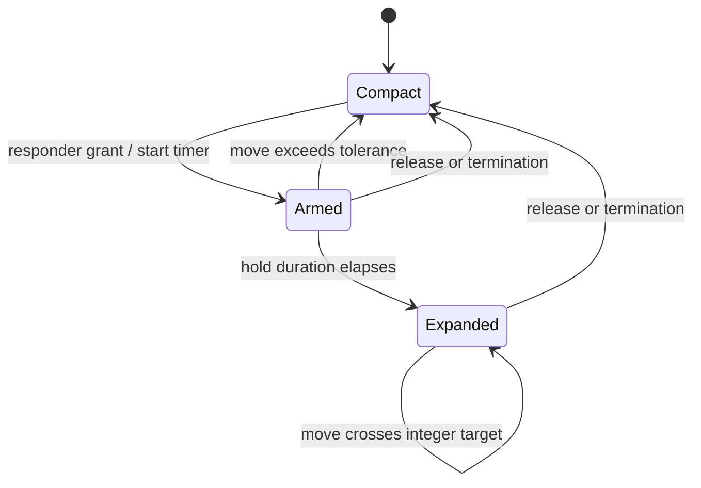

# Scroll indicator and scrubber

`ScrollIndicator` is the same page rail in two host contexts:

| Orientation | Host | Meaning of one index |
|-------------|------|----------------------|
| Vertical | `DayPager` | One day/entry page |
| Horizontal | Expanded `Stack` | One artefact |

The rail is passive during normal paging. A long press expands it into preview
tiles; dragging along its major axis asks the host ScrollView to jump.

## Active files

| File | Responsibility |
|------|----------------|
| `src/components/ScrollIndicator.tsx` | Rail rendering, long-press responder, scrub index calculation, preview components |
| `src/components/DayPager.tsx` | Vertical host, current-page shared value, day preview, imperative jump |
| `src/components/Stack.tsx` | Horizontal host, current-artefact shared value, artefact preview, imperative jump |
| `src/constants/interaction.ts` | Hold duration and movement tolerance |

## Component contract

The host owns paging truth:

- `count` defines the valid integer range.
- `currentPage` is a fractional Reanimated shared value written by the host's
  animated scroll handler.
- `onJumpToIndex(index)` performs the actual ScrollView jump on RN/JS.
- `renderPreview(index)` renders host-specific thumbnail content.

`ScrollIndicator` derives visuals from `currentPage`; it does not mirror the
fractional scroll offset in React state. A UI-thread animated reaction only
publishes a new rounded integer when the active page changes, which updates the
bounded preview window without rendering on every scroll frame.

## Why raw View responders

The current implementation uses React Native's View responder props:

- `onStartShouldSetResponder`
- `onResponderGrant`
- `onResponderMove`
- `onResponderRelease`
- `onResponderTerminate`
- `onResponderTerminationRequest`

It intentionally does not wrap the rail in RNGH `GestureDetector`. Under
`StrictMode`, the RNGH path used `findNodeHandle` on its child and produced a
development redbox at app load. An intermediate `PanResponder.create` approach
also conflicted with strict React Compiler checks around render-time ref access.
Direct responder props avoid both integration problems.

This choice keeps move handling on RN/JS rather than the UI runtime. That is an
appropriate trade-off here: each move does constant arithmetic and emits only
when the integer target changes. Continuous visual scroll and expansion
animation still run through Reanimated on the UI thread.

## Interaction state

React state is limited to values that affect rendering:

```text
activeIndex  rounded host page, used for the sliding window
expanded     compact dots vs preview tiles
```

`sessionRef` stores mutable responder state that should not render:

```text
orientation       latest major axis
panStartIndex     host page when the hold completes
lastJumpIndex     dedupe target for this responder session
railSize          measured major-axis track size
count             latest valid range
onJumpToIndex     latest host callback
longPressTimer    cancelable RN timer
```

Latest props are synchronized into the session in an effect. Event handlers
therefore read current host data without mutating refs during render, which
keeps the component compatible with strict React Compiler diagnostics.

## Long-press sequence



On responder grant, the component:

1. cancels any stale timer;
2. snapshots the rounded host page as `panStartIndex`;
3. resets per-session displacement and dedupe values;
4. starts the long-press timer.

Before expansion, excessive movement cancels the timer so ordinary nearby
scroll gestures are not converted into a scrub. Once expanded, the component
requests responder ownership until release; this prevents the parent pager
from stealing an active scrub.

## Index calculation

For either orientation:

```text
major-axis travel = current pointer - grant pointer
pixels per page   = measured rail length / count
page delta        = round(travel / pixels per page)
target            = clamp(panStartIndex + page delta, 0, count - 1)
```

The rail length uses `max(railSize, 1)` and the divisor uses `max(count, 1)`, so
an early gesture before layout or an empty host cannot divide by zero.

`lastJumpIndex` suppresses repeated move events within one scrub session. It is
reset when the scrub collapses.

## Direct jump delivery

Responder callbacks already execute on RN/JS, so a changed target calls:

```ts
session.onJumpToIndex(nextIndex);
```

There is no `scheduleOnRN` call and no intermediate React state. A previous
implementation stored `pendingJumpIndex` and delivered it from an effect. That
caused an unnecessary render for each crossed page and could drop a valid later
jump when a new session ended on the same integer value—React correctly ignores
equal state updates. Direct delivery avoids both problems.

The host callback may call `scrollTo` or `scrollToOffset`; that imperative work
is intentionally owned by `DayPager` or `Stack`, not the indicator.

## Visual behavior

### Compact rail

Only a bounded sliding window of indices is mounted. The active item stretches
along the rail axis while inactive items remain dots. Opacity and scale derive
from each item's distance to `currentPage`, so normal paging remains smooth
without RN renders.

### Expanded scrubber

The same window becomes preview tiles rendered by the host. A Reanimated shared
value springs between compact and expanded layouts. Vertical and horizontal
styles share one component but differ in:

- flex direction;
- width/height interpolation;
- translate axis;
- active-pill dimension;
- major-axis responder travel.

`EntryPreview` and `ArtefactPreview` are presentation helpers exported from the
same module. The former shows day context; the latter renders paper/print
content for an artefact index.

## Cancellation and cleanup

Every end path clears the timer:

- drift before the hold threshold;
- normal release;
- responder termination;
- a new grant;
- unmount cleanup.

Collapse resets mutable session truth before updating React state, then springs
the expanded progress to zero. This ordering keeps responder decisions correct
even before React commits the compact render.

## Performance implications

- Normal scroll animation stays on the UI thread.
- Long-press recognition uses one RN timer.
- Scrub move work is O(1) and callback delivery is deduped by integer target.
- No React update occurs for fractional pointer movement.
- The preview window bounds mounted content with `maxVisible`.

The RN responder system is less composable than RNGH for simultaneous,
multi-touch, or velocity-driven gestures. The scrubber needs none of those
features. If the interaction becomes more complex, reevaluate RNGH after its
StrictMode `findNodeHandle` path is resolved and preserve the rule that
external callbacks must not be serialized as Worklets data.

## Validation

The vertical and horizontal flows both need current physical-device coverage:

1. long-press until previews appear;
2. scrub rapidly to both ends;
3. release and repeat;
4. return to an index used in a previous session;
5. confirm the host lands on that repeated target;
6. verify ordinary pager scrolling still wins when movement starts before the
   hold threshold;
7. confirm no `findNodeHandle`, "callbacks are not worklets", or
   "Writing to value during render" logs.

Record results in
[`qa/react-compiler-closure.md`](./qa/react-compiler-closure.md).
