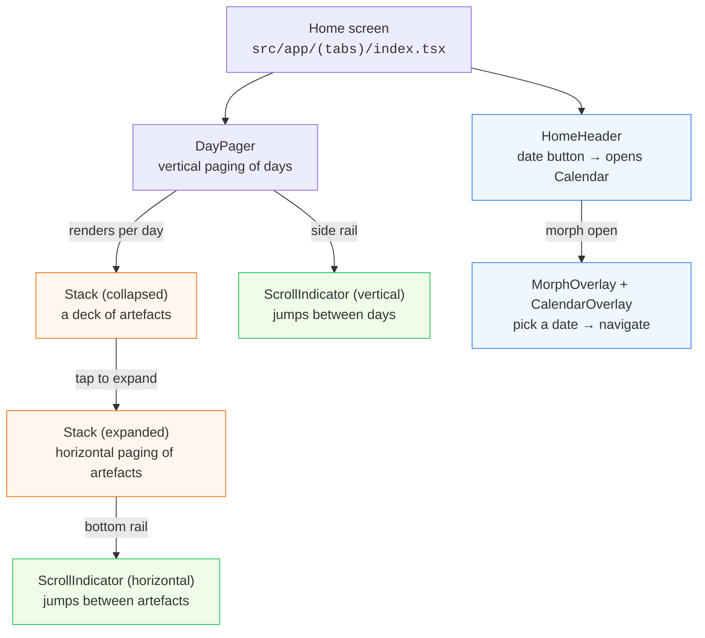

# soies — Feature Documentation

This directory documents three interrelated UI features in the **soies** app
(an Expo / React Native journaling app for "papers" and "prints"):

| # | Feature | Primary file(s) | Doc |
|---|---------|-----------------|-----|
| 1 | **Stack / Entry expand & collapse** | `src/components/Stack.tsx`, `src/components/ArtefactWrapper.tsx` | [01-stack-expand-collapse.md](./01-stack-expand-collapse.md) |
| 2 | **Calendar with a morphing overlay** | `src/components/MorphOverlay.tsx`, `src/components/CalendarOverlay.tsx`, `src/components/HomeHeader.tsx` | [02-calendar-morph-overlay.md](./02-calendar-morph-overlay.md) |
| 3 | **Scroll indicator** | `src/components/ScrollIndicator.tsx`, `src/components/DayPager.tsx` | [03-scroll-indicator.md](./03-scroll-indicator.md) |

Each document is self-contained: it lists every file involved, breaks the code
down into small, numbered segments, and explains each segment in detail. Mermaid
diagrams are used to illustrate state, layout, and interaction flows.

---

## How the three features fit together

The app's home screen is a vertical **day pager**: each page is one day, and each
day contains one or more **entries**. An entry is a *stack* of artefacts (papers
or prints). The three documented features cooperate across this hierarchy:



- **Feature 1 (Stack)** owns the expand/collapse of an entry and the horizontal
  paging through its artefacts.
- **Feature 2 (Calendar + Morph)** owns date navigation. A button in the header
  morphs into a fullscreen calendar; picking a date navigates behind the closing
  overlay.
- **Feature 3 (Scroll indicator)** is reused in two orientations: a **vertical**
  rail on the day pager (jump between days) and a **horizontal** rail on an
  expanded stack (jump between artefacts). Long-press either rail to expand it
  into a thumbnail scrubber.

---

## Shared foundations

Before diving into the features, it helps to understand the building blocks all
three rely on.

### The data model (`src/data/entries.ts`)

```ts
export type PaperArtefact  = { text: string };
export type PrintArtefact  = { text: string; img: ImageSource | number };
export type Artefact       = PaperArtefact | PrintArtefact;

export type PaperEntry = { type: "paper";  artefacts: PaperArtefact[] };
export type PrintEntry = { type: "print";  artefacts: PrintArtefact[] };
export type Entry      = PaperEntry | PrintEntry;

export type DayEntries  = { date: string; entries: Entry[] };
```

- An **artefact** is the smallest unit — a piece of text (`PaperArtefact`) or an
  image + caption (`PrintArtefact`).
- An **entry** is a discriminated union on `type`; it holds a list of artefacts.
  The `type` field ("paper" | "print") drives layout, aspect ratios, and which
  renderer is used.
- A **day** (`DayEntries`) has an ISO `date` and a list of entries.

`getEntriesByDate(date)` returns the entries for a given ISO date, and
`getEntryDates()` returns the set of dates that have entries (used by the
calendar to draw dots).

### Date utilities (`src/utils/date.ts`)

Pure helpers that work with `YYYY-MM-DD` ISO strings (no time component, so no
timezone drift):

- `toISODate(date)` — `Date` → `"YYYY-MM-DD"`.
- `todayISO()` — today's ISO date.
- `parseISO(iso)` — ISO string → local `Date`.
- `addDaysISO(iso, days)` — add/subtract days, returning an ISO string.
- `formatDisplayDate(iso)` — locale-formatted "Month D, YYYY" for the header.

### The app shell & Portal hosts (`src/app/_layout.tsx`)

Two **Portal hosts** are mounted once at the root and used by both the Stack
expand and the Calendar morph:

```tsx
<GestureHandlerRootView style={{ flex: 1 }}>
  <PortalProvider>
    <SafeAreaProvider>
      <StatusBar style="auto" />
      <StyledSafeAreaView className="flex-1 bg-background">
        <Stack screenOptions={{ headerShown: false }}>
          <Stack.Screen name="(tabs)" />
        </Stack>
        <StyledPortalHost name="overlay" className="absolute inset-0" />
      </StyledSafeAreaView>
      <StyledPortalHost name="morph" className="absolute inset-0" />
    </SafeAreaProvider>
  </PortalProvider>
</GestureHandlerRootView>
```

- **`overlay` host** — lives *inside* the `SafeAreaView`, so content portaled
  here respects the safe area. The expanded `Stack` renders into this host.
- **`morph` host** — lives *outside* the `SafeAreaView` (a sibling), so the
  morphing calendar panel can cover the full screen edge-to-edge, ignoring safe
  areas. `MorphOverlay` renders into this host.

`react-native-teleport`'s `<Portal hostName="…">` lets a component declared deep
in the tree (e.g. inside `Stack` or `HomeHeader`) teleport its render output to
one of these root-level hosts. This guarantees overlays always sit on top of the
tab bar and page content.

### Animation primitives (`react-native-reanimated` + `react-native-worklets`)

All three features are built on Reanimated's **shared values** and **worklets**:

- `useSharedValue(initial)` — a mutable value that lives on the UI thread and can
  be read/written from worklets without crossing the JS↔UI bridge on every frame.
- `useDerivedValue(fn, deps)` — a read-only shared value derived from other
  shared values; recomputed on the UI thread when its inputs change.
- `useAnimatedStyle(fn)` — returns a style object recomputed on the UI thread;
  React Native applies it directly to the native view, so animations run off the
  JS thread.
- `useAnimatedScrollHandler(fn)` — a scroll handler that runs as a worklet,
  letting us write `event.contentOffset.x` straight into a shared value.
- `useAnimatedReaction(prepare, react, deps)` — watches a shared-value expression
  and runs a callback (which can bridge back to JS) when it changes.
- `withSpring(to, config, callback)` / `withTiming(to, config, callback)` —
  animate a shared value to a target; the optional callback fires on completion
  (still on the UI thread, so it bridges back via `scheduleOnRN`).
- `interpolate(value, inputRange, outputRange, options)` — maps a value from one
  range to another, clamping by default.
- `measure(ref)` — synchronously measures a view's screen-space frame from a
  worklet (used by the morph to learn where the trigger button is).

Two **worklet↔JS bridges** appear throughout:

- `scheduleOnUI(fn)` — run a function (declared `"worklet"`) on the UI thread.
- `scheduleOnRN(fn, …args)` — run a JS-thread function from within a worklet
  (used to update React state in response to UI-thread events without a render
  per frame).

### Spring configs

Two spring configurations are used; they define the "feel" of the animations:

- `src/constants/animation.ts` — `SPRING_CONFIG`: stiff and fast (stiffness 900,
  damping 110, mass 4) with `overshootClamping: true`. Used by the Stack
  expand/collapse for a snappy, non-bouncy transition.
- `MorphOverlay.tsx` defines its own `MORPH_SPRING` (stiffness 110, damping 20,
  mass 1) — deliberately slower (~400ms) so the shape morph is *perceivable*.

### Layout constants (`src/constants/layout.ts`)

```ts
export const LAYOUT = {
  STACK_OFFSET: 8,          // px between cards in the collapsed stack
  EXPANDED_STACK_GAP: 48,   // extra px added to each page width when expanded
};
```

`STACK_OFFSET` is the visual gap between stacked cards in the collapsed state;
`EXPANDED_STACK_GAP` widens each "page" in the expanded horizontal pager so
neighbouring artefacts peek at the edges.

### Styling: `uniwind` + Tailwind classes

Class-based styling is done with **uniwind** (a NativeWind-style Tailwind
engine). Some library components (e.g. `react-native-teleport`'s `Portal`,
`expo-image`'s `Image`) don't accept a `className` prop natively, so they are
wrapped with `withUniwind(Component)` to enable `className` support:

```ts
const StyledPortal = withUniwind(Portal);   // in Stack.tsx
const StyledImage  = withUniwind(Image);    // in Print.tsx / ScrollIndicator.tsx
```

Custom Tailwind tokens used by these features include `aspect-a4`,
`aspect-print`, `aspect-print-image`, `bg-paper`, `text-primary`,
`text-secondary`, `bg-controls-background`, `border-controls-border`,
`bg-icon`, `rounded-4xl`, and the `font-paper` / `font-mono` / `font-sans-medium`
font families. These are defined in the project's Tailwind/uniwind config and
`global.css`.

---

## Reading guide

- New to the codebase? Read this README, then the [Stack doc](./01-stack-expand-collapse.md).
- The [Calendar/morph doc](./02-calendar-morph-overlay.md) is the most
  conceptually dense — it explains the measure-and-morph technique and the
  decoupled-state trick that keeps the calendar from re-rendering mid-close.
- The [Scroll indicator doc](./03-scroll-indicator.md) explains a compact
  component that is reused in two orientations and supports a long-press scrubber.

Each feature doc ends with an **edge cases & design decisions** section that
captures the non-obvious choices (safe-area measurement, preloading via always-on
Portals, worklet↔JS bridging, sliding-window rendering, etc.).
