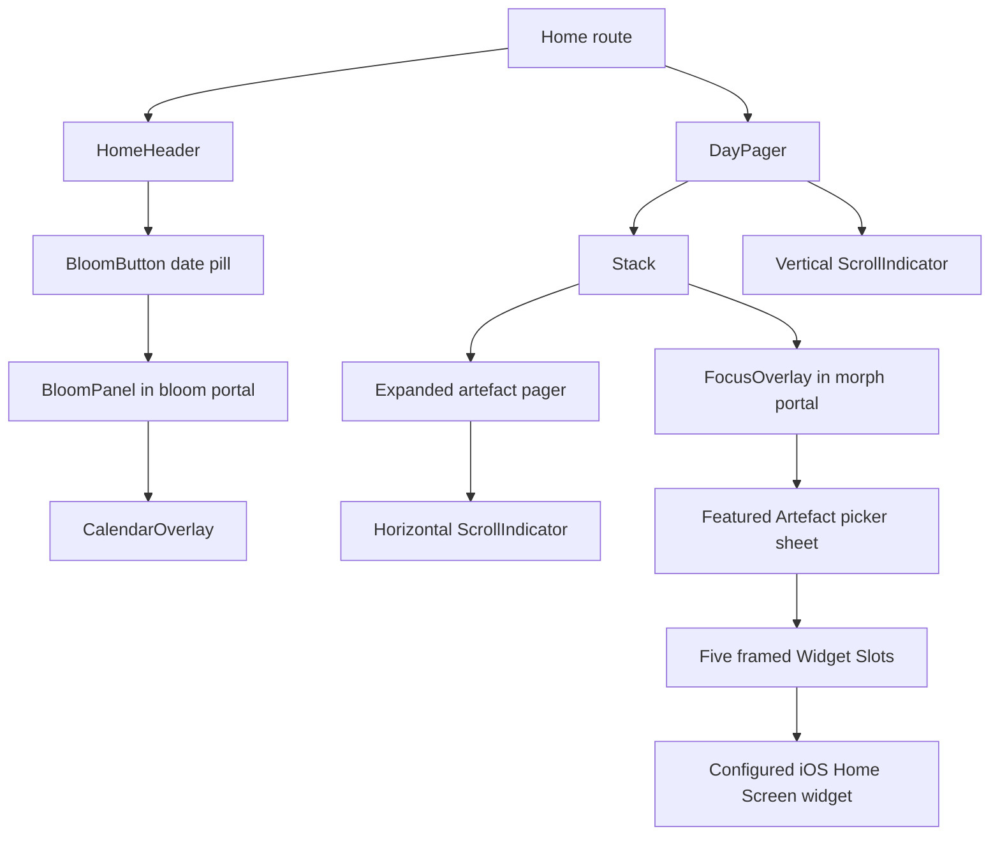

# soies — feature documentation

This directory documents the interactions that make up the Home
experience. For domain terminology (`Entry`, `Artefact`, `Paper`, `Print`), read
[`CONTEXT.md`](../CONTEXT.md). For the whole repository map, read
[`overview.md`](./overview.md).

| # | Feature | Active implementation | Deep dive |
|---|---------|-----------------------|-----------|
| 1 | Stack expand/collapse | `Stack`, `CollapsedDeck`, `ArtefactWrapper` | [01-stack-expand-collapse.md](./01-stack-expand-collapse.md) |
| 2 | Blooming calendar | `HomeHeader`, `BloomButton`, `BloomPanel`, `CalendarOverlay` | [02-calendar-morph-overlay.md](./02-calendar-morph-overlay.md) |
| 3 | Page scrubber | `ScrollIndicator`, `DayPager`, expanded `Stack` | [03-scroll-indicator.md](./03-scroll-indicator.md) |
| 4 | Featured Artefact widgets | `FeaturedWidgetsSheet`, `WidgetFrameCaptureHost`, `FeaturedArtefactWidget` | [ADR 0011](./adr/0011-stable-raster-backed-featured-widget-slots.md) |

## How the features fit together



- The calendar updates the route date while `BloomPanel` closes, so the next
  day is ready behind the animation.
- The day pager owns vertical scrolling; each expanded stack owns horizontal
  artefact scrolling. `ScrollIndicator` only asks those hosts to jump.
- Focus mode and stack expansion are separate interactions. Focus clones the
  collapsed deck into the `morph` portal; expansion renders a pager into the
  safe-area `overlay` portal.

## Root infrastructure

`src/app/_layout.tsx` keeps `GestureHandlerRootView` outermost and wraps the app
subtree in `StrictMode`. It mounts three portal hosts:

| Host | Consumer | Placement |
|------|----------|-----------|
| `overlay` | Expanded `Stack` | Inside the safe area |
| `morph` | `FocusOverlay` | Full-screen root |
| `bloom` | `BloomPanel` | Full-screen root |

Create is a full-screen absolute sibling at the root rather than a fourth
Portal. Its Bloom menu still uses `bloom`; avoiding a Portal nested inside a
Portal keeps Fabric's native parent hierarchy unambiguous during teardown.

The root `BlurTargetView` supplies Android blur sampling through
`BlurTargetViewContext`. `blurTarget` and `blurMethod` are omitted on iOS,
matching Expo SDK 57's Android-only API and avoiding StrictMode
`findNodeHandle` diagnostics.

## Animation and thread boundaries

Reanimated shared values use `.get()` / `.set()` for React Compiler
compatibility. Scroll handlers, animated styles, measurements, and springs stay
on the UI thread. React state and host callbacks stay on RN/JS.

React Compiler callback caching does not satisfy Worklets' remote-function and
serialization contracts. Active UI→RN calls therefore use a stable React
dispatcher as the `scheduleOnRN` target and serializable data arguments:

```ts
scheduleOnRN(setCreate, null);
scheduleOnRN(setOutgoing, null);
scheduleOnRN(setCloseSequence, next);
```

`BloomPanel` invokes an external `onClose` only after the primitive completion
sequence reaches an RN effect. `FocusOverlay` uses the same sequence to invoke
`onCloseComplete`, allowing `Stack` to release its native overlay tree only
after the spring settles. `ScrollIndicator` uses raw RN View responders, so
scrub jumps call the host callback directly without crossing a Worklets
boundary.

`MorphOverlay.tsx` is a dormant legacy component with no callsite. Its
function-valued close bridge is unsafe; harden it using the `BloomPanel`
completion-sequence pattern before reuse.

## Runtime validation

Static checks cannot prove native Worklets or responder behavior. The current
manual device status and required remaining matrix live in
[`qa/react-compiler-closure.md`](./qa/react-compiler-closure.md).

Useful local gates:

```sh
pnpm check
pnpm lint:rc
pnpm exec expo export --platform ios --clear
```
