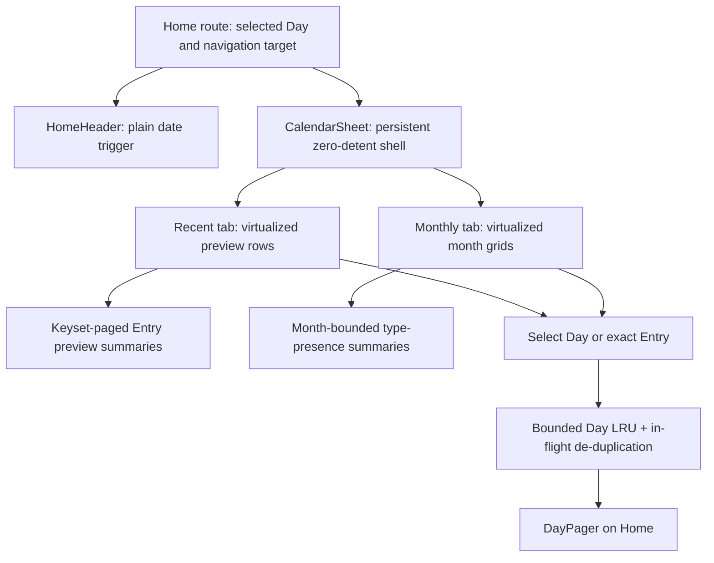

# Calendar bottom-sheet implementation plan

Status: implemented; automated/static gates are recorded in the audit, while
the physical-device latency, frame-time, and memory stress matrix remains a
release-validation requirement

This plan replaces the fullscreen calendar bloom with the white Recent/Monthly bottom sheet shown in the supplied mockups. It also resolves the calendar's eager hidden work (PERF-04), replaces the whole-journal preload that currently props up the close animation (PERF-01), and completes the date-range and strict-date portions of UX-11.

The priority order is fixed: performance, user experience, code simplicity/hygiene, then developer experience.

## Scope boundaries

In scope:

- a persistent lightweight native sheet shell with bounded, prepared tab content;
- Recent and Monthly browsing, selection, loading, retry, and empty states;
- a bounded Day cache and lightweight idle warming;
- an immutable User Creation Day and strict ISO Day validation;
- device performance, memory, animation, accessibility, and failure validation;
- updating active calendar documentation and the relevant audit rows after the implementation is proven.

Out of scope:

- locale-aware headings or weekday labels; the first version deliberately matches the English mockups;
- horizontal swipe navigation between tabs;
- more than five Artefacts or a `5+` counter;
- deleting the dormant fullscreen Bloom/CalendarOverlay path or legacy `MorphOverlay`; that cleanup remains separate;
- rasterizing previews by default; a thumbnail cache is allowed only if profiling proves the canonical renderer cannot meet the gates;
- the unrelated DayPager virtualization remediation in PERF-02.

No new runtime dependency is needed. Reuse the installed native bottom sheet, FlashList, flash-calendar, react-native-edge-fade, Expo Image, and canonical Paper/Print/Ink renderers.

## Confirmed interaction contract

### Sheet and tabs

- The existing date control becomes a plain trigger. It no longer blooms.
- The trigger opens one white, near-full-height, full-width sheet with no intermediate detent.
- The handle and X button match Featured Artefacts; X, downward drag, scrim press, Android Back, Entry selection, and Day selection all dismiss it.
- The sheet's fixed header contains `Recent` and `Monthly`, the formatted Focused Day or Focused Month, and the X button.
- The scrolling content passes beneath a solid white header scrim and a short overlay fade that starts below the header text, so the labels stay fully legible.
- A bottom fade is visible only while more content exists below. Both fades use `react-native-edge-fade` in white overlay mode; no live blur is introduced.
- The first app-launch opening selects Recent. Later openings remember the last selected tab.
- Every presentation resets Recent to its newest Entry and Monthly to the current month. Switching tabs within one presentation preserves each retained tab's position.
- Tab changes are press-only and use a short opacity crossfade. Both bounded virtualized trees stay mounted; the inactive tab is transparent and non-interactive.

### Recent

- Entries are ordered by `date DESC, sort_order DESC`, with stable Entry ID as the final tie-breaker.
- Rows never mix Days. A Day's Entries are packed sequentially into rows of two; an odd final Entry occupies a full-width row.
- The fixed heading uses `30 september 2026`: lowercase English month, day-month-year order, and a muted monospaced year.
- A focal line approximately 40% down the scroll viewport determines the Focused Day. A small hysteresis band prevents header/background flicker at row boundaries.
- Every card belonging to the Focused Day uses the slightly darker background. The heading changes only when the Focused Day changes.
- Each card renders the complete first Artefact at thumbnail scale: all Paper text and paragraph styling, Print image and caption, and flattened Ink. Text is never truncated.
- The first prepared viewport and later visible cards mount a real first-Artefact renderer. Remaining Artefacts are represented by horizontally offset white silhouettes using the existing Home stack spacing. The silhouette count is capped at five defensively, with no `5+` label.
- One marker appears per card: Paper yellow, Print magenta, and an unsupported future Entry type neutral gray.
- Selecting a card starts the target Day load and sheet close concurrently, navigates Home to that Day, and positions DayPager on the exact Entry once data is available. The Entry remains collapsed.
- With no Entries, the heading shows today and the body says `No entries yet` without another call to action.

### Monthly

- Months are chronological from the User Creation Month through the current month. The sheet opens focused on the current month at the bottom of the range; the user scrolls upward into the past.
- The fixed heading uses `september 2026`. The weekday row is fixed English `M T W T F S S`, Monday first.
- The same 40%-viewport focal rule and hysteresis determine the Focused Month. Its complete month grid receives the darker background.
- The underlined Day is the Selected Day currently displayed on Home, not necessarily today.
- The complete User Creation Month is visible, but Days before the exact User Creation Day are disabled. Days after today are disabled. Empty in-range Days remain selectable.
- Markers express type presence, not Entry count: at most one yellow Paper dot, one magenta Print dot, and one gray unsupported-type dot per Day, in that order.
- Selecting a Day starts its load and sheet close concurrently, navigates Home to that Day, and positions DayPager at the first Entry. An empty Day lands on Home's existing empty-Day state.
- A journal with no Entries still shows the complete selectable calendar without markers.

### Errors and degraded states

- A Monthly marker-query failure leaves the grid usable, displays `Entry markers unavailable` with Retry, and omits markers only while degraded.
- A Recent first-page failure shows an inline Retry state. A later-page failure keeps loaded rows and adds a footer Retry.
- One preview-render failure replaces only that preview with a neutral placeholder.
- A sheet-level error boundary keeps the X dismissal available and offers retry without taking down Home.
- Home Day-load failure uses a layout-stable error/retry state; it never paints the previous Day as if it were the newly selected Day.
- Unknown Entry/Artefact types remain visible through the existing unsupported renderer and neutral markers.

## Target architecture

### UI ownership

- `src/app/index.tsx` owns the Selected Day, pending exact-Entry target, Day loading, and the `CalendarSheet` session. This keeps route changes and DayPager positioning in the component that already owns those states.
- `src/components/HomeHeader.tsx` becomes presentational for calendar opening: replace the calendar `BloomButton` composition with the same date-pill content in a regular accessible press target.
- Add `src/components/CalendarSheet.tsx` for the zero/open detents, session state, fixed header, crossfade, fades, dismissal, and error boundary.
- Add `src/components/CalendarRecentTab.tsx`, `CalendarMonthlyTab.tsx`, and `CalendarEntryPreview.tsx`. Keep grouping/focus/formatting as pure helpers in one small `src/data/calendarBrowse.ts` module rather than distributing duplicate logic across components.
- Extend `src/components/DayPager.tsx` with an Entry-ID target that is consumed once after the target Day loads. Do not route this through Widget-specific types.

The existing `BloomButton`, `BloomPanel`, `CalendarOverlay`, and `MorphOverlay` files are not deleted or opportunistically refactored in this work.

### Sheet lifecycle

1. Home mounts `CalendarSheet` once at detent zero with its surface, handle, fixed header, close control, and layout-stable body placeholder.
2. After Home's first committed frame, `requestIdleCallback` warms the first Recent page and marker summaries for the current and immediately previous month. When those settle, both bounded virtualized tab trees are prepared while hidden and retained. Cancel the idle request on teardown and keep failures observable/retryable.
3. A trigger tap updates the native detent immediately. If preparation has not completed on the first-ever cold open, the first native position event or next-frame fallback mounts the content without holding sheet motion.
4. Prepared content is already painted for normal openings and tab visits; a cold first query retains the same geometry until it resolves.
5. A close request sets the zero detent and retains both trees through the closing animation.
6. Only `onSettle(0)` resets the native lists while hidden, trims Recent to its first page, and removes Monthly marker state outside the current/previous-month window. The remembered tab ID and bounded prepared content survive.

Do not put per-frame sheet position into React state. Use the native position event only for the opening latency mark and the one-time content-mount transition.

### Data contracts

Add focused repository APIs instead of hydrating the journal:

| API | Payload and ordering | Purpose |
|---|---|---|
| `getRecentEntryPreviewPage(cursor, limit)` | Entry identity/type/date/order, Artefact count, and only the first non-deleted Artefact; keyset order `(date, sort_order, id) DESC` | Recent pagination without loading hidden Artefacts |
| `getEntryTypePresence(startDay, endDay)` | Day plus distinct Entry type | Monthly markers for a bounded month window |
| `getUserCreationDay()` | immutable local `YYYY-MM-DD` | lower calendar boundary |
| `getEntriesByDate(day)` | complete Day, as today | Home after selection |

Use a lookahead row when paginating Recent so an odd Entry at a page boundary is held if the next Entry belongs to the same Day. This prevents a full-width card from later reshaping into a two-card row. A single very busy Day remains incrementally pageable rather than becoming one unvirtualized section.

Inspect `EXPLAIN QUERY PLAN` with the stress dataset. Add a partial active-entry index for the Recent order or marker range only if the existing `(date, sort_order)` index does not produce the required bounded scan; do not add speculative indexes.

### Bounded caches and freshness

- Replace the process-lifetime all-journal Map with an eight-Day LRU that also deduplicates in-flight loads. An invalidated or rejected promise is never retained.
- Retain the first Recent page and current/previous marker window between presentations. Pages and older marker models visited during a session are trimmed after close settles; the process-level summary caches keep their independent documented bounds.
- `entriesVersion` invalidates affected Day, Recent, and marker data after Create. Any edit/delete/restore path touched by this implementation must issue the same invalidation rather than relying on time-to-live.
- Recompute today and the User Creation Day at each presentation. This handles foregrounding or crossing midnight without a permanent timer.
- Delete the `getAllEntriesByDate` startup call and its silent one-shot guard. Remove the now-unused all-journal preload/cache APIs rather than leaving an attractive accidental call path.

On selection, start `getEntriesByDate` before changing the route and closing the sheet. A cache hit is adopted synchronously. A miss switches Home to the target Day's stable loading shell immediately; when the promise resolves, cache it and consume the exact Entry target. This replaces the existing stale-previous-Day workaround without delaying dismissal.

### Stable User Creation Day and strict Days

- Add a migration that rebuilds `users` with `creation_day TEXT NOT NULL`. For an existing row, perform the only possible one-time backfill: convert its UTC `created_at` to the device's local `YYYY-MM-DD` during migration, then persist that value permanently.
- New Users write `created_at` as UTC milliseconds and `creation_day` from the local Day at creation time.
- Seed the test User with both `creation_day = '2026-01-01'` and a January 1, 2026 `created_at`; do not derive seed creation from the date the test runs.
- Add one strict ISO Day parser that validates shape, round-trips year/month/day, and rejects normalized impossible values such as `2026-99-01` or `2026-02-30`.
- Apply it to Home route dates and Widget deep-link dates. Invalid external input falls back safely to today; sheet-generated Days are additionally constrained to User Creation Day through today.

This completes UX-11 rather than fixing only its hardcoded-month symptom.

### Rendering and focus tracking

- Recent uses FlashList row items with stable row keys and a deliberately small draw distance. Monthly continues to use flash-calendar's month data but supplies the redesigned fixed weekday row, month-grid renderer, markers, and Monday-first configuration.
- Keep both layouts centered and width-capped on wide windows. Recent never exceeds two columns; Monthly remains exactly seven columns. Derive one or two width tokens from the mockup during implementation rather than adding a breakpoint framework.
- Measure list row/month frames and resolve the item intersecting the 40% focal line with a pure helper. Apply a small shared hysteresis token, pin the first/last period at list boundaries, and bridge to React only when the Focused Day/Month ID changes.
- Header, tab, and background updates therefore occur at period boundaries, not on every scroll event.
- Clip the white viewport and edge-fade native view to the same sheet radius. Use a solid white header scrim followed by a short `AnimatedEdgeFadeView` in `mode="overlay"`; drive the separate bottom fade to zero on the UI thread when no content remains below.
- Eagerly mount canonical Artefact renderers for the first prepared viewport, then only for visible Recent cards. Horizontally offset placeholders are plain Views and never mount hidden Paper, Print, Image, or Ink trees.

## Implementation sequence and gates

### 0. Establish the baseline

- Add development-only timing around date-trigger press and the first `onPositionChange` event whose position is greater than zero.
- Record release-build p50/p95 opening latency, dropped frames, launch work, and memory on the oldest supported iPhone and a lower-tier supported Android device.
- Capture warm and first-ever cold open separately. Keep the same measurement in the new sheet until final acceptance.

Gate: the team has comparable before/after traces rather than judging smoothness only by eye.

### 1. Land date invariants and read models

- Implement strict Day parsing and tests first.
- Add `creation_day`, repository mapping, deterministic seed data, and migration/backfill tests.
- Add Recent preview and Monthly marker queries with pure mapping types and keyset/lookahead tests.
- Test soft-deleted rows, no Artefacts, five Artefacts, unknown types, identical sort orders, page boundaries within one Day, leap days, and creation/current boundary Days.

Gate: Node tests prove ordering, range, aggregation, migration, and malformed-input behavior without UI involvement.

### 2. Replace the bloom with the warm sheet shell

- Add `CalendarSheet` with zero/open detents, Featured-style surface/handle/X, scrim, drag/scrim/Back dismissal, and settle-owned hidden-state reset.
- Convert HomeHeader's trigger without changing its visual label or chrome fade.
- Initially render only placeholders behind the fixed header; wire both tabs to simple placeholder bodies.
- Implement last-tab memory, per-presentation reset, per-tab offset preservation, and press-only crossfade as a small explicit state machine.

Gate: p95 tap-to-first-nonzero-position is at most 50 ms on both physical-device release builds before either real list is added. One hundred open/close cycles reach a stable memory plateau with only the documented bounded prepared trees retained.

### 3. Replace the all-journal preload and wire selection

- Introduce the bounded Day LRU with in-flight request deduplication, rejection cleanup, and invalidation tests.
- Remove the all-journal preload from Home.
- Add Home's pending exact-Entry target and DayPager's one-shot Entry positioning.
- Start target loading, navigation, and sheet dismissal concurrently for both selection kinds.
- Ensure a miss shows target-Day loading/error UI, never stale previous-Day content.

Gate: cached and uncached selections close smoothly; exact Recent selection and first-Entry Monthly selection are deterministic; a failed query is retryable; retained Day data never exceeds the cache bound.

If a 100+-Entry Day exposes the separately audited non-virtualized DayPager as the remaining source of transition jank, report PERF-02 as a prerequisite/follow-up rather than restoring the global preload or expanding this feature silently.

### 4. Implement Recent end to end

- Add keyset pagination, stable Day-only row packing, empty/error/footer states, and focus tracking.
- Add the responsive one/two-card design, type marker, canonical first-Artefact renderer, static count silhouettes, and per-card preview boundary.
- Prepare expensive preview children for the first viewport, then limit later children to the visible window.
- Wire exact Entry selection and restore the saved offset when returning to Recent during the same presentation.

Gate: test no entries, 1/2/3/5 Entries per Day, a page boundary in a large Day, long complete Paper text, Print/Ink readiness and failure, unknown data, rapid pagination, rotation, and repeated selection.

### 5. Implement Monthly end to end

- Derive the month count from User Creation Month through current month and open at current.
- Render fixed Monday-first weekdays, virtualized chronological grids, Focused Month background, Selected Day underline, and bounded disabled Days.
- Query type-presence summaries only for visible/buffered months, merging the current/previous idle-warmed windows.
- Add marker degraded/retry UI without blocking Day selection.

Gate: test same-month and multi-year journals, Jan 1 seed, creation mid-month, leap year, today at month/year boundaries, selected Day outside the visible month, unknown markers, empty months, failed marker queries, and scroll-to-first/last bounds.

### 6. Finish polish and containment

- Add top/bottom native fades, focused-period hysteresis, wide-layout caps, safe-area geometry, pressed/disabled states, and reduced-motion behavior.
- Add accessibility roles/states for tabs, close, cards, and Days; card labels include date, Entry type, title when present, and Artefact count.
- Add the sheet-level error boundary and verify every async branch has a visible or logged failure path.
- Confirm both retained tabs use fixed opacity ownership, the inactive tab rejects pointer events, and rapid switching never exposes an unpainted frame.

Gate: VoiceOver/TalkBack, largest supported text settings, reduce motion, rotation, Android Back, drag/scrim/X dismissal, rapid tab tapping, and app foreground/midnight refresh all work without crashes or inaccessible controls.

### 7. Final performance and documentation closure

- Run a release stress seed with at least 10,000 Entries, up to five Artefacts each, long journal history, unknown types, and a 100+-Entry Day.
- Measure cold Home startup, warm/cold sheet opening, Recent pagination, Monthly scrolling, selection close, JS/UI frame time, JS/native heap, and image memory.
- Repeat at least 100 open/close cycles and 50 tab switches; memory must plateau after caches and retained browse windows reach their documented bounds, with no blank preview or marker frame.
- Run `pnpm check`, React Compiler lint/health checks, and production Expo exports for iOS and Android using the SDK 57 toolchain.
- Rewrite `docs/02-calendar-morph-overlay.md` to describe the active sheet (the filename may remain for link stability), update `docs/README.md` and `docs/overview.md`, and mark PERF-01, PERF-04, and UX-11 addressed only with test/profile evidence.

Gate: all static, automated, device, performance, and failure-injection checks pass; no runtime dependency or default raster cache was added without measured justification.

## Acceptance checklist

- Sheet motion begins within the 50 ms p95 contract on warm and cold-data paths.
- Closed state retains the native shell, both virtualized browse trees reset to their bounded prepared windows, and bounded lightweight caches.
- Recent and Monthly exactly follow their agreed ordering, focus, formatting, marker, range, and selection rules.
- The top header fade and conditional bottom fade are native overlay fades, not blur effects.
- No preview truncates its first Artefact or mounts hidden Artefact renderers.
- Navigation never shows stale previous-Day content and lands on the intended Entry.
- Errors stay local, visible, retryable, and dismissible.
- User Creation Day is immutable, the seed is January 1, 2026, and impossible/external Days cannot enter Home.
- Cache size and memory stabilize under stress; retained lists reset and trim only after close settles.
- Legacy overlay cleanup remains clearly deferred and untouched by this implementation.
