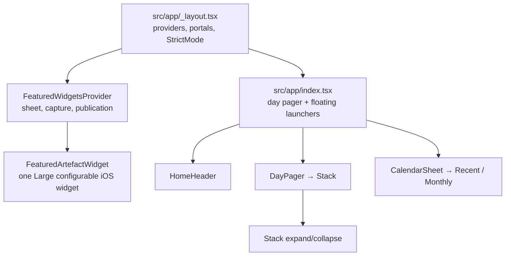

# soies — Project overview

**soies** is a personal journaling app built with Expo SDK 57 and React Native. Users browse dated **entries** (stacks of **artefacts**) day by day, expand stacks to read individual papers or prints, and navigate through Recent entries or Monthly grids in a native calendar sheet. Domain terminology lives in [`CONTEXT.md`](../CONTEXT.md).

---

## Tech stack

| Layer | Choice |
|-------|--------|
| Framework | Expo 57, React Native 0.86, React 19 |
| Compiler | [React Compiler](https://docs.expo.dev/guides/react-compiler) (`experiments.reactCompiler` in `app.json`; `babel.config.js` with `panicThreshold: 'all_errors'` — diagnostics are **hard build failures**). Validation: `pnpm lint` (Oxlint including native `react/react-compiler`), `pnpm lint:rc`, `pnpm healthcheck:rc`, `pnpm check`. Do not reintroduce manual `useMemo` / `useCallback` / `memo` as a render optimization without a measured re-render problem (`memo(CalendarMonthWithDots)` is the intentional exception for uncompiled flash-calendar). `useCallback` is also permitted when stable identity is an explicit correctness contract with native or third-party APIs; document that contract at the call site. |
| Routing | [Expo Router](https://docs.expo.dev/router/introduction/) (file-based root Stack) |
| Styling | [Uniwind](https://docs.uniwind.dev/) + Tailwind CSS v4 (`className` on native views) |
| Animation | `react-native-ease` for discrete state transitions; Reanimated 4 + Worklets for gesture-, scroll-, keyboard-, layout-, and measurement-driven motion. Shared values use `.get()` / `.set()` for React Compiler compatibility. See [ADR 0014](./adr/0014-ease-reanimated-animation-boundary.md). |
| Overlays | `react-native-teleport` (portal hosts at the root) + `@swmansion/react-native-bottom-sheet` |
| Lists / paging | `ScrollView` + Reanimated (day/artefact pagers); FlashList 2 (calendar browse lists) |
| Calendar UI | `@marceloterreiro/flash-calendar` + `react-native-edge-fade` |
| Icons | `react-native-nano-icons` (SVGs in `assets/icons/`) |
| Images | `expo-image` |
| Haptics | `react-native-pulsar` |
| Package manager | pnpm |

Persistence: `@op-engineering/op-sqlite` — see ADRs in `docs/adr/`.

### Worklets boundary rule

React Compiler callback caching is **not** a correctness guarantee for Worklets, gesture handlers, native subscriptions, or third-party list APIs. Across active code, a UI-runtime callback may call `scheduleOnRN` with a **stable React dispatcher** as the function and **serializable primitives** as arguments. Do **not** pass render-local callbacks, React setters, or other function values as `scheduleOnRN` arguments.

Known-good pattern: `scheduleOnRN(setOutgoing, null)` / `scheduleOnRN(setCloseSequence, n)`. External callbacks (e.g. BloomPanel `onClose`) stay on RN via a ref + completion sequence effect.

Ease owns only fixed state changes. If one visual surface also needs a
Reanimated property, the engines receive separate nested native views; they
never animate the same property on the same view. Shared Entry transitions use
the root `EntryTransitionProvider`, and Reduce Motion preserves completion
callbacks with an immediate Ease transition.

**Exception:** [`MorphOverlay.tsx`](../src/components/MorphOverlay.tsx) still uses an unsafe `scheduleOnRN(finishClose, onClose)` bridge but has **no callsite** under `src/`. Do not wire it without applying the BloomPanel pattern first. Physical-device stress matrix: [`docs/qa/react-compiler-closure.md`](./qa/react-compiler-closure.md).

---

## How the app is organized



---

## Root & configuration

| File | Role |
|------|------|
| [`package.json`](../package.json) | Dependencies, scripts (`start`, `ios`, `android`, `lint`, `lint:rc`, `healthcheck:rc`, `check`, `typecheck`, `fmt`). Entry point: **`expo-router/entry`** (canonical; custom `index.js` and `.pnpm` `watchFolders` were removed after the Metro matrix proved them unnecessary). `expo.autolinking.ios.buildFromSource` forces Reanimated + Worklets to compile from source on iOS. |
| [`app.json`](../app.json) | Expo app config: `soies` URL scheme, iOS 17 deployment target, one five-choice `systemLarge` widget, bundle IDs, plugins, EAS project ID, and **`experiments.reactCompiler`**. Android widget generation is explicitly disabled. Image selection uses the system picker without photo-library read permission; camera and save-only Photos access are configured separately. |
| [`babel.config.js`](../babel.config.js) | `babel-preset-expo` + React Compiler options (`panicThreshold: "all_errors"` → hard build failures). |
| [`eas.json`](../eas.json) | EAS Build profiles: `development`, `preview`, `production`, `ios-simulator`, `development-simulator`. |
| [`metro.config.js`](../metro.config.js) | Metro + Uniwind (`cssEntryFile`, `dtsFile`) only. No `unstable_enableSymlinks` (Metro 0.84 always-on; Expo Doctor rejects the override). No extra `watchFolders`. |
| [`tsconfig.json`](../tsconfig.json) | TypeScript (extends Expo base, `strict: true`). |
| [`.oxlintrc.json`](../.oxlintrc.json) / [`.oxfmtrc.json`](../.oxfmtrc.json) | Lint and format (oxlint with native React Compiler rules, oxfmt). |
| [`.github/workflows/quality.yml`](../.github/workflows/quality.yml) | CI: `pnpm check` + production iOS `expo export`. |
| [`CONTEXT.md`](../CONTEXT.md) | Ubiquitous language: Entry, Artefact, Featured Artefact, Widget Slot, Widget, Frame, Tombstone, Undo. |
| [`AGENTS.md`](../AGENTS.md) / [`CLAUDE.md`](../CLAUDE.md) | Pointers for AI assistants (Expo **v57** docs). |
| [`README.md`](../README.md) | Minimal Expo Router + Uniwind starter notes. |

---

## `src/app/` — routes (Expo Router)

| File | Role |
|------|------|
| [`src/app/_layout.tsx`](../src/app/_layout.tsx) | **Root layout.** `GestureHandlerRootView` outermost, then **`StrictMode`**, fonts, keyboard, safe area, bottom-sheet and portal providers, the shared `EntryTransitionProvider`, and one headerless Stack route. Mounts portal hosts: **`overlay`** (inside safe area — expanded stacks), **`morph`** (focus overlay), and **`bloom`** (Create's Bloom menu). Create is a root-owned absolute sibling so its own menu never becomes a natively reparented Portal inside another Portal. Provides `BlurTargetView` for blur sampling. Database init is single-flight under StrictMode. Exports a retryable route error boundary. |
| [`src/app/index.tsx`](../src/app/index.tsx) | **Home screen.** Wraps Home in `ExpandProvider`, strictly resolves the date and one-shot widget commands from the URL, loads one complete Day through the bounded cache, and renders `HomeHeader`, vertical `DayPager`, and the persistent lightweight `CalendarSheet` shell. It adapts Calendar selection and post-Save reloads to the shared Entry transition: prepare a lightweight `PreparedHomeEntry`, wait for native-sheet dismissal when required, retire the old body, enter the cover after its first Artefact is ready, then adopt canonical Home behind that cover. Paper hand-off waits for document-scoped native TextKit readiness before the cover retires. The iOS-only Featured Artefacts launcher and cross-platform Create launcher float directly over this route. Exports a Home-specific retry boundary. |

Create, Share, and the iOS Featured Widgets sheet each have a retry/dismiss
feature boundary inside the provider that owns their session. Create keeps its
draft hooks and in-flight work above that boundary; Share and Widgets retain
their provider-owned session. A render failure therefore replaces only the
fallible transient subtree while preserving recoverable state. Boundary
diagnostics contain structural component context, never journal content.

---

## `src/components/` — UI

### Core home experience

| File | Role |
|------|------|
| [`HomeHeader.tsx`](../src/components/HomeHeader.tsx) | Top bar: plain formatted-date trigger for the native calendar sheet plus animated Entry titles as the Day pager moves. |
| [`DayPager.tsx`](../src/components/DayPager.tsx) | Vertical pager of **entries** for one day. One full-screen page per entry (`Stack`). It can consume a collapsed Entry target from Recent or an exact expanded Artefact target from a Widget command without changing Home's index-keyed reuse lifecycle. |
| [`Stack.tsx`](../src/components/Stack.tsx) | **Entry stack** — collapsed deck vs expanded horizontal artefact pager. Tap to expand; long-press or ellipsis opens Focus. Focus's portal, blur, and subject clone mount only for an active open/close session. A widget target immediately expands at the matching artefact ID. |
| [`CollapsedDeck.tsx`](../src/components/CollapsedDeck.tsx) | Renders the stacked-card collapsed view; `useWrappedArtefacts` builds wrapped `Paper` / `Print` children. |
| [`ArtefactWrapper.tsx`](../src/components/ArtefactWrapper.tsx) | Animated wrapper per artefact: interpolates position/size/shadow between collapsed stack layout and expanded pager layout. |
| [`Paper.tsx`](../src/components/Paper.tsx) | Text-only artefact renderer (A4 aspect, paper background). |
| [`Print.tsx`](../src/components/Print.tsx) | Image + caption artefact renderer (polaroid-style aspect). |

### Overlays & navigation

| File | Role |
|------|------|
| [`CalendarSheet.tsx`](../src/components/CalendarSheet.tsx) | Persistent zero-detent native shell. Prepares and retains bounded virtualized Recent/Monthly trees after first paint, owns the opaque header/fades/dismissal/Ease crossfade, and resets/trims retained browse state after close settles. |
| [`PreparedHomeEntry.tsx`](../src/components/PreparedHomeEntry.tsx) | Non-interactive transition cover shared by Calendar and Create Save. It renders the target Entry's first real Artefact plus white count silhouettes and reports native Paper/Print readiness. |
| [`CalendarRecentTab.tsx`](../src/components/CalendarRecentTab.tsx) / [`CalendarEntryPreview.tsx`](../src/components/CalendarEntryPreview.tsx) | Keyset-paged FlashList rows with inline Day labels, visible canonical first-Artefact previews, count silhouettes, and exact Entry selection. |
| [`CalendarMonthlyTab.tsx`](../src/components/CalendarMonthlyTab.tsx) | Chronological virtualized month grids from User Creation Day through today, Day-1-aligned month indicators, Focused Month background, Selected Day underline, disabled bounds, type-presence markers, and a viewport-derived final scroll bound. |
| [`BloomButton.tsx`](../src/components/BloomButton.tsx) / [`BloomPanel.tsx`](../src/components/BloomPanel.tsx) | **Measure-and-morph bloom** still used by Create's compact menu. Origin stays inline; panel portals into the `bloom` host. Close completion and content crossfade use stable dispatcher + primitive Worklets bridges. |
| [`CalendarOverlay.tsx`](../src/components/CalendarOverlay.tsx) | Dormant former fullscreen calendar with no callsite. Deletion is deferred with the broader legacy overlay cleanup. |
| [`FocusOverlay.tsx`](../src/components/FocusOverlay.tsx) | Long-press / ellipsis focus: blurred backdrop, measured subject clone, and menu. On iOS, **Feature in Widget** appears immediately before Share and opens the picker for that Entry. |
| [`ArtefactFrame.tsx`](../src/components/ArtefactFrame.tsx) / [`artefactFrameGeometry.ts`](../src/components/artefactFrameGeometry.ts) | Shared portrait frame renderer plus pure board/shadow invariants for live capture, cached Featured Artefact previews, and branded empty/unavailable prompts. |
| [`MorphOverlay.tsx`](../src/components/MorphOverlay.tsx) | **Unused** legacy morph overlay (no callsite). Kept for reference; unsafe Worklets `onClose` bridge — do not reintroduce without hardening. |

### Shared UI & context

| File | Role |
|------|------|
| [`ScrollIndicator.tsx`](../src/components/ScrollIndicator.tsx) | Reusable page rail (vertical or horizontal). Raw RN View responders avoid RNGH's StrictMode `findNodeHandle` path; scrub moves invoke the latest host jump callback directly on RN/JS. Reanimated keeps continuous rail/host scroll visuals on the UI thread, while Ease owns the retained expanded-shell fade/scale. Exports `EntryPreview` / `ArtefactPreview` for scrubber tiles. |
| [`ExpandContext.tsx`](../src/components/ExpandContext.tsx) | Shared `chromeProgress` value (0 = chrome visible, 1 = hidden) while a stack is expanded. Used by header, day pager, and stack. |
| [`CreateContext.tsx`](../src/components/CreateContext.tsx) | Owns the Create authoring session and adapts open, Cancel, and Save to the shared request-scoped Entry transition. It retains the source tree until Home has entered. |
| [`BlurTargetViewContext.tsx`](../src/components/BlurTargetViewContext.tsx) | Ref to the root `BlurTargetView` so bloom/focus overlays can blur the correct subtree. |
| [`Button.tsx`](../src/components/Button.tsx) | Styled pressable (rounded controls background/border). Supports `forwardRef` for morph measurement. |
| [`Icon.tsx`](../src/components/Icon.tsx) | Nano icon set generated from `assets/icons/` via build-time glyph map. |
| [`LongPressable.tsx`](../src/components/LongPressable.tsx) | `Pressable` with default long-press delay and haptic feedback. |

### Featured Artefacts and iOS widget flow

| File | Role |
|------|------|
| [`FeaturedArtefactsButton.ios.tsx`](../src/components/FeaturedArtefactsButton.ios.tsx) | Round bottom-left launcher for Featured Artefacts. Its platform fallback renders nothing on Android/web. |
| [`FeaturedWidgetsContext.ios.tsx`](../src/widgets/FeaturedWidgetsContext.ios.tsx) | iOS controller for sheet sessions, transactional assignment, publication warnings, and coalesced first-paint/foreground reconciliation. The platform fallback exposes no feature affordances. |
| [`FeaturedWidgetsSheet.tsx`](../src/widgets/FeaturedWidgetsSheet.tsx) | One fixed-height native bottom sheet. Raw picker and five-slot framed management phases remain mounted in the same body and Ease-crossfade over 200 ms. |
| [`WidgetFrameCaptureHost.tsx`](../src/widgets/WidgetFrameCaptureHost.tsx) / [`widgetFrameGeometry.ts`](../src/widgets/widgetFrameGeometry.ts) | Lazily mounts one off-screen `ArtefactFrame`, waits for layout/Print/Ink readiness, and serializes a high-resolution transparent PNG inside the shared asymmetric shadow crop with a ten-second timeout. |
| [`widgetFrameCache.ts`](../src/widgets/widgetFrameCache.ts) | Stores revisioned, renderer-versioned captures in `widgetsDirectory`; paths are derived cache state and stale files are removed only after a later successful publication. |
| [`widgetSnapshot.ts`](../src/widgets/widgetSnapshot.ts) | Builds one atomic five-key snapshot containing empty, featured, or unavailable state plus frame URIs, deep links, and localized accessibility labels. |
| [`FeaturedArtefactWidget.ios.tsx`](../src/widgets/FeaturedArtefactWidget.ios.tsx) | SwiftUI-backed `systemLarge` widget. Each installed instance reads its `featuredSlot` configuration and renders that key from the shared snapshot. |
| [`widgetDeepLink.ts`](../src/widgets/widgetDeepLink.ts) | Parses and de-duplicates cold/warm slot commands before Home consumes and clears their URL parameters. |

Selection captures first, commits the lowest genuinely empty slot in one database transaction, then publishes one snapshot containing all five positions. Duplicate artefacts are rejected and active unavailable bindings remain capacity reservations. Publication failure never rolls back user intent: the sheet shows the assigned slot, surfaces a non-blocking warning, and reconciliation retries later. Empty/unavailable states publish before any potentially slow recapture.

## `src/data/` — data layer

| File | Role |
|------|------|
| [`entries.ts`](../src/data/entries.ts) | **Domain types** (`PaperArtefact`, `PrintArtefact`, `Entry`, `DayEntries`) and helpers. Entry view models expose stable `id` and `date` for widget targeting. Persistence is in `src/db/`. |
| [`calendarBrowse.ts`](../src/data/calendarBrowse.ts) / [`calendarBrowseCache.ts`](../src/data/calendarBrowseCache.ts) | Pure calendar grouping/focus/range helpers plus bounded first-page/month-marker summary caches. |
| [`entriesCache.ts`](../src/data/entriesCache.ts) | Eight-Day complete-entry LRU with in-flight load de-duplication and invalidation. |
| [`preparedHomeHandoff.ts`](../src/data/preparedHomeHandoff.ts) | Type-only hand-off model for the lightweight Calendar/Save transition cover. The shared request-scoped reducer lives in `src/entry-transition/`. |
| [`paperContentReadiness.ts`](../src/data/paperContentReadiness.ts) | Per-Paper document readiness latch that safely replays TextKit's edge-triggered layout signal to a later Calendar hand-off request. |
| [`mock-image.png`](../src/data/mock-image.png) | Sample image for print entries in seed/dev data. |

### Widget persistence

`featured_widget_slots` owns five numbered positions. A missing or tombstoned slot row is empty; an active row whose Entry or Artefact is soft-deleted is unavailable and still reserves capacity so Undo restores it in place. A partial unique index prevents one active Artefact from occupying more than one slot. Legacy `gallery_items` rows are intentionally neither migrated nor deleted; no current route, provider, repository, or seed path reads them.

---

## `src/utils/` — helpers

| File | Role |
|------|------|
| [`date.ts`](../src/utils/date.ts) | ISO Day helpers (`YYYY-MM-DD`), including strict semantic validation for untrusted routes/deep links. No time component — avoids timezone drift. |
| [`haptics.ts`](../src/utils/haptics.ts) | Worklet-safe long-press haptic via Pulsar. |

---

## `src/constants/` — tuning knobs

| File | Role |
|------|------|
| [`animation.ts`](../src/constants/animation.ts) | Entry duration and Ease curves, preserved discrete-transition tokens, stack/bloom springs, chrome thresholds, title travel, and shadow tokens. |
| [`layout.ts`](../src/constants/layout.ts) | Stack spacing: `STACK_OFFSET` (collapsed gap), `EXPANDED_STACK_GAP` (peek width in expanded pager). |
| [`interaction.ts`](../src/constants/interaction.ts) | Long-press timings and distance thresholds for pressables and scroll-indicator scrub. |

---

## `src/` — styling & types

| File | Role |
|------|------|
| [`global.css`](../src/global.css) | Tailwind/Uniwind theme: aspect ratios (`aspect-a4`, `aspect-print`), font families, light/dark color tokens (`background`, `paper`, `primary`, etc.). |
| [`global.d.ts`](../src/global.d.ts) | Ambient TypeScript declarations. |
| [`uniwind-types.d.ts`](../src/uniwind-types.d.ts) | Generated Uniwind className typings (referenced from Metro config). |

---

## `assets/` — static files

| Path | Role |
|------|------|
| `assets/fonts/` | Embedded fonts (ABC Stefan, Geist, Geist Mono) — registered in `app.json` and loaded in root layout. |
| `assets/icons/*.svg` | Tab and action icons; compiled to `nanoicons/icons.glyphmap.json` by the nano-icons plugin. |

---

## `docs/` — design documentation

| Path | Role |
|------|------|
| [`docs/README.md`](./README.md) | Index of the four main UI features and how they connect. Start here for deep dives. |
| [`docs/01-stack-expand-collapse.md`](./01-stack-expand-collapse.md) | Stack expand/collapse, horizontal paging, portal overlay. |
| [`docs/02-calendar-morph-overlay.md`](./02-calendar-morph-overlay.md) | Active native Calendar sheet lifecycle, tabs, bounded data, and selection behavior. |
| [`docs/03-scroll-indicator.md`](./03-scroll-indicator.md) | Scroll indicator (vertical day rail + horizontal artefact rail). |
| [`docs/react-native-ease-migration-plan.md`](./react-native-ease-migration-plan.md) | Live inventory, shared Entry contract, preserved timings, and automated/physical acceptance status for the partial Ease migration. |
| [`docs/qa/react-compiler-closure.md`](./qa/react-compiler-closure.md) | Physical-device stress matrix for RC / Worklets closure. |
| [`docs/adr/`](./adr/) | Architecture decision records, including the Ease/Reanimated ownership boundary in ADR 0014. |

---

## `ios/` and `android/` (generated)

These native project folders are produced by `expo prebuild`. They contain Xcode / Gradle projects, CocoaPods (`Podfile`, `Podfile.lock`), and native module linking. Regenerate with `pnpm exec expo prebuild --clean` after native dependency or config changes.

---

## Common commands

```sh
pnpm start              # Metro dev server (use --clear after babel/RC config changes)
pnpm ios                # Build and run on iOS (simulator or --device)
pnpm android            # Build and run on Android
pnpm fmt / pnpm fmt:check
pnpm typecheck          # tsc --noEmit
pnpm lint               # oxlint (includes native react/react-compiler)
pnpm lint:rc            # targeted Oxlint React Compiler rule
pnpm healthcheck:rc     # pinned react-compiler-healthcheck (expect all components to compile)
pnpm test               # repository and Featured Widget regression tests
pnpm check              # fmt:check + typecheck + lint + healthcheck:rc + test
pnpm exec expo export --platform ios --clear   # production transform (prints React Compiler enabled)
pnpm eas build --profile ios-simulator --platform ios
```

CI (`.github/workflows/quality.yml`) runs `pnpm check` and an iOS `expo export` on PRs / primary-branch pushes.

---

## Where to read next

1. **Domain language** → [`CONTEXT.md`](../CONTEXT.md)
2. **How Home + Stack + Calendar fit together** → [`docs/README.md`](./README.md)
3. **RC / Worklets physical stress** → [`docs/qa/react-compiler-closure.md`](./qa/react-compiler-closure.md)
4. **Persistence & sync direction** → [`docs/adr/`](./adr/)
