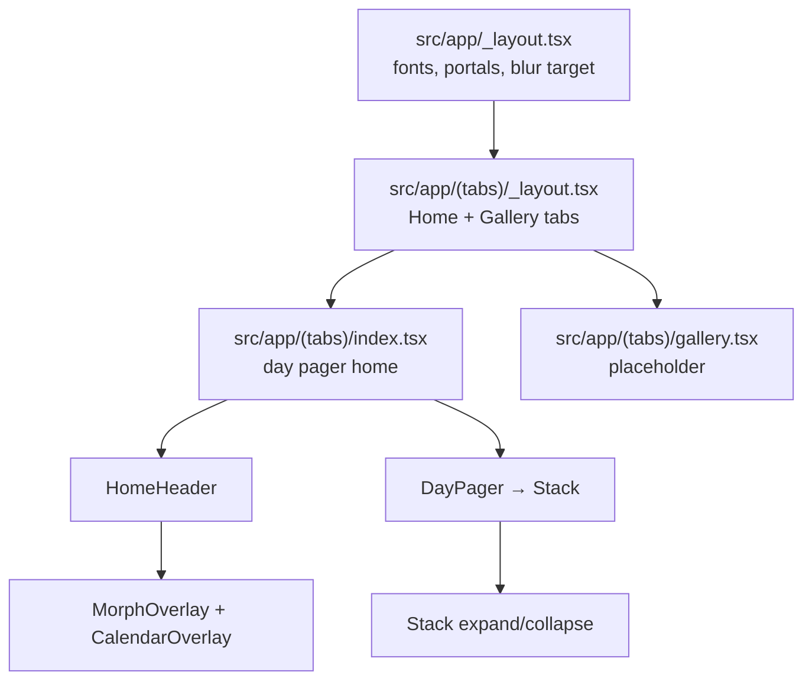

# soies — Project overview

**soies** is a personal journaling app built with Expo SDK 57 and React Native. Users browse dated **entries** (stacks of **artefacts**) day by day, expand stacks to read individual papers or prints, and navigate dates via a morphing calendar overlay. Domain terminology lives in [`CONTEXT.md`](./CONTEXT.md).

---

## Tech stack

| Layer | Choice |
|-------|--------|
| Framework | Expo 57, React Native 0.86, React 19 |
| Routing | [Expo Router](https://docs.expo.dev/router/introduction/) (file-based, native tabs) |
| Styling | [Uniwind](https://docs.uniwind.dev/) + Tailwind CSS v4 (`className` on native views) |
| Animation | Reanimated 4 + Worklets (UI-thread springs, scroll handlers, morphs) |
| Overlays | `react-native-teleport` (portal hosts at the root) |
| Lists / paging | `ScrollView` + Reanimated (day pager, expanded artefact pager) |
| Calendar UI | `@marceloterreiro/flash-calendar` |
| Icons | `react-native-nano-icons` (SVGs in `assets/icons/`) |
| Images | `expo-image` |
| Haptics | `react-native-pulsar` |
| Package manager | pnpm |

Planned persistence (not wired in UI yet): `@op-engineering/op-sqlite` — see ADRs in `docs/adr/`.

---

## How the app is organized



---

## Root & configuration

| File | Role |
|------|------|
| [`package.json`](./package.json) | Dependencies, scripts (`start`, `ios`, `android`, `lint`, `fmt`). Entry point: `expo-router/entry`. |
| [`app.json`](./app.json) | Expo config: bundle IDs, plugins (router, fonts, nano-icons, widgets), EAS project ID. **`autolinking.ios.buildFromSource`** forces Reanimated + Worklets to compile from source on iOS (required for worklets static feature flags). |
| [`eas.json`](./eas.json) | EAS Build profiles: `development`, `preview`, `production`, `ios-simulator`, `development-simulator`. |
| [`metro.config.js`](./metro.config.js) | Metro bundler + Uniwind integration (`cssEntryFile`, `dtsFile`). |
| [`tsconfig.json`](./tsconfig.json) | TypeScript (extends Expo base, `strict: true`). |
| [`.oxlintrc.json`](./.oxlintrc.json) / [`.oxfmtrc.json`](./.oxfmtrc.json) | Lint and format (oxlint, oxfmt). |
| [`CONTEXT.md`](./CONTEXT.md) | Ubiquitous language: Entry, Artefact, Paper, Print, Day, Gallery, Tombstone, Undo. |
| [`AGENTS.md`](./AGENTS.md) / [`CLAUDE.md`](./CLAUDE.md) | Pointers for AI assistants (Expo v56 docs note). |
| [`README.md`](./README.md) | Minimal Expo Router + Uniwind starter notes. |

---

## `src/app/` — routes (Expo Router)

| File | Role |
|------|------|
| [`src/app/_layout.tsx`](./src/app/_layout.tsx) | **Root layout.** Loads custom fonts, wraps the app in gesture handler, safe area, and portal provider. Mounts two portal hosts: **`overlay`** (inside safe area — expanded stacks) and **`morph`** (full screen — calendar morph). Provides `BlurTargetView` for focus-mode blur. |
| [`src/app/(tabs)/_layout.tsx`](./src/app/(tabs)/_layout.tsx) | **Tab layout.** Native-style tabs (Home, Gallery) with custom styled triggers. Wraps tabs in `ExpandProvider` so expand/collapse can hide chrome app-wide. |
| [`src/app/(tabs)/index.tsx`](./src/app/(tabs)/index.tsx) | **Home screen.** Reads optional `?date=` from the URL, loads entries for that day, renders `HomeHeader` + vertical `DayPager`. Tracks scroll offset as shared values for the header title and scroll indicator. |
| [`src/app/(tabs)/gallery.tsx`](./src/app/(tabs)/gallery.tsx) | **Gallery tab.** Placeholder screen for future curated entry browsing. |

---

## `src/components/` — UI

### Core home experience

| File | Role |
|------|------|
| [`HomeHeader.tsx`](./src/components/HomeHeader.tsx) | Top bar: formatted date button (opens calendar morph), animated entry titles as you scroll days, action buttons. Composes `MorphOverlay`, `CalendarOverlay`, and `Button`. |
| [`DayPager.tsx`](./src/components/DayPager.tsx) | Vertical pager of **entries** for one day. One full-screen “page” per entry (`Stack`). Vertical `ScrollIndicator` on the side; fades chrome while a stack is expanded. |
| [`Stack.tsx`](./src/components/Stack.tsx) | **Entry stack** — collapsed deck vs expanded horizontal artefact pager. Tap to expand (portals to `overlay` host). Long-press opens focus overlay. Horizontal scroll indicator when expanded. |
| [`CollapsedDeck.tsx`](./src/components/CollapsedDeck.tsx) | Renders the stacked-card collapsed view; `useWrappedArtefacts` builds wrapped `Paper` / `Print` children. |
| [`ArtefactWrapper.tsx`](./src/components/ArtefactWrapper.tsx) | Animated wrapper per artefact: interpolates position/size/shadow between collapsed stack layout and expanded pager layout. |
| [`Paper.tsx`](./src/components/Paper.tsx) | Text-only artefact renderer (A4 aspect, paper background). |
| [`Print.tsx`](./src/components/Print.tsx) | Image + caption artefact renderer (polaroid-style aspect). |

### Overlays & navigation

| File | Role |
|------|------|
| [`MorphOverlay.tsx`](./src/components/MorphOverlay.tsx) | Generic **measure-and-morph** overlay: animates from a trigger button’s on-screen frame to fullscreen (or menu). Used by the calendar date picker. Renders into the `morph` portal host. |
| [`CalendarOverlay.tsx`](./src/components/CalendarOverlay.tsx) | Month calendar (`flash-calendar`) with dots on days that have entries. Selecting a date navigates home with `?date=`. |
| [`FocusOverlay.tsx`](./src/components/FocusOverlay.tsx) | Long-press “focus” mode on a stack: blurred backdrop, cloned deck, contextual menu actions (share, edit, delete icons — UI only for now). |

### Shared UI & context

| File | Role |
|------|------|
| [`ScrollIndicator.tsx`](./src/components/ScrollIndicator.tsx) | Reusable page rail (vertical or horizontal). Tap to jump; long-press expands a thumbnail scrubber. Exports `EntryPreview` / `ArtefactPreview` for scrubber tiles. |
| [`ExpandContext.tsx`](./src/components/ExpandContext.tsx) | Shared `chromeProgress` value (0 = chrome visible, 1 = hidden) while a stack is expanded. Used by header, day pager, and stack. |
| [`BlurTargetViewContext.tsx`](./src/components/BlurTargetViewContext.tsx) | Ref to the root `BlurTargetView` so `FocusOverlay` can blur the correct subtree. |
| [`Button.tsx`](./src/components/Button.tsx) | Styled pressable (rounded controls background/border). Supports `forwardRef` for morph measurement. |
| [`Icon.tsx`](./src/components/Icon.tsx) | Nano icon set generated from `assets/icons/` via build-time glyph map. |
| [`LongPressable.tsx`](./src/components/LongPressable.tsx) | `Pressable` with default long-press delay and haptic feedback. |

### Tabs

| File | Role |
|------|------|
| [`tabs/StyledTabList.tsx`](./src/components/tabs/StyledTabList.tsx) | Bottom tab bar container styling. |
| [`tabs/StyledTabTrigger.tsx`](./src/components/tabs/StyledTabTrigger.tsx) | Individual tab trigger styling. |

---

## `src/data/` — data layer

| File | Role |
|------|------|
| [`entries.ts`](./src/data/entries.ts) | **Domain types** (`PaperArtefact`, `PrintArtefact`, `Entry`, `DayEntries`) and **mock data** for development. Exports `getEntriesByDate(date)` and `getEntryDates()` (calendar dots). Will be replaced by SQLite per ADRs. |
| [`mock-image.png`](./src/data/mock-image.png) | Sample image for print entries in mock data. |

---

## `src/utils/` — helpers

| File | Role |
|------|------|
| [`date.ts`](./src/utils/date.ts) | ISO date helpers (`YYYY-MM-DD`): `todayISO`, `toISODate`, `parseISO`, `addDaysISO`, `formatDisplayDate`. No time component — avoids timezone drift. |
| [`haptics.ts`](./src/utils/haptics.ts) | Worklet-safe long-press haptic via Pulsar. |

---

## `src/constants/` — tuning knobs

| File | Role |
|------|------|
| [`animation.ts`](./src/constants/animation.ts) | Spring config for stack expand (`SPRING_CONFIG`), chrome fade threshold (`CHROME_FADE_END`), title scroll travel (`TITLE_TRAVEL`), shadow tokens. |
| [`layout.ts`](./src/constants/layout.ts) | Stack spacing: `STACK_OFFSET` (collapsed gap), `EXPANDED_STACK_GAP` (peek width in expanded pager). |
| [`interaction.ts`](./src/constants/interaction.ts) | Long-press timings and distance thresholds for pressables and scroll-indicator scrub. |

---

## `src/` — styling & types

| File | Role |
|------|------|
| [`global.css`](./src/global.css) | Tailwind/Uniwind theme: aspect ratios (`aspect-a4`, `aspect-print`), font families, light/dark color tokens (`background`, `paper`, `primary`, etc.). |
| [`global.d.ts`](./src/global.d.ts) | Ambient TypeScript declarations. |
| [`uniwind-types.d.ts`](./src/uniwind-types.d.ts) | Generated Uniwind className typings (referenced from Metro config). |

---

## `assets/` — static files

| Path | Role |
|------|------|
| `assets/fonts/` | Embedded fonts (ABC Stefan, Geist, Geist Mono) — registered in `app.json` and loaded in root layout. |
| `assets/icons/*.svg` | Tab and action icons; compiled to `nanoicons/icons.glyphmap.json` by the nano-icons plugin. |

---

## `docs/` — design documentation

| Path | Role |
|------|------|
| [`docs/README.md`](./docs/README.md) | Index of the three main UI features and how they connect. Start here for deep dives. |
| [`docs/01-stack-expand-collapse.md`](./docs/01-stack-expand-collapse.md) | Stack expand/collapse, horizontal paging, portal overlay. |
| [`docs/02-calendar-morph-overlay.md`](./docs/02-calendar-morph-overlay.md) | Calendar + morph overlay technique. |
| [`docs/03-scroll-indicator.md`](./docs/03-scroll-indicator.md) | Scroll indicator (vertical day rail + horizontal artefact rail). |
| [`docs/adr/`](./docs/adr/) | Architecture decision records: soft-delete tombstones, unix-ms timestamps, opaque artefact blobs, op-sqlite, portal overlays. |

---

## `ios/` and `android/` (generated)

These native project folders are produced by `expo prebuild`. They contain Xcode / Gradle projects, CocoaPods (`Podfile`, `Podfile.lock`), and native module linking. Regenerate with `pnpm expo prebuild --clean` after native dependency or config changes.

---

## Common commands

```sh
pnpm start              # Metro dev server
pnpm ios                # Build and run on iOS simulator (requires Xcode 26.4+ for SDK 57)
pnpm android            # Build and run on Android
pnpm lint / pnpm fmt    # oxlint / oxfmt
pnpm eas build --profile ios-simulator --platform ios   # Cloud simulator build
```

---

## Where to read next

1. **Domain language** → [`CONTEXT.md`](./CONTEXT.md)
2. **How Home + Stack + Calendar fit together** → [`docs/README.md`](./docs/README.md)
3. **Persistence & sync direction** → [`docs/adr/`](./docs/adr/)
