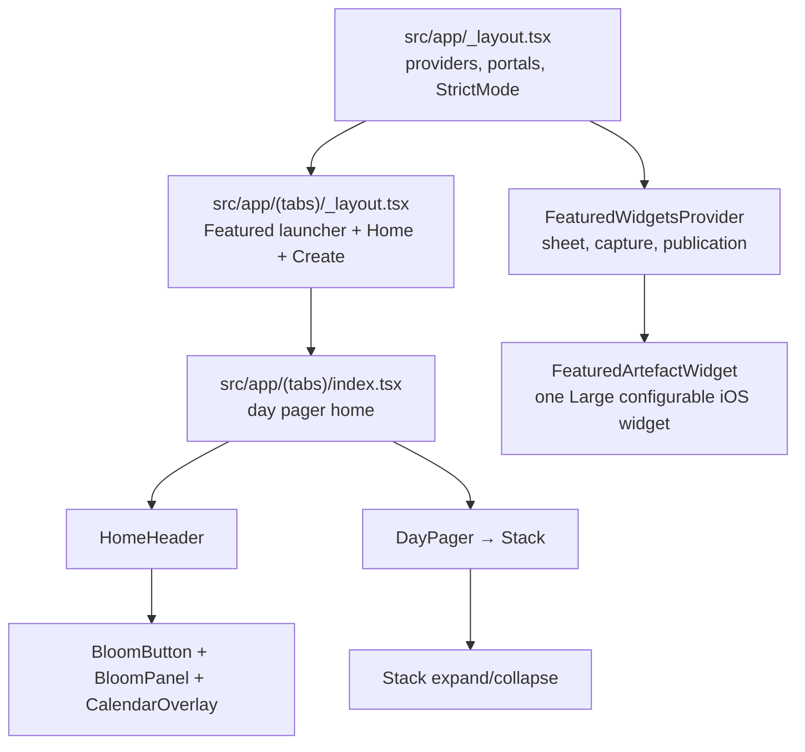

# soies — Project overview

**soies** is a personal journaling app built with Expo SDK 57 and React Native. Users browse dated **entries** (stacks of **artefacts**) day by day, expand stacks to read individual papers or prints, and navigate dates via a blooming calendar panel. Domain terminology lives in [`CONTEXT.md`](../CONTEXT.md).

---

## Tech stack

| Layer | Choice |
|-------|--------|
| Framework | Expo 57, React Native 0.86, React 19 |
| Compiler | [React Compiler](https://docs.expo.dev/guides/react-compiler) (`experiments.reactCompiler` in `app.json`; `babel.config.js` with `panicThreshold: 'all_errors'` — diagnostics are **hard build failures**). Validation: `pnpm lint` (Oxlint including native `react/react-compiler`), `pnpm lint:rc`, `pnpm healthcheck:rc`, `pnpm check`. Do not reintroduce manual `useMemo` / `useCallback` / `memo` as a render optimization without a measured re-render problem (`memo(CalendarMonthWithDots)` is the intentional exception for uncompiled flash-calendar). `useCallback` is also permitted when stable identity is an explicit correctness contract with native or third-party APIs; document that contract at the call site. |
| Routing | [Expo Router](https://docs.expo.dev/router/introduction/) (file-based, native tabs) |
| Styling | [Uniwind](https://docs.uniwind.dev/) + Tailwind CSS v4 (`className` on native views) |
| Animation | Reanimated 4 + Worklets (UI-thread springs, scroll handlers, morphs). Shared values use `.get()` / `.set()` for React Compiler compatibility. |
| Overlays | `react-native-teleport` (portal hosts at the root) |
| Lists / paging | `ScrollView` + Reanimated (day pager, expanded artefact pager) |
| Calendar UI | `@marceloterreiro/flash-calendar` |
| Icons | `react-native-nano-icons` (SVGs in `assets/icons/`) |
| Images | `expo-image` |
| Haptics | `react-native-pulsar` |
| Package manager | pnpm |

Persistence: `@op-engineering/op-sqlite` — see ADRs in `docs/adr/`.

### Worklets boundary rule

React Compiler callback caching is **not** a correctness guarantee for Worklets, gesture handlers, native subscriptions, or third-party list APIs. Across active code, a UI-runtime callback may call `scheduleOnRN` with a **stable React dispatcher** as the function and **serializable primitives** as arguments. Do **not** pass render-local callbacks, React setters, or other function values as `scheduleOnRN` arguments.

Known-good pattern: `scheduleOnRN(setCreate, null)` / `scheduleOnRN(setOutgoing, null)` / `scheduleOnRN(setCloseSequence, n)`. External callbacks (e.g. BloomPanel `onClose`) stay on RN via a ref + completion sequence effect.

**Exception:** [`MorphOverlay.tsx`](../src/components/MorphOverlay.tsx) still uses an unsafe `scheduleOnRN(finishClose, onClose)` bridge but has **no callsite** under `src/`. Do not wire it without applying the BloomPanel pattern first. Physical-device stress matrix: [`docs/qa/react-compiler-closure.md`](./qa/react-compiler-closure.md).

---

## How the app is organized



---

## Root & configuration

| File | Role |
|------|------|
| [`package.json`](../package.json) | Dependencies, scripts (`start`, `ios`, `android`, `lint`, `lint:rc`, `healthcheck:rc`, `check`, `typecheck`, `fmt`). Entry point: **`expo-router/entry`** (canonical; custom `index.js` and `.pnpm` `watchFolders` were removed after the Metro matrix proved them unnecessary). `expo.autolinking.ios.buildFromSource` forces Reanimated + Worklets to compile from source on iOS. |
| [`app.json`](../app.json) | Expo app config: `soies` URL scheme, iOS 17 deployment target, one five-choice `systemLarge` widget, bundle IDs, plugins, EAS project ID, and **`experiments.reactCompiler`**. Android widget generation is explicitly disabled. |
| [`babel.config.js`](../babel.config.js) | `babel-preset-expo` + React Compiler options (`panicThreshold: "all_errors"` → hard build failures). |
| [`eas.json`](../eas.json) | EAS Build profiles: `development`, `preview`, `production`, `ios-simulator`, `development-simulator`. |
| [`metro.config.js`](../metro.config.js) | Metro + Uniwind (`cssEntryFile`, `dtsFile`) only. No `unstable_enableSymlinks` (Metro 0.84 always-on; Expo Doctor rejects the override). No extra `watchFolders`. |
| [`tsconfig.json`](../tsconfig.json) | TypeScript (extends Expo base, `strict: true`). |
| [`.oxlintrc.json`](../.oxlintrc.json) / [`.oxfmtrc.json`](../.oxfmtrc.json) | Lint and format (oxlint with native React Compiler rules, oxfmt). |
| [`.github/workflows/quality.yml`](../.github/workflows/quality.yml) | CI: `pnpm check` + production iOS `expo export`. |
| [`CONTEXT.md`](../CONTEXT.md) | Ubiquitous language: Entry, Artefact, Featured Artefact, Widget Slot, Widget, Frame, Tombstone, Undo. |
| [`AGENTS.md`](../AGENTS.md) / [`CLAUDE.md`](../CLAUDE.md) | Pointers for AI assistants (Expo **v57** docs). |
| [`README.md`](../README.md) | Minimal Expo Router + Uniwind starter notes. |

---

## `src/app/` — routes (Expo Router)

| File | Role |
|------|------|
| [`src/app/_layout.tsx`](../src/app/_layout.tsx) | **Root layout.** `GestureHandlerRootView` outermost, then **`StrictMode`**, fonts, keyboard, safe area, portal provider. Mounts portal hosts: **`overlay`** (inside safe area — expanded stacks), **`morph`** (focus overlay), **`bloom`** (BloomPanel calendar/menus), **`create`** (create flow). Provides `BlurTargetView` for blur sampling. Database init is single-flight under StrictMode. |
| [`src/app/(tabs)/_layout.tsx`](../src/app/(tabs)/_layout.tsx) | **Tab layout.** Keeps Home centered, with the iOS-only Featured Artefacts launcher at bottom-left and Create at bottom-right. Wraps the route in `ExpandProvider`; Android/web resolve the Featured launcher to `null`. |
| [`src/app/(tabs)/index.tsx`](../src/app/(tabs)/index.tsx) | **Home screen.** Reads date and one-shot widget commands from the URL, loads entries for that day, and renders `HomeHeader` + vertical `DayPager`. An occupied widget command targets an exact entry/artefact; an empty or unavailable command opens Featured Artefacts at its slot. |

---

## `src/components/` — UI

### Core home experience

| File | Role |
|------|------|
| [`HomeHeader.tsx`](../src/components/HomeHeader.tsx) | Top bar: formatted date button (opens calendar bloom), animated entry titles as you scroll days, action buttons. Composes `BloomButton` / `BloomPanel`, `CalendarOverlay`, and create entry. |
| [`DayPager.tsx`](../src/components/DayPager.tsx) | Vertical pager of **entries** for one day. One full-screen page per entry (`Stack`). It can jump to a stable entry ID from a widget command without changing Home's index-keyed reuse lifecycle. |
| [`Stack.tsx`](../src/components/Stack.tsx) | **Entry stack** — collapsed deck vs expanded horizontal artefact pager. Tap to expand; long-press or ellipsis opens Focus. A widget target immediately expands at the matching artefact ID. |
| [`CollapsedDeck.tsx`](../src/components/CollapsedDeck.tsx) | Renders the stacked-card collapsed view; `useWrappedArtefacts` builds wrapped `Paper` / `Print` children. |
| [`ArtefactWrapper.tsx`](../src/components/ArtefactWrapper.tsx) | Animated wrapper per artefact: interpolates position/size/shadow between collapsed stack layout and expanded pager layout. |
| [`Paper.tsx`](../src/components/Paper.tsx) | Text-only artefact renderer (A4 aspect, paper background). |
| [`Print.tsx`](../src/components/Print.tsx) | Image + caption artefact renderer (polaroid-style aspect). |

### Overlays & navigation

| File | Role |
|------|------|
| [`BloomButton.tsx`](../src/components/BloomButton.tsx) / [`BloomPanel.tsx`](../src/components/BloomPanel.tsx) | **Measure-and-morph bloom** used by the calendar (fullscreen) and create menus. Origin stays inline; panel portals into the `bloom` host. Close completion and content crossfade use stable dispatcher + primitive Worklets bridges. |
| [`CalendarOverlay.tsx`](../src/components/CalendarOverlay.tsx) | Month calendar (`flash-calendar`) with dots on days that have entries. Selecting a date navigates home with `?date=`. |
| [`FocusOverlay.tsx`](../src/components/FocusOverlay.tsx) | Long-press / ellipsis focus: blurred backdrop, measured subject clone, and menu. On iOS, **Feature in Widget** appears immediately before Share and opens the picker for that Entry. |
| [`ArtefactFrame.tsx`](../src/components/ArtefactFrame.tsx) | Single source of portrait frame geometry for live capture, cached Featured Artefact previews, and branded empty/unavailable prompts. |
| [`MorphOverlay.tsx`](../src/components/MorphOverlay.tsx) | **Unused** legacy morph overlay (no callsite). Kept for reference; unsafe Worklets `onClose` bridge — do not reintroduce without hardening. |

### Shared UI & context

| File | Role |
|------|------|
| [`ScrollIndicator.tsx`](../src/components/ScrollIndicator.tsx) | Reusable page rail (vertical or horizontal). Raw RN View responders avoid RNGH's StrictMode `findNodeHandle` path; scrub moves invoke the latest host jump callback directly on RN/JS. Reanimated keeps the rail and host scroll visuals on the UI thread. Exports `EntryPreview` / `ArtefactPreview` for scrubber tiles. |
| [`ExpandContext.tsx`](../src/components/ExpandContext.tsx) | Shared `chromeProgress` value (0 = chrome visible, 1 = hidden) while a stack is expanded. Used by header, day pager, and stack. |
| [`CreateContext.tsx`](../src/components/CreateContext.tsx) | Create-entry overlay state; close spring uses `scheduleOnRN(setCreate, null)`. |
| [`BlurTargetViewContext.tsx`](../src/components/BlurTargetViewContext.tsx) | Ref to the root `BlurTargetView` so bloom/focus overlays can blur the correct subtree. |
| [`Button.tsx`](../src/components/Button.tsx) | Styled pressable (rounded controls background/border). Supports `forwardRef` for morph measurement. |
| [`Icon.tsx`](../src/components/Icon.tsx) | Nano icon set generated from `assets/icons/` via build-time glyph map. |
| [`LongPressable.tsx`](../src/components/LongPressable.tsx) | `Pressable` with default long-press delay and haptic feedback. |

### Featured Artefacts and iOS widget flow

| File | Role |
|------|------|
| [`FeaturedArtefactsButton.ios.tsx`](../src/components/FeaturedArtefactsButton.ios.tsx) | Round bottom-left launcher for Featured Artefacts. Its platform fallback renders nothing on Android/web. |
| [`FeaturedWidgetsContext.ios.tsx`](../src/widgets/FeaturedWidgetsContext.ios.tsx) | iOS controller for sheet sessions, transactional assignment, publication warnings, and coalesced first-paint/foreground reconciliation. The platform fallback exposes no feature affordances. |
| [`FeaturedWidgetsSheet.tsx`](../src/widgets/FeaturedWidgetsSheet.tsx) | One fixed-height native bottom sheet. Raw picker and five-slot framed management phases remain mounted in the same body and cross-fade over 200 ms. |
| [`WidgetFrameCaptureHost.tsx`](../src/widgets/WidgetFrameCaptureHost.tsx) | Lazily mounts one off-screen `ArtefactFrame`, waits for layout/Print/Ink readiness, and serializes high-resolution transparent PNG capture with a ten-second timeout. |
| [`widgetFrameCache.ts`](../src/widgets/widgetFrameCache.ts) | Stores revisioned, renderer-versioned captures in `widgetsDirectory`; paths are derived cache state and stale files are removed only after a later successful publication. |
| [`widgetSnapshot.ts`](../src/widgets/widgetSnapshot.ts) | Builds one atomic five-key snapshot containing empty, featured, or unavailable state plus metadata, deep links, and accessibility labels. |
| [`FeaturedArtefactWidget.ios.tsx`](../src/widgets/FeaturedArtefactWidget.ios.tsx) | SwiftUI-backed `systemLarge` widget. Each installed instance reads its `featuredSlot` configuration and renders that key from the shared snapshot. |
| [`widgetDeepLink.ts`](../src/widgets/widgetDeepLink.ts) | Parses and de-duplicates cold/warm slot commands before Home consumes and clears their URL parameters. |

Selection captures first, commits the lowest genuinely empty slot in one database transaction, then publishes one snapshot containing all five positions. Duplicate artefacts are rejected and active unavailable bindings remain capacity reservations. Publication failure never rolls back user intent: the sheet shows the assigned slot, surfaces a non-blocking warning, and reconciliation retries later. Empty/unavailable states publish before any potentially slow recapture.

### Tabs

| File | Role |
|------|------|
| [`tabs/StyledTabList.tsx`](../src/components/tabs/StyledTabList.tsx) | Bottom tab bar container styling. |
| [`tabs/StyledTabTrigger.tsx`](../src/components/tabs/StyledTabTrigger.tsx) | Individual tab trigger styling. |

---

## `src/data/` — data layer

| File | Role |
|------|------|
| [`entries.ts`](../src/data/entries.ts) | **Domain types** (`PaperArtefact`, `PrintArtefact`, `Entry`, `DayEntries`) and helpers. Entry view models expose stable `id` and `date` for widget targeting. Persistence is in `src/db/`. |
| [`mock-image.png`](../src/data/mock-image.png) | Sample image for print entries in seed/dev data. |

### Widget persistence

`featured_widget_slots` owns five numbered positions. A missing or tombstoned slot row is empty; an active row whose Entry or Artefact is soft-deleted is unavailable and still reserves capacity so Undo restores it in place. A partial unique index prevents one active Artefact from occupying more than one slot. Legacy `gallery_items` rows are intentionally neither migrated nor deleted; no current route, provider, repository, or seed path reads them.

---

## `src/utils/` — helpers

| File | Role |
|------|------|
| [`date.ts`](../src/utils/date.ts) | ISO date helpers (`YYYY-MM-DD`): `todayISO`, `toISODate`, `parseISO`, `addDaysISO`, `formatDisplayDate`. No time component — avoids timezone drift. |
| [`haptics.ts`](../src/utils/haptics.ts) | Worklet-safe long-press haptic via Pulsar. |

---

## `src/constants/` — tuning knobs

| File | Role |
|------|------|
| [`animation.ts`](../src/constants/animation.ts) | Spring config for stack expand (`SPRING_CONFIG`), chrome fade threshold (`CHROME_FADE_END`), title scroll travel (`TITLE_TRAVEL`), bloom/create springs, shadow tokens. |
| [`layout.ts`](../src/constants/layout.ts) | Stack spacing: `STACK_OFFSET` (collapsed gap), `EXPANDED_STACK_GAP` (peek width in expanded pager). |
| [`interaction.ts`](../src/constants/interaction.ts) | Long-press timings and distance thresholds for pressables and scroll-indicator scrub. |

---

## `src/` — styling & types

| File | Role |
|------|------|
| [`global.css`](../src/global.css) | Tailwind/Uniwind theme: aspect ratios (`aspect-a4`, `aspect-print`), font families, light/dark color tokens (`background`, `paper`, `primary`, etc.). |
| [`global.d.ts`](../src/global.d.ts) | Ambient TypeScript declarations. |
| [`uniwind-types.d.ts`](../src/uniwind-types.d.ts) | Generated Uniwind className typings (referenced from Metro config). |

---

## `assets/` — static files

| Path | Role |
|------|------|
| `assets/fonts/` | Embedded fonts (ABC Stefan, Geist, Geist Mono) — registered in `app.json` and loaded in root layout. |
| `assets/icons/*.svg` | Tab and action icons; compiled to `nanoicons/icons.glyphmap.json` by the nano-icons plugin. |

---

## `docs/` — design documentation

| Path | Role |
|------|------|
| [`docs/README.md`](./README.md) | Index of the four main UI features and how they connect. Start here for deep dives. |
| [`docs/01-stack-expand-collapse.md`](./01-stack-expand-collapse.md) | Stack expand/collapse, horizontal paging, portal overlay. |
| [`docs/02-calendar-morph-overlay.md`](./02-calendar-morph-overlay.md) | Calendar + bloom/morph overlay technique. |
| [`docs/03-scroll-indicator.md`](./03-scroll-indicator.md) | Scroll indicator (vertical day rail + horizontal artefact rail). |
| [`docs/qa/react-compiler-closure.md`](./qa/react-compiler-closure.md) | Physical-device stress matrix for RC / Worklets closure. |
| [`docs/adr/`](./adr/) | Architecture decision records: persistence, portal overlays, media/share seams, and stable raster-backed Widget Slots. |

---

## `ios/` and `android/` (generated)

These native project folders are produced by `expo prebuild`. They contain Xcode / Gradle projects, CocoaPods (`Podfile`, `Podfile.lock`), and native module linking. Regenerate with `pnpm exec expo prebuild --clean` after native dependency or config changes.

---

## Common commands

```sh
pnpm start              # Metro dev server (use --clear after babel/RC config changes)
pnpm ios                # Build and run on iOS (simulator or --device)
pnpm android            # Build and run on Android
pnpm fmt / pnpm fmt:check
pnpm typecheck          # tsc --noEmit
pnpm lint               # oxlint (includes native react/react-compiler)
pnpm lint:rc            # targeted Oxlint React Compiler rule
pnpm healthcheck:rc     # pinned react-compiler-healthcheck (expect all components to compile)
pnpm test               # repository and Featured Widget regression tests
pnpm check              # fmt:check + typecheck + lint + healthcheck:rc + test
pnpm exec expo export --platform ios --clear   # production transform (prints React Compiler enabled)
pnpm eas build --profile ios-simulator --platform ios
```

CI (`.github/workflows/quality.yml`) runs `pnpm check` and an iOS `expo export` on PRs / primary-branch pushes.

---

## Where to read next

1. **Domain language** → [`CONTEXT.md`](../CONTEXT.md)
2. **How Home + Stack + Calendar fit together** → [`docs/README.md`](./README.md)
3. **RC / Worklets physical stress** → [`docs/qa/react-compiler-closure.md`](./qa/react-compiler-closure.md)
4. **Persistence & sync direction** → [`docs/adr/`](./adr/)
